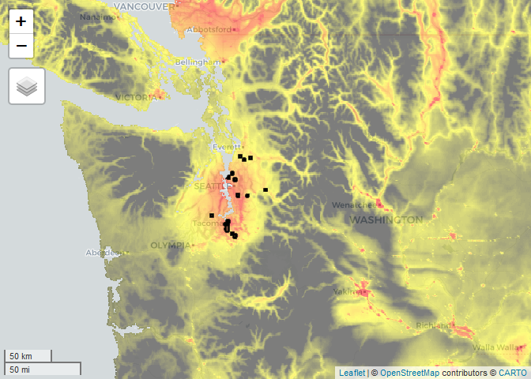

Untitled
================

<!-- ## Header --------------------------- -->
<!-- ## -->
<!-- ## Script name:get_predictors.R -->
<!-- ## -->
<!-- ## Abstract: This script is used to get landscape predictors from Google Earth Engine -->
<!-- ## for use in stormwaterheatmap regressions. -->
<!-- ## -->
<!-- ## Author: Christian Nilsen, Geosyntec Consultants -->
<!-- ## Email: cnilsen@geosyntec.com -->
<!-- ## -->
<!-- ## Date Created: 2021-01-24, Christian Nilsen -->
<!-- ## Date Modified: 2021-05-12, Eva Dusek Jennings -->
<!-- ## -->
<!-- ## Copyright (c) Geosyntec Consultants, 2021 -->
<!-- ## -->
<!-- ## -->
<!-- ## This program is free software: you can redistribute it and/or modify -->
<!-- ## it under the terms of the GNU General Public License as published by -->
<!-- ## the Free Software Foundation, version 3.0 -->
<!-- ## -->
<!-- ## This program is distributed in the hope that it will be useful, -->
<!-- ## but WITHOUT ANY WARRANTY; without even the implied warranty of -->
<!-- ## MERCHANTABILITY or FITNESS FOR A PARTICULAR PURPOSE.  See the -->
<!-- ## GNU General Public License for more details. -->
<!-- ## For a copy of the GNU General Public License -->
<!-- ##  see <https://www.gnu.org/licenses/>. -->
<!-- ## -->

## New - watershed buffers

May be useful for using data (especially air quality) outside of
watershed bounds.

``` r
#links to feature collections. 
sheds_no_buffer <- "users/stormwaterheatmap/revised_s8_watersheds_v4"
buffered_sheds_500m <- "users/stormwaterheatmap/buffered_sheds_500m"
buffered_sheds_1k <- "users/stormwaterheatmap/buffered_sheds_1k"
buffered_sheds_2k <- "users/stormwaterheatmap/buffered_sheds_2k"
buffered_sheds_3k <- "users/stormwaterheatmap/buffered_sheds_3k"

# Data  -------------------------------------------------------------------

shed_url <- buffered_sheds_1k # change this to update watershed feature layer

watersheds <- ee$FeatureCollection(shed_url)$select(c("Location_N"), c("Location")) # 
```

# Get Predictor images from earth engine

## Tree cover, traffic, population, slope

``` r
## 
## trees
tree_cover <- ee$Image("USGS/NLCD/NLCD2016")$select("percent_tree_cover")

## traffic
traffic <- ee$Image(0)$blend(ee$Image("users/cnilsen/traffic_raw"))$rename("traffic")

## population density
population <- ee$Image("users/stormwaterheatmap/population_per_ha")
# slope

elevation <- ee$Image("USGS/NED") 
slope <- ee$Terrain$slope(elevation)
```

## Land Cover

The tnc\_landcover image can also be used for the following values:
`[0, 1, 2, 3, 4,5, 6, 7]`

`labels: [ 'No data', 'Grass/Low Vegetation', 'Shrub/Medium Vegetation', 'Trees/Forest', 'Bare soil', 'Water', 'Impervious – Except Roofs', 'Impervious - Roofs']`

``` r
## imperviousness:

tnc_landcover <-ee$Image("users/jrobertson2000/psLandCover_1m_finPS_roofs") 
impervious <-tnc_landcover$eq(6)$Or(tnc_landcover$eq(7))$rename("impervious") #
 #(excl roofs) is coded as 6; roofs are coded as 7; this
#imperviousness is both combined imp_ground 
impervious<-tnc_landcover$eq(6)$rename("imperv_ground") # roads & parking areas &sidewalks; 

roofs <- tnc_landcover$eq(7)
# Christian wouldn't do roads separately-- too correlated with
# impervious & traffic 
imp_roofs <-tnc_landcover$eq(7)$rename("imperv_roofs") 
grass_low_veg <-tnc_landcover$eq(1)$rename("grass_low_veg")
```

## Coarse Air Quality

### PM2.5

PM2.5: Global Annual PM2.5 Grids from MODIS, MISR and SeaWiFS Aerosol
Optical Depth (AOD) with GWR, v1 (1998 – 2016)

See:
<https://sedac.ciesin.columbia.edu/data/set/sdei-global-annual-gwr-pm2-5-modis-misr-seawifs-aod>

### NO2

Global 3-Year Running Mean Ground-Level NO2 Grids from GOME, SCIAMACHY
and GOME-2, v1 (1996 – 2012) See
<https://sedac.ciesin.columbia.edu/data/set/sdei-global-3-year-running-mean-no2-gome-sciamachy-gome2>

``` r
no2 <-ee$Image("users/stormwaterheatmap/SURFACE_NO2_010x010_2010")$rename("NO_2")
pm25 <-ee$Image("users/cnilsen/pm25clipped")$rename("pm25")
```

## Age of development

**Updated Layer** See: \# age\_of\_development &lt;-
ee$Image("JRC/GHSL/P2016/BUILT\_LDSMT\_GLOBE\_V1")$select(“built”)$rename(“mean\_dev\_age”)
\#mean value; this one is confusing b/c value of 2=no development

``` r
no_dev <-ee$Image("JRC/GHSL/P2016/BUILT_LDSMT_GLOBE_V1")$select("built")$eq(2)$rename("no_dev")
# proportion that has no development 
age_2000_2014 <-ee$Image("JRC/GHSL/P2016/BUILT_LDSMT_GLOBE_V1")$select("built")$eq(3)$rename("dev_2000_2014")
# proportion that was built in 2000-2014 
age_1990_2000 <-ee$Image("JRC/GHSL/P2016/BUILT_LDSMT_GLOBE_V1")$select("built")$eq(4)$rename("dev_1990_2000")
# proportion that was built in 1990-2000 
age_1975_1990 <-ee$Image("JRC/GHSL/P2016/BUILT_LDSMT_GLOBE_V1")$select("built")$eq(5)$rename("dev_1975_1990")
# proportion that was built in 1975-1990 
age_pre_1975 <-ee$Image("JRC/GHSL/P2016/BUILT_LDSMT_GLOBE_V1")$select("built")$eq(6)$rename("dev_pre_1975")
# proportion that was built pre-1975
```

# Commerce landuse data ————————————————–

# source: //<https://www.commerce.wa.gov/serving-communities/growth-management/puget-sound-mapping-project/>

actual landuses in our sampling data set: { “list”: \[ \[
“KICLDRS8D\_OUT”, { “5”: 2.3058823529411767 } \], \[ “KICHDRS8D\_OUT”, {
“0”: 4.254901960784314, “7”: 0.3803921568627451 } \], \[
“SEAI1S8D\_OUT”, { “0”: 8.737254901960785, “4”: 30.10980392156863, “7”:
9.952941176470588, “8”: 25.392156862745093, “10”: 18.462745098039214,
“11”: 4.305882352941176 } \], \[ “PIEHIRES\_OUT”, { “4”:
1.6392156862745098, “7”: 7.313725490196079, “8”: 38.48235294117647, “9”:
6.580392156862745, “10”: 131.32941176470592 } \], \[ “PIELORES\_OUT”, {
“5”: 61.08627450980394 } \], \[ “SNO\_COM”, { “4”: 59.47450980392157 }
\], \[ “SNO\_LDR”, { “1”: 14.36078431372549, “5”: 14.972549019607843,
“7”: 1.2431372549019608, “8”: 12.329411764705883 } \], \[
“SEAC1S8D\_OUT”, { “4”: 105.52549019607841, “8”: 3.423529411764706 } \],
\[ “POSOUTFALL\_60”, { “4”: 11.647058823529411, “6”: 0.49411764705882355
} \], \[ “SEAR1S8D\_OUT”, { “4”: 15.231372549019605, “7”:
0.25098039215686274, “8”: 34.53725490196078, “10”: 1.4627450980392156 }
\], \[ “POT564S8D\_OUT”, { “6”: 29.54509803921568, “7”:
2.250980392156863, “8”: 0.2, “11”: 37.20392156862745 } \], \[
“PIECOMM\_OUT”, { “4”: 7.1960784313725465 } \], \[ “SNO\_HDR”, { “0”:
0.7490196078431373, “8”: 11.423529411764704 } \], \[ “KICCOMS8D\_OUT”, {
“0”: 3.3019607843137253, “7”: 0.11764705882352941 } \], \[
“TAC001S8D\_OF235”, { “4”: 97.25882352941176, “5”: 1.3607843137254902,
“6”: 0.09803921568627451, “7”: 0.050980392156862744 } \], \[
“TAC003S8D\_OF245”, { “4”: 4.423529411764706, “6”: 0.10196078431372549,
“7”: 0.10588235294117647, “8”: 16.91764705882353, “11”:
1.615686274509804 } \], \[ “TFWFD1”, { “0”: 8.796078431372548, “4”:
255.20000000000005, “5”: 5.870588235294116, “7”: 85.6, “8”:
722.2431372549016, “10”: 104.77254901960785, “11”: 3 } \] \] }

``` r
landuse_table <-ee$FeatureCollection("users/stormwaterheatmap/psrc_landuse")

# MASTER_CAT Master_num

## Undesignated 0

## Agricultural Area 1

## Tribal 2

## Forest Lands 3

## Intensive Urban 4**

## Rural Character Residential 5**

## Water 6**

## PROW 7**

## ROW 8**

## Active Open Space and Recreation 9

# Urban Character Residential 10**

## Industrial 11**

## Public 12

## Natural Preservation and Conservation 13

## Military 14

## Mineral Resource Area 15

landuse <- landuse_table$reduceToImage(list("Master_num"),ee$Reducer$first())$rename("landuseCode")

# percent landuse

percent.residential <- landuse$eq(10)$rename("RES") 
percent.industrial<- landuse$eq(11)$rename("IND")
percent.commercial <- landuse$eq(4)$rename("COM") 
percent.rural_res <-landuse$eq(5)$rename("RURES") 
percent.row <-landuse$eq(7)$Or(landuse$eq(8))$rename("ROW")
```

## Roofs by land use

``` r
# make a binary image of roofs 1 = roof, 0 = not roof

# intersect roofs and landuse values

roofs_landuse <- landuse$multiply(roofs)$selfMask() 
percent.roofs.RES<- roofs_landuse$eq(10)$rename("roof_RES") 
percent.roofs.IND <-roofs_landuse$eq(11)$rename("roof_IND")

# percent.roofs.TRANS <- roofs_landuse$eq(3)$rename("roof_TRANS")

percent.roofs.COM <- roofs_landuse$eq(4)$rename("roof_COM")
percent.roofs.AG_TIMBER <-
roofs_landuse$eq(1)$Or(roofs_landuse$eq(3))$rename("roof_AG")

# percent.roofs.WATER <- roofs_landuse$eq(7)$rename("roof_WATER")

# percent.roofs.OPEN <- roofs_landuse$eq(8)$rename("roof_OPEN")

# palette for displaying land uses


# display the results for roofs by landuse

# Map$centerObject(eeObject = roofs, zoom = 7)

# Map$addLayer(roofs_landuse,visParams = list(min = 1, max = 8, palette = landuse_pallete))

# gives an image of roofs

# "Residential": 1,

# "Industrial": 2,

# "Transportation ": 3,

# "Commercial": 4,

# "Agricultural": 5,

# "Timber and Resource Extraction": 6,

# "Water": 7,

# "open space": 8

# }

# CO Emissions ------------------------------------------------------------

# CO Emissions ------------------------------------------------------------

# From Gurney, K.R., J. Liang, R. Patarasuk, Y. Song, J. Huang, and G. Roest. 2019. Vulcan: High-Resolution Annual Fossil Fuel

# CO2 Emissions in USA, 2010-2015, Version 3. ORNL DAAC, Oak Ridge, Tennessee, USA. <https://doi.org/10.3334/ORNLDAAC/1741>

############# 

## Sector Code Description

# airport Airport sector (taxi/takeoff to 3000')

# cement Cement production sector

# cmv Commercial Marine Vessel sector

# commercial Commercial sector

# elec_prod Electricity production sector

# industrial Industrial sector

# nonroad Nonroad sector (e.g. snowmobiles, ATVs)

# onroad Onroad sector

# railroad Railroad sector

# residential Residential sector

# total Total emissions


Vulcan_total <-ee$Image("users/stormwaterheatmap/Vulcan_total")$reduce("mean")$rename("CO_emissions_total")
Vulcan_airport <-ee$Image("users/stormwaterheatmap/Vulcan_airport")$reduce("mean")$rename("CO_emissions_airport")
Vulcan_cmv <-ee$Image("users/stormwaterheatmap/Vulcan_cmv")$reduce("mean")$rename("CO_emissions_cmv")
Vulcan_commercial <-ee$Image("users/stormwaterheatmap/Vulcan_commercial")$reduce("mean")$rename("CO_emissions_commercial")
Vulcan_residential <-ee$Image("users/stormwaterheatmap/Vulcan_residential")$reduce("mean")$rename("CO_emissions_residential")
Vulcan_industrial <-ee$Image("users/stormwaterheatmap/Vulcan_industrial")$reduce("mean")$rename("CO_emissions_industrial")
Vulcan_nonroad <-ee$Image("users/stormwaterheatmap/Vulcan_nonroad")$reduce("mean")$rename("CO_emissions_nonroad")
Vulcan_onroad <-ee$Image("users/stormwaterheatmap/Vulcan_onroad")$reduce("mean")$rename("CO_emissions_onroad")
Vulcan_rail <-ee$Image("users/stormwaterheatmap/Vulcan_rail")$reduce("mean")$rename("CO_emissions_rail")
```

# Surface Air Quality ———————————————-

``` r
v4_pm25 <-ee$Image("users/stormwaterheatmap/V4NA03_PM25_NA_201001_201012-RH35-NoNegs")$rename("PM25_NA")
sa <-ee$Image("users/stormwaterheatmap/surface_area")$rename("particulate_surface_area")
```

Make Map for One Predictor

``` r
# Make Map for One Predictor -----------------------------------------------

map_image <- v4_pm25 #  
map_viz <- list(min = 2, max = 7,palette = list("black", "yellow", "red"), opacity = 0.5)
Map$centerObject(eeObject = watersheds, zoom = 7)
```

    ## NOTE: Center obtained from the first element.

``` r
Map$addLayer(map_image, visParams = map_viz) + Map$addLayer(watersheds)
```

<!-- -->

# Reduce Predictors

``` r
# Reduce Predictors -------------------------------------------------------

## combine predictors in one dataset (one band each) - this is an image

predictors <- ee$Image(0)$blend(
  ee$Image$cat
  (
  age_1975_1990, 
  age_1990_2000,
  age_2000_2014, 
  age_pre_1975, 
  grass_low_veg, 
  imp_roofs, 
  impervious,
  no_dev, 
  no2, 
  percent.commercial,
  percent.industrial,
  percent.residential,
  percent.roofs.COM,
  percent.roofs.IND, 
  percent.roofs.RES, # percent.roofs.TRANS, #
  percent.row,
  percent.rural_res,
  pm25, 
  population, 
  sa,
  slope, 
  traffic,
  tree_cover, 
  v4_pm25, 
  Vulcan_commercial, 
  Vulcan_nonroad, 
  Vulcan_onroad,
  Vulcan_residential, 
  Vulcan_total
)
)

## calculate mean stats from earth engine

ee_stats <- predictors$reduceRegions( collection = watersheds, # this
#is what we gave it for 16 watersheds; Christian has one for Puget
#Lowlands; will try in Sandbox to see if it works 
scale = 30, # 30m per pixel
reducer = ee$Reducer$mean() )

# evaluate ee object - pulls data from server to client

ee_df <- ee_stats$getInfo()

# wrangle the data

df_predictors <- ee_df$features %>% # band names diff't than image#names; constant is traffic 
map("properties") %>% rbindlist(fill = TRUE) %>% select(Location_N, everything())

# built refers to buildup index. Those are categorical data - maybe shouldn't be averaged?
```

# Results

``` r
# Results -----------------------------------------------------------------

#View(df_predictors)

# pivot for charting

df_long <- df_predictors %>% pivot_longer(cols = -c(Location_N),names_to = "predictor")
df_transposed <- df_predictors %>%
  # tibble::rownames_to_column() %>%  
   pivot_longer(-Location_N,names_to = "predictor") %>% 
   pivot_wider(names_from=Location_N, values_from=value) 
# plot value of each predictor for the 16 watersheds

# ggplot(df_long) + geom_col(aes(x = Location_N, y = value), fill =
# "cadetBlue", position = "dodge") + facet_wrap(~predictor, scales = "free")

predictors_list <- split(df_long$value, df_long$predictor)

df_transposed %>% add_column('boxplot' = "",.before=2) %>% 
  add_column('histogram' = "",.before=2) %>% 
  kable(digits = 2) %>%
  kable_paper(full_width = TRUE,html_font = "serif") %>%
  column_spec(2, image = spec_hist(predictors_list,same_lim = FALSE)) %>% 
  column_spec(3, image = spec_boxplot(predictors_list,same_lim = FALSE))
```

<table class=" lightable-paper" style="font-family: serif; margin-left: auto; margin-right: auto;">
<thead>
<tr>
<th style="text-align:left;">
predictor
</th>
<th style="text-align:left;">
histogram
</th>
<th style="text-align:left;">
boxplot
</th>
<th style="text-align:right;">
KICCOMS8D\_OUT
</th>
<th style="text-align:right;">
KICLDRS8D\_OUT
</th>
<th style="text-align:right;">
KICHDRS8D\_OUT
</th>
<th style="text-align:right;">
SEAI1S8D\_OUT
</th>
<th style="text-align:right;">
PIEHIRES\_OUT
</th>
<th style="text-align:right;">
PIELORES\_OUT
</th>
<th style="text-align:right;">
SNO\_COM
</th>
<th style="text-align:right;">
SNO\_LDR
</th>
<th style="text-align:right;">
SEAC1S8D\_OUT
</th>
<th style="text-align:right;">
POSOUTFALL\_60
</th>
<th style="text-align:right;">
SEAR1S8D\_OUT
</th>
<th style="text-align:right;">
POT564S8D\_OUT
</th>
<th style="text-align:right;">
PIECOMM\_OUT
</th>
<th style="text-align:right;">
SNO\_HDR
</th>
<th style="text-align:right;">
TAC001S8D\_OF235
</th>
<th style="text-align:right;">
TAC003S8D\_OF245
</th>
<th style="text-align:right;">
TFWFD1
</th>
</tr>
</thead>
<tbody>
<tr>
<td style="text-align:left;">
COM
</td>
<td style="text-align:left;">
<svg xmlns="http://www.w3.org/2000/svg" xmlns:xlink="http://www.w3.org/1999/xlink" class="svglite" width="48.00pt" height="12.00pt" viewbox="0 0 48.00 12.00">
<defs>
<style type="text/css">
    .svglite line, .svglite polyline, .svglite polygon, .svglite path, .svglite rect, .svglite circle {
      fill: none;
      stroke: #000000;
      stroke-linecap: round;
      stroke-linejoin: round;
      stroke-miterlimit: 10.00;
    }
  </style>
</defs><rect width="100%" height="100%" style="stroke: none; fill: none;"></rect><defs><clippath id="cpMC4wMHw0OC4wMHwwLjAwfDEyLjAw"><rect x="0.00" y="0.00" width="48.00" height="12.00"></rect></clippath></defs><g clip-path="url(#cpMC4wMHw0OC4wMHwwLjAwfDEyLjAw)">
</g><defs><clippath id="cpMC4wMHw0OC4wMHwyLjg4fDEyLjAw"><rect x="0.00" y="2.88" width="48.00" height="9.12"></rect></clippath></defs><g clip-path="url(#cpMC4wMHw0OC4wMHwyLjg4fDEyLjAw)"><rect x="1.34" y="3.22" width="6.03" height="8.44" style="stroke-width: 0.38; fill: #D3D3D3;"></rect><rect x="7.37" y="8.28" width="6.03" height="3.38" style="stroke-width: 0.38; fill: #D3D3D3;"></rect><rect x="13.40" y="10.82" width="6.03" height="0.84" style="stroke-width: 0.38; fill: #D3D3D3;"></rect><rect x="19.43" y="10.82" width="6.03" height="0.84" style="stroke-width: 0.38; fill: #D3D3D3;"></rect><rect x="25.46" y="11.66" width="6.03" height="0.00" style="stroke-width: 0.38; fill: #D3D3D3;"></rect><rect x="31.49" y="11.66" width="6.03" height="0.00" style="stroke-width: 0.38; fill: #D3D3D3;"></rect><rect x="37.52" y="11.66" width="6.03" height="0.00" style="stroke-width: 0.38; fill: #D3D3D3;"></rect><rect x="43.55" y="10.82" width="6.03" height="0.84" style="stroke-width: 0.38; fill: #D3D3D3;"></rect></g>
</svg>
</td>
<td style="text-align:left;">
<svg xmlns="http://www.w3.org/2000/svg" xmlns:xlink="http://www.w3.org/1999/xlink" class="svglite" width="48.00pt" height="12.00pt" viewBox="0 0 48.00 12.00">
<defs>
<style type="text/css">
    .svglite line, .svglite polyline, .svglite polygon, .svglite path, .svglite rect, .svglite circle {
      fill: none;
      stroke: #000000;
      stroke-linecap: round;
      stroke-linejoin: round;
      stroke-miterlimit: 10.00;
    }
  </style>
</defs><rect width="100%" height="100%" style="stroke: none; fill: none;"></rect><defs><clipPath id="cpMC4wMHw0OC4wMHwwLjAwfDEyLjAw"><rect x="0.00" y="0.00" width="48.00" height="12.00"></rect></clipPath></defs><g clip-path="url(#cpMC4wMHw0OC4wMHwwLjAwfDEyLjAw)"><polygon points="6.17,8.22 6.17,3.78 12.42,3.78 12.42,8.22 " style="stroke-width: 0.75; stroke: none; fill: #D3D3D3;"></polygon><line x1="8.66" y1="8.22" x2="8.66" y2="3.78" style="stroke-width: 0.75; stroke: #FF0000; stroke-linecap: butt;"></line><line x1="5.45" y1="6.00" x2="6.17" y2="6.00" style="stroke-width: 0.75;"></line><line x1="19.20" y1="6.00" x2="12.42" y2="6.00" style="stroke-width: 0.75;"></line><line x1="5.45" y1="7.11" x2="5.45" y2="4.89" style="stroke-width: 0.75;"></line><line x1="19.20" y1="7.11" x2="19.20" y2="4.89" style="stroke-width: 0.75;"></line><circle cx="42.18" cy="6.00" r="0.54" style="stroke-width: 0.75;"></circle><circle cx="24.05" cy="6.00" r="0.54" style="stroke-width: 0.75;"></circle></g>
</svg>
</td>
<td style="text-align:right;">
0.02
</td>
<td style="text-align:right;">
0.01
</td>
<td style="text-align:right;">
0.02
</td>
<td style="text-align:right;">
0.13
</td>
<td style="text-align:right;">
0.03
</td>
<td style="text-align:right;">
0.00
</td>
<td style="text-align:right;">
0.58
</td>
<td style="text-align:right;">
0.03
</td>
<td style="text-align:right;">
0.49
</td>
<td style="text-align:right;">
0.08
</td>
<td style="text-align:right;">
0.28
</td>
<td style="text-align:right;">
0.00
</td>
<td style="text-align:right;">
0.40
</td>
<td style="text-align:right;">
0.01
</td>
<td style="text-align:right;">
0.56
</td>
<td style="text-align:right;">
0.41
</td>
<td style="text-align:right;">
0.22
</td>
</tr>
<tr>
<td style="text-align:left;">
CO\_emissions\_commercial
</td>
<td style="text-align:left;">
<svg xmlns="http://www.w3.org/2000/svg" xmlns:xlink="http://www.w3.org/1999/xlink" class="svglite" width="48.00pt" height="12.00pt" viewbox="0 0 48.00 12.00">
<defs>
<style type="text/css">
    .svglite line, .svglite polyline, .svglite polygon, .svglite path, .svglite rect, .svglite circle {
      fill: none;
      stroke: #000000;
      stroke-linecap: round;
      stroke-linejoin: round;
      stroke-miterlimit: 10.00;
    }
  </style>
</defs><rect width="100%" height="100%" style="stroke: none; fill: none;"></rect><defs><clippath id="cpMC4wMHw0OC4wMHwwLjAwfDEyLjAw"><rect x="0.00" y="0.00" width="48.00" height="12.00"></rect></clippath></defs><g clip-path="url(#cpMC4wMHw0OC4wMHwwLjAwfDEyLjAw)">
</g><defs><clippath id="cpMC4wMHw0OC4wMHwyLjg4fDEyLjAw"><rect x="0.00" y="2.88" width="48.00" height="9.12"></rect></clippath></defs><g clip-path="url(#cpMC4wMHw0OC4wMHwyLjg4fDEyLjAw)"><rect x="0.041" y="3.22" width="8.07" height="8.44" style="stroke-width: 0.38; fill: #D3D3D3;"></rect><rect x="8.11" y="6.03" width="8.07" height="5.63" style="stroke-width: 0.38; fill: #D3D3D3;"></rect><rect x="16.18" y="6.03" width="8.07" height="5.63" style="stroke-width: 0.38; fill: #D3D3D3;"></rect><rect x="24.25" y="10.25" width="8.07" height="1.41" style="stroke-width: 0.38; fill: #D3D3D3;"></rect><rect x="32.32" y="10.25" width="8.07" height="1.41" style="stroke-width: 0.38; fill: #D3D3D3;"></rect><rect x="40.38" y="10.25" width="8.07" height="1.41" style="stroke-width: 0.38; fill: #D3D3D3;"></rect></g>
</svg>
</td>
<td style="text-align:left;">
<svg xmlns="http://www.w3.org/2000/svg" xmlns:xlink="http://www.w3.org/1999/xlink" class="svglite" width="48.00pt" height="12.00pt" viewBox="0 0 48.00 12.00">
<defs>
<style type="text/css">
    .svglite line, .svglite polyline, .svglite polygon, .svglite path, .svglite rect, .svglite circle {
      fill: none;
      stroke: #000000;
      stroke-linecap: round;
      stroke-linejoin: round;
      stroke-miterlimit: 10.00;
    }
  </style>
</defs><rect width="100%" height="100%" style="stroke: none; fill: none;"></rect><defs><clipPath id="cpMC4wMHw0OC4wMHwwLjAwfDEyLjAw"><rect x="0.00" y="0.00" width="48.00" height="12.00"></rect></clipPath></defs><g clip-path="url(#cpMC4wMHw0OC4wMHwwLjAwfDEyLjAw)"><polygon points="10.43,8.22 10.43,3.78 20.11,3.78 20.11,8.22 " style="stroke-width: 0.75; stroke: none; fill: #D3D3D3;"></polygon><line x1="15.14" y1="8.22" x2="15.14" y2="3.78" style="stroke-width: 0.75; stroke: #FF0000; stroke-linecap: butt;"></line><line x1="5.45" y1="6.00" x2="10.43" y2="6.00" style="stroke-width: 0.75;"></line><line x1="34.49" y1="6.00" x2="20.11" y2="6.00" style="stroke-width: 0.75;"></line><line x1="5.45" y1="7.11" x2="5.45" y2="4.89" style="stroke-width: 0.75;"></line><line x1="34.49" y1="7.11" x2="34.49" y2="4.89" style="stroke-width: 0.75;"></line><circle cx="42.18" cy="6.00" r="0.54" style="stroke-width: 0.75;"></circle></g>
</svg>
</td>
<td style="text-align:right;">
30.46
</td>
<td style="text-align:right;">
43.35
</td>
<td style="text-align:right;">
39.58
</td>
<td style="text-align:right;">
231.21
</td>
<td style="text-align:right;">
61.90
</td>
<td style="text-align:right;">
14.47
</td>
<td style="text-align:right;">
295.56
</td>
<td style="text-align:right;">
20.64
</td>
<td style="text-align:right;">
1488.68
</td>
<td style="text-align:right;">
190.40
</td>
<td style="text-align:right;">
294.03
</td>
<td style="text-align:right;">
143.37
</td>
<td style="text-align:right;">
88.44
</td>
<td style="text-align:right;">
87.20
</td>
<td style="text-align:right;">
761.07
</td>
<td style="text-align:right;">
566.30
</td>
<td style="text-align:right;">
255.17
</td>
</tr>
<tr>
<td style="text-align:left;">
CO\_emissions\_nonroad
</td>
<td style="text-align:left;">
<svg xmlns="http://www.w3.org/2000/svg" xmlns:xlink="http://www.w3.org/1999/xlink" class="svglite" width="48.00pt" height="12.00pt" viewbox="0 0 48.00 12.00">
<defs>
<style type="text/css">
    .svglite line, .svglite polyline, .svglite polygon, .svglite path, .svglite rect, .svglite circle {
      fill: none;
      stroke: #000000;
      stroke-linecap: round;
      stroke-linejoin: round;
      stroke-miterlimit: 10.00;
    }
  </style>
</defs><rect width="100%" height="100%" style="stroke: none; fill: none;"></rect><defs><clippath id="cpMC4wMHw0OC4wMHwwLjAwfDEyLjAw"><rect x="0.00" y="0.00" width="48.00" height="12.00"></rect></clippath></defs><g clip-path="url(#cpMC4wMHw0OC4wMHwwLjAwfDEyLjAw)">
</g><defs><clippath id="cpMC4wMHw0OC4wMHwyLjg4fDEyLjAw"><rect x="0.00" y="2.88" width="48.00" height="9.12"></rect></clippath></defs><g clip-path="url(#cpMC4wMHw0OC4wMHwyLjg4fDEyLjAw)"><rect x="-0.12" y="3.22" width="9.28" height="8.44" style="stroke-width: 0.38; fill: #D3D3D3;"></rect><rect x="9.15" y="10.72" width="9.28" height="0.94" style="stroke-width: 0.38; fill: #D3D3D3;"></rect><rect x="18.43" y="7.91" width="9.28" height="3.75" style="stroke-width: 0.38; fill: #D3D3D3;"></rect><rect x="27.71" y="10.72" width="9.28" height="0.94" style="stroke-width: 0.38; fill: #D3D3D3;"></rect><rect x="36.99" y="9.79" width="9.28" height="1.88" style="stroke-width: 0.38; fill: #D3D3D3;"></rect></g>
</svg>
</td>
<td style="text-align:left;">
<svg xmlns="http://www.w3.org/2000/svg" xmlns:xlink="http://www.w3.org/1999/xlink" class="svglite" width="48.00pt" height="12.00pt" viewBox="0 0 48.00 12.00">
<defs>
<style type="text/css">
    .svglite line, .svglite polyline, .svglite polygon, .svglite path, .svglite rect, .svglite circle {
      fill: none;
      stroke: #000000;
      stroke-linecap: round;
      stroke-linejoin: round;
      stroke-miterlimit: 10.00;
    }
  </style>
</defs><rect width="100%" height="100%" style="stroke: none; fill: none;"></rect><defs><clipPath id="cpMC4wMHw0OC4wMHwwLjAwfDEyLjAw"><rect x="0.00" y="0.00" width="48.00" height="12.00"></rect></clipPath></defs><g clip-path="url(#cpMC4wMHw0OC4wMHwwLjAwfDEyLjAw)"><polygon points="8.37,8.22 8.37,3.78 22.64,3.78 22.64,8.22 " style="stroke-width: 0.75; stroke: none; fill: #D3D3D3;"></polygon><line x1="11.43" y1="8.22" x2="11.43" y2="3.78" style="stroke-width: 0.75; stroke: #FF0000; stroke-linecap: butt;"></line><line x1="5.45" y1="6.00" x2="8.37" y2="6.00" style="stroke-width: 0.75;"></line><line x1="42.18" y1="6.00" x2="22.64" y2="6.00" style="stroke-width: 0.75;"></line><line x1="5.45" y1="7.11" x2="5.45" y2="4.89" style="stroke-width: 0.75;"></line><line x1="42.18" y1="7.11" x2="42.18" y2="4.89" style="stroke-width: 0.75;"></line></g>
</svg>
</td>
<td style="text-align:right;">
21.53
</td>
<td style="text-align:right;">
96.28
</td>
<td style="text-align:right;">
27.58
</td>
<td style="text-align:right;">
166.84
</td>
<td style="text-align:right;">
241.43
</td>
<td style="text-align:right;">
24.90
</td>
<td style="text-align:right;">
334.24
</td>
<td style="text-align:right;">
29.49
</td>
<td style="text-align:right;">
572.35
</td>
<td style="text-align:right;">
123.10
</td>
<td style="text-align:right;">
234.36
</td>
<td style="text-align:right;">
184.76
</td>
<td style="text-align:right;">
96.27
</td>
<td style="text-align:right;">
111.23
</td>
<td style="text-align:right;">
457.04
</td>
<td style="text-align:right;">
268.36
</td>
<td style="text-align:right;">
232.56
</td>
</tr>
<tr>
<td style="text-align:left;">
CO\_emissions\_onroad
</td>
<td style="text-align:left;">
<svg xmlns="http://www.w3.org/2000/svg" xmlns:xlink="http://www.w3.org/1999/xlink" class="svglite" width="48.00pt" height="12.00pt" viewbox="0 0 48.00 12.00">
<defs>
<style type="text/css">
    .svglite line, .svglite polyline, .svglite polygon, .svglite path, .svglite rect, .svglite circle {
      fill: none;
      stroke: #000000;
      stroke-linecap: round;
      stroke-linejoin: round;
      stroke-miterlimit: 10.00;
    }
  </style>
</defs><rect width="100%" height="100%" style="stroke: none; fill: none;"></rect><defs><clippath id="cpMC4wMHw0OC4wMHwwLjAwfDEyLjAw"><rect x="0.00" y="0.00" width="48.00" height="12.00"></rect></clippath></defs><g clip-path="url(#cpMC4wMHw0OC4wMHwwLjAwfDEyLjAw)">
</g><defs><clippath id="cpMC4wMHw0OC4wMHwyLjg4fDEyLjAw"><rect x="0.00" y="2.88" width="48.00" height="9.12"></rect></clippath></defs><g clip-path="url(#cpMC4wMHw0OC4wMHwyLjg4fDEyLjAw)"><rect x="1.60" y="3.22" width="8.91" height="8.44" style="stroke-width: 0.38; fill: #D3D3D3;"></rect><rect x="10.51" y="7.91" width="8.91" height="3.75" style="stroke-width: 0.38; fill: #D3D3D3;"></rect><rect x="19.42" y="9.79" width="8.91" height="1.88" style="stroke-width: 0.38; fill: #D3D3D3;"></rect><rect x="28.34" y="10.72" width="8.91" height="0.94" style="stroke-width: 0.38; fill: #D3D3D3;"></rect><rect x="37.25" y="11.66" width="8.91" height="0.00" style="stroke-width: 0.38; fill: #D3D3D3;"></rect><rect x="46.16" y="10.72" width="8.91" height="0.94" style="stroke-width: 0.38; fill: #D3D3D3;"></rect></g>
</svg>
</td>
<td style="text-align:left;">
<svg xmlns="http://www.w3.org/2000/svg" xmlns:xlink="http://www.w3.org/1999/xlink" class="svglite" width="48.00pt" height="12.00pt" viewBox="0 0 48.00 12.00">
<defs>
<style type="text/css">
    .svglite line, .svglite polyline, .svglite polygon, .svglite path, .svglite rect, .svglite circle {
      fill: none;
      stroke: #000000;
      stroke-linecap: round;
      stroke-linejoin: round;
      stroke-miterlimit: 10.00;
    }
  </style>
</defs><rect width="100%" height="100%" style="stroke: none; fill: none;"></rect><defs><clipPath id="cpMC4wMHw0OC4wMHwwLjAwfDEyLjAw"><rect x="0.00" y="0.00" width="48.00" height="12.00"></rect></clipPath></defs><g clip-path="url(#cpMC4wMHw0OC4wMHwwLjAwfDEyLjAw)"><polygon points="8.76,8.22 8.76,3.78 18.57,3.78 18.57,8.22 " style="stroke-width: 0.75; stroke: none; fill: #D3D3D3;"></polygon><line x1="12.50" y1="8.22" x2="12.50" y2="3.78" style="stroke-width: 0.75; stroke: #FF0000; stroke-linecap: butt;"></line><line x1="5.45" y1="6.00" x2="8.76" y2="6.00" style="stroke-width: 0.75;"></line><line x1="29.32" y1="6.00" x2="18.57" y2="6.00" style="stroke-width: 0.75;"></line><line x1="5.45" y1="7.11" x2="5.45" y2="4.89" style="stroke-width: 0.75;"></line><line x1="29.32" y1="7.11" x2="29.32" y2="4.89" style="stroke-width: 0.75;"></line><circle cx="42.18" cy="6.00" r="0.54" style="stroke-width: 0.75;"></circle></g>
</svg>
</td>
<td style="text-align:right;">
585.52
</td>
<td style="text-align:right;">
600.42
</td>
<td style="text-align:right;">
632.59
</td>
<td style="text-align:right;">
4315.15
</td>
<td style="text-align:right;">
676.10
</td>
<td style="text-align:right;">
218.42
</td>
<td style="text-align:right;">
3211.08
</td>
<td style="text-align:right;">
483.44
</td>
<td style="text-align:right;">
4994.80
</td>
<td style="text-align:right;">
548.13
</td>
<td style="text-align:right;">
1450.49
</td>
<td style="text-align:right;">
204.99
</td>
<td style="text-align:right;">
2068.33
</td>
<td style="text-align:right;">
984.93
</td>
<td style="text-align:right;">
2708.31
</td>
<td style="text-align:right;">
2445.88
</td>
<td style="text-align:right;">
2345.84
</td>
</tr>
<tr>
<td style="text-align:left;">
CO\_emissions\_residential
</td>
<td style="text-align:left;">
<svg xmlns="http://www.w3.org/2000/svg" xmlns:xlink="http://www.w3.org/1999/xlink" class="svglite" width="48.00pt" height="12.00pt" viewbox="0 0 48.00 12.00">
<defs>
<style type="text/css">
    .svglite line, .svglite polyline, .svglite polygon, .svglite path, .svglite rect, .svglite circle {
      fill: none;
      stroke: #000000;
      stroke-linecap: round;
      stroke-linejoin: round;
      stroke-miterlimit: 10.00;
    }
  </style>
</defs><rect width="100%" height="100%" style="stroke: none; fill: none;"></rect><defs><clippath id="cpMC4wMHw0OC4wMHwwLjAwfDEyLjAw"><rect x="0.00" y="0.00" width="48.00" height="12.00"></rect></clippath></defs><g clip-path="url(#cpMC4wMHw0OC4wMHwwLjAwfDEyLjAw)">
</g><defs><clippath id="cpMC4wMHw0OC4wMHwyLjg4fDEyLjAw"><rect x="0.00" y="2.88" width="48.00" height="9.12"></rect></clippath></defs><g clip-path="url(#cpMC4wMHw0OC4wMHwyLjg4fDEyLjAw)"><rect x="0.43" y="3.22" width="8.80" height="8.44" style="stroke-width: 0.38; fill: #D3D3D3;"></rect><rect x="9.23" y="7.44" width="8.80" height="4.22" style="stroke-width: 0.38; fill: #D3D3D3;"></rect><rect x="18.03" y="7.44" width="8.80" height="4.22" style="stroke-width: 0.38; fill: #D3D3D3;"></rect><rect x="26.82" y="11.66" width="8.80" height="0.00" style="stroke-width: 0.38; fill: #D3D3D3;"></rect><rect x="35.62" y="11.66" width="8.80" height="0.00" style="stroke-width: 0.38; fill: #D3D3D3;"></rect><rect x="44.42" y="10.61" width="8.80" height="1.06" style="stroke-width: 0.38; fill: #D3D3D3;"></rect></g>
</svg>
</td>
<td style="text-align:left;">
<svg xmlns="http://www.w3.org/2000/svg" xmlns:xlink="http://www.w3.org/1999/xlink" class="svglite" width="48.00pt" height="12.00pt" viewBox="0 0 48.00 12.00">
<defs>
<style type="text/css">
    .svglite line, .svglite polyline, .svglite polygon, .svglite path, .svglite rect, .svglite circle {
      fill: none;
      stroke: #000000;
      stroke-linecap: round;
      stroke-linejoin: round;
      stroke-miterlimit: 10.00;
    }
  </style>
</defs><rect width="100%" height="100%" style="stroke: none; fill: none;"></rect><defs><clipPath id="cpMC4wMHw0OC4wMHwwLjAwfDEyLjAw"><rect x="0.00" y="0.00" width="48.00" height="12.00"></rect></clipPath></defs><g clip-path="url(#cpMC4wMHw0OC4wMHwwLjAwfDEyLjAw)"><polygon points="7.74,8.22 7.74,3.78 19.97,3.78 19.97,8.22 " style="stroke-width: 0.75; stroke: none; fill: #D3D3D3;"></polygon><line x1="12.98" y1="8.22" x2="12.98" y2="3.78" style="stroke-width: 0.75; stroke: #FF0000; stroke-linecap: butt;"></line><line x1="5.45" y1="6.00" x2="7.74" y2="6.00" style="stroke-width: 0.75;"></line><line x1="24.82" y1="6.00" x2="19.97" y2="6.00" style="stroke-width: 0.75;"></line><line x1="5.45" y1="7.11" x2="5.45" y2="4.89" style="stroke-width: 0.75;"></line><line x1="24.82" y1="7.11" x2="24.82" y2="4.89" style="stroke-width: 0.75;"></line><circle cx="42.18" cy="6.00" r="0.54" style="stroke-width: 0.75;"></circle></g>
</svg>
</td>
<td style="text-align:right;">
75.47
</td>
<td style="text-align:right;">
195.46
</td>
<td style="text-align:right;">
93.75
</td>
<td style="text-align:right;">
342.41
</td>
<td style="text-align:right;">
162.57
</td>
<td style="text-align:right;">
48.75
</td>
<td style="text-align:right;">
527.98
</td>
<td style="text-align:right;">
46.02
</td>
<td style="text-align:right;">
1001.46
</td>
<td style="text-align:right;">
439.13
</td>
<td style="text-align:right;">
652.24
</td>
<td style="text-align:right;">
3.95
</td>
<td style="text-align:right;">
124.28
</td>
<td style="text-align:right;">
360.10
</td>
<td style="text-align:right;">
282.20
</td>
<td style="text-align:right;">
98.69
</td>
<td style="text-align:right;">
352.47
</td>
</tr>
<tr>
<td style="text-align:left;">
CO\_emissions\_total
</td>
<td style="text-align:left;">
<svg xmlns="http://www.w3.org/2000/svg" xmlns:xlink="http://www.w3.org/1999/xlink" class="svglite" width="48.00pt" height="12.00pt" viewbox="0 0 48.00 12.00">
<defs>
<style type="text/css">
    .svglite line, .svglite polyline, .svglite polygon, .svglite path, .svglite rect, .svglite circle {
      fill: none;
      stroke: #000000;
      stroke-linecap: round;
      stroke-linejoin: round;
      stroke-miterlimit: 10.00;
    }
  </style>
</defs><rect width="100%" height="100%" style="stroke: none; fill: none;"></rect><defs><clippath id="cpMC4wMHw0OC4wMHwwLjAwfDEyLjAw"><rect x="0.00" y="0.00" width="48.00" height="12.00"></rect></clippath></defs><g clip-path="url(#cpMC4wMHw0OC4wMHwwLjAwfDEyLjAw)">
</g><defs><clippath id="cpMC4wMHw0OC4wMHwyLjg4fDEyLjAw"><rect x="0.00" y="2.88" width="48.00" height="9.12"></rect></clippath></defs><g clip-path="url(#cpMC4wMHw0OC4wMHwyLjg4fDEyLjAw)"><rect x="1.78" y="3.22" width="7.70" height="8.44" style="stroke-width: 0.38; fill: #D3D3D3;"></rect><rect x="9.48" y="10.72" width="7.70" height="0.94" style="stroke-width: 0.38; fill: #D3D3D3;"></rect><rect x="17.18" y="9.79" width="7.70" height="1.88" style="stroke-width: 0.38; fill: #D3D3D3;"></rect><rect x="24.88" y="11.66" width="7.70" height="0.00" style="stroke-width: 0.38; fill: #D3D3D3;"></rect><rect x="32.58" y="8.85" width="7.70" height="2.81" style="stroke-width: 0.38; fill: #D3D3D3;"></rect><rect x="40.28" y="9.79" width="7.70" height="1.88" style="stroke-width: 0.38; fill: #D3D3D3;"></rect></g>
</svg>
</td>
<td style="text-align:left;">
<svg xmlns="http://www.w3.org/2000/svg" xmlns:xlink="http://www.w3.org/1999/xlink" class="svglite" width="48.00pt" height="12.00pt" viewBox="0 0 48.00 12.00">
<defs>
<style type="text/css">
    .svglite line, .svglite polyline, .svglite polygon, .svglite path, .svglite rect, .svglite circle {
      fill: none;
      stroke: #000000;
      stroke-linecap: round;
      stroke-linejoin: round;
      stroke-miterlimit: 10.00;
    }
  </style>
</defs><rect width="100%" height="100%" style="stroke: none; fill: none;"></rect><defs><clipPath id="cpMC4wMHw0OC4wMHwwLjAwfDEyLjAw"><rect x="0.00" y="0.00" width="48.00" height="12.00"></rect></clipPath></defs><g clip-path="url(#cpMC4wMHw0OC4wMHwwLjAwfDEyLjAw)"><polygon points="6.43,8.22 6.43,3.78 31.06,3.78 31.06,8.22 " style="stroke-width: 0.75; stroke: none; fill: #D3D3D3;"></polygon><line x1="10.28" y1="8.22" x2="10.28" y2="3.78" style="stroke-width: 0.75; stroke: #FF0000; stroke-linecap: butt;"></line><line x1="5.45" y1="6.00" x2="6.43" y2="6.00" style="stroke-width: 0.75;"></line><line x1="42.18" y1="6.00" x2="31.06" y2="6.00" style="stroke-width: 0.75;"></line><line x1="5.45" y1="7.11" x2="5.45" y2="4.89" style="stroke-width: 0.75;"></line><line x1="42.18" y1="7.11" x2="42.18" y2="4.89" style="stroke-width: 0.75;"></line></g>
</svg>
</td>
<td style="text-align:right;">
713.00
</td>
<td style="text-align:right;">
935.51
</td>
<td style="text-align:right;">
793.51
</td>
<td style="text-align:right;">
5113.30
</td>
<td style="text-align:right;">
1142.00
</td>
<td style="text-align:right;">
306.54
</td>
<td style="text-align:right;">
4368.85
</td>
<td style="text-align:right;">
581.12
</td>
<td style="text-align:right;">
10409.30
</td>
<td style="text-align:right;">
1460.55
</td>
<td style="text-align:right;">
2647.31
</td>
<td style="text-align:right;">
5633.90
</td>
<td style="text-align:right;">
2377.32
</td>
<td style="text-align:right;">
1543.47
</td>
<td style="text-align:right;">
4300.26
</td>
<td style="text-align:right;">
3847.49
</td>
<td style="text-align:right;">
3211.16
</td>
</tr>
<tr>
<td style="text-align:left;">
IND
</td>
<td style="text-align:left;">
<svg xmlns="http://www.w3.org/2000/svg" xmlns:xlink="http://www.w3.org/1999/xlink" class="svglite" width="48.00pt" height="12.00pt" viewbox="0 0 48.00 12.00">
<defs>
<style type="text/css">
    .svglite line, .svglite polyline, .svglite polygon, .svglite path, .svglite rect, .svglite circle {
      fill: none;
      stroke: #000000;
      stroke-linecap: round;
      stroke-linejoin: round;
      stroke-miterlimit: 10.00;
    }
  </style>
</defs><rect width="100%" height="100%" style="stroke: none; fill: none;"></rect><defs><clippath id="cpMC4wMHw0OC4wMHwwLjAwfDEyLjAw"><rect x="0.00" y="0.00" width="48.00" height="12.00"></rect></clippath></defs><g clip-path="url(#cpMC4wMHw0OC4wMHwwLjAwfDEyLjAw)">
</g><defs><clippath id="cpMC4wMHw0OC4wMHwyLjg4fDEyLjAw"><rect x="0.00" y="2.88" width="48.00" height="9.12"></rect></clippath></defs><g clip-path="url(#cpMC4wMHw0OC4wMHwyLjg4fDEyLjAw)"><rect x="-1.27" y="3.22" width="6.12" height="8.44" style="stroke-width: 0.38; fill: #D3D3D3;"></rect><rect x="4.85" y="6.38" width="6.12" height="5.28" style="stroke-width: 0.38; fill: #D3D3D3;"></rect><rect x="10.97" y="10.61" width="6.12" height="1.06" style="stroke-width: 0.38; fill: #D3D3D3;"></rect><rect x="17.09" y="11.66" width="6.12" height="0.00" style="stroke-width: 0.38; fill: #D3D3D3;"></rect><rect x="23.21" y="10.61" width="6.12" height="1.06" style="stroke-width: 0.38; fill: #D3D3D3;"></rect><rect x="29.33" y="11.66" width="6.12" height="0.00" style="stroke-width: 0.38; fill: #D3D3D3;"></rect><rect x="35.45" y="11.66" width="6.12" height="0.00" style="stroke-width: 0.38; fill: #D3D3D3;"></rect><rect x="41.57" y="9.55" width="6.12" height="2.11" style="stroke-width: 0.38; fill: #D3D3D3;"></rect></g>
</svg>
</td>
<td style="text-align:left;">
<svg xmlns="http://www.w3.org/2000/svg" xmlns:xlink="http://www.w3.org/1999/xlink" class="svglite" width="48.00pt" height="12.00pt" viewBox="0 0 48.00 12.00">
<defs>
<style type="text/css">
    .svglite line, .svglite polyline, .svglite polygon, .svglite path, .svglite rect, .svglite circle {
      fill: none;
      stroke: #000000;
      stroke-linecap: round;
      stroke-linejoin: round;
      stroke-miterlimit: 10.00;
    }
  </style>
</defs><rect width="100%" height="100%" style="stroke: none; fill: none;"></rect><defs><clipPath id="cpMC4wMHw0OC4wMHwwLjAwfDEyLjAw"><rect x="0.00" y="0.00" width="48.00" height="12.00"></rect></clipPath></defs><g clip-path="url(#cpMC4wMHw0OC4wMHwwLjAwfDEyLjAw)"><polygon points="6.91,8.22 6.91,3.78 12.64,3.78 12.64,8.22 " style="stroke-width: 0.75; stroke: none; fill: #D3D3D3;"></polygon><line x1="8.45" y1="8.22" x2="8.45" y2="3.78" style="stroke-width: 0.75; stroke: #FF0000; stroke-linecap: butt;"></line><line x1="5.45" y1="6.00" x2="6.91" y2="6.00" style="stroke-width: 0.75;"></line><line x1="17.92" y1="6.00" x2="12.64" y2="6.00" style="stroke-width: 0.75;"></line><line x1="5.45" y1="7.11" x2="5.45" y2="4.89" style="stroke-width: 0.75;"></line><line x1="17.92" y1="7.11" x2="17.92" y2="4.89" style="stroke-width: 0.75;"></line><circle cx="25.65" cy="6.00" r="0.54" style="stroke-width: 0.75;"></circle><circle cx="39.02" cy="6.00" r="0.54" style="stroke-width: 0.75;"></circle><circle cx="42.18" cy="6.00" r="0.54" style="stroke-width: 0.75;"></circle></g>
</svg>
</td>
<td style="text-align:right;">
0.00
</td>
<td style="text-align:right;">
0.00
</td>
<td style="text-align:right;">
0.00
</td>
<td style="text-align:right;">
0.18
</td>
<td style="text-align:right;">
0.00
</td>
<td style="text-align:right;">
0.00
</td>
<td style="text-align:right;">
0.00
</td>
<td style="text-align:right;">
0.03
</td>
<td style="text-align:right;">
0.00
</td>
<td style="text-align:right;">
0.00
</td>
<td style="text-align:right;">
0.00
</td>
<td style="text-align:right;">
0.44
</td>
<td style="text-align:right;">
0.00
</td>
<td style="text-align:right;">
0.00
</td>
<td style="text-align:right;">
0.10
</td>
<td style="text-align:right;">
0.25
</td>
<td style="text-align:right;">
0.03
</td>
</tr>
<tr>
<td style="text-align:left;">
NO\_2
</td>
<td style="text-align:left;">
<svg xmlns="http://www.w3.org/2000/svg" xmlns:xlink="http://www.w3.org/1999/xlink" class="svglite" width="48.00pt" height="12.00pt" viewbox="0 0 48.00 12.00">
<defs>
<style type="text/css">
    .svglite line, .svglite polyline, .svglite polygon, .svglite path, .svglite rect, .svglite circle {
      fill: none;
      stroke: #000000;
      stroke-linecap: round;
      stroke-linejoin: round;
      stroke-miterlimit: 10.00;
    }
  </style>
</defs><rect width="100%" height="100%" style="stroke: none; fill: none;"></rect><defs><clippath id="cpMC4wMHw0OC4wMHwwLjAwfDEyLjAw"><rect x="0.00" y="0.00" width="48.00" height="12.00"></rect></clippath></defs><g clip-path="url(#cpMC4wMHw0OC4wMHwwLjAwfDEyLjAw)">
</g><defs><clippath id="cpMC4wMHw0OC4wMHwyLjg4fDEyLjAw"><rect x="0.00" y="2.88" width="48.00" height="9.12"></rect></clippath></defs><g clip-path="url(#cpMC4wMHw0OC4wMHwyLjg4fDEyLjAw)"><rect x="1.60" y="3.22" width="8.78" height="8.44" style="stroke-width: 0.38; fill: #D3D3D3;"></rect><rect x="10.38" y="8.28" width="8.78" height="3.38" style="stroke-width: 0.38; fill: #D3D3D3;"></rect><rect x="19.16" y="10.82" width="8.78" height="0.84" style="stroke-width: 0.38; fill: #D3D3D3;"></rect><rect x="27.94" y="10.82" width="8.78" height="0.84" style="stroke-width: 0.38; fill: #D3D3D3;"></rect><rect x="36.72" y="11.66" width="8.78" height="0.00" style="stroke-width: 0.38; fill: #D3D3D3;"></rect><rect x="45.49" y="10.82" width="8.78" height="0.84" style="stroke-width: 0.38; fill: #D3D3D3;"></rect></g>
</svg>
</td>
<td style="text-align:left;">
<svg xmlns="http://www.w3.org/2000/svg" xmlns:xlink="http://www.w3.org/1999/xlink" class="svglite" width="48.00pt" height="12.00pt" viewBox="0 0 48.00 12.00">
<defs>
<style type="text/css">
    .svglite line, .svglite polyline, .svglite polygon, .svglite path, .svglite rect, .svglite circle {
      fill: none;
      stroke: #000000;
      stroke-linecap: round;
      stroke-linejoin: round;
      stroke-miterlimit: 10.00;
    }
  </style>
</defs><rect width="100%" height="100%" style="stroke: none; fill: none;"></rect><defs><clipPath id="cpMC4wMHw0OC4wMHwwLjAwfDEyLjAw"><rect x="0.00" y="0.00" width="48.00" height="12.00"></rect></clipPath></defs><g clip-path="url(#cpMC4wMHw0OC4wMHwwLjAwfDEyLjAw)"><polygon points="6.18,8.22 6.18,3.78 18.25,3.78 18.25,8.22 " style="stroke-width: 0.75; stroke: none; fill: #D3D3D3;"></polygon><line x1="10.17" y1="8.22" x2="10.17" y2="3.78" style="stroke-width: 0.75; stroke: #FF0000; stroke-linecap: butt;"></line><line x1="5.45" y1="6.00" x2="6.18" y2="6.00" style="stroke-width: 0.75;"></line><line x1="33.21" y1="6.00" x2="18.25" y2="6.00" style="stroke-width: 0.75;"></line><line x1="5.45" y1="7.11" x2="5.45" y2="4.89" style="stroke-width: 0.75;"></line><line x1="33.21" y1="7.11" x2="33.21" y2="4.89" style="stroke-width: 0.75;"></line><circle cx="42.18" cy="6.00" r="0.54" style="stroke-width: 0.75;"></circle></g>
</svg>
</td>
<td style="text-align:right;">
2.45
</td>
<td style="text-align:right;">
5.10
</td>
<td style="text-align:right;">
2.62
</td>
<td style="text-align:right;">
5.16
</td>
<td style="text-align:right;">
3.61
</td>
<td style="text-align:right;">
3.35
</td>
<td style="text-align:right;">
3.37
</td>
<td style="text-align:right;">
3.33
</td>
<td style="text-align:right;">
4.40
</td>
<td style="text-align:right;">
3.88
</td>
<td style="text-align:right;">
3.79
</td>
<td style="text-align:right;">
4.02
</td>
<td style="text-align:right;">
3.61
</td>
<td style="text-align:right;">
3.43
</td>
<td style="text-align:right;">
4.02
</td>
<td style="text-align:right;">
4.02
</td>
<td style="text-align:right;">
3.83
</td>
</tr>
<tr>
<td style="text-align:left;">
PM25\_NA
</td>
<td style="text-align:left;">
<svg xmlns="http://www.w3.org/2000/svg" xmlns:xlink="http://www.w3.org/1999/xlink" class="svglite" width="48.00pt" height="12.00pt" viewbox="0 0 48.00 12.00">
<defs>
<style type="text/css">
    .svglite line, .svglite polyline, .svglite polygon, .svglite path, .svglite rect, .svglite circle {
      fill: none;
      stroke: #000000;
      stroke-linecap: round;
      stroke-linejoin: round;
      stroke-miterlimit: 10.00;
    }
  </style>
</defs><rect width="100%" height="100%" style="stroke: none; fill: none;"></rect><defs><clippath id="cpMC4wMHw0OC4wMHwwLjAwfDEyLjAw"><rect x="0.00" y="0.00" width="48.00" height="12.00"></rect></clippath></defs><g clip-path="url(#cpMC4wMHw0OC4wMHwwLjAwfDEyLjAw)">
</g><defs><clippath id="cpMC4wMHw0OC4wMHwyLjg4fDEyLjAw"><rect x="0.00" y="2.88" width="48.00" height="9.12"></rect></clippath></defs><g clip-path="url(#cpMC4wMHw0OC4wMHwyLjg4fDEyLjAw)"><rect x="0.88" y="3.22" width="5.60" height="8.44" style="stroke-width: 0.38; fill: #D3D3D3;"></rect><rect x="6.48" y="6.38" width="5.60" height="5.28" style="stroke-width: 0.38; fill: #D3D3D3;"></rect><rect x="12.07" y="9.55" width="5.60" height="2.11" style="stroke-width: 0.38; fill: #D3D3D3;"></rect><rect x="17.67" y="11.66" width="5.60" height="0.00" style="stroke-width: 0.38; fill: #D3D3D3;"></rect><rect x="23.27" y="10.61" width="5.60" height="1.06" style="stroke-width: 0.38; fill: #D3D3D3;"></rect><rect x="28.87" y="11.66" width="5.60" height="0.00" style="stroke-width: 0.38; fill: #D3D3D3;"></rect><rect x="34.47" y="11.66" width="5.60" height="0.00" style="stroke-width: 0.38; fill: #D3D3D3;"></rect><rect x="40.07" y="11.66" width="5.60" height="0.00" style="stroke-width: 0.38; fill: #D3D3D3;"></rect><rect x="45.67" y="10.61" width="5.60" height="1.06" style="stroke-width: 0.38; fill: #D3D3D3;"></rect></g>
</svg>
</td>
<td style="text-align:left;">
<svg xmlns="http://www.w3.org/2000/svg" xmlns:xlink="http://www.w3.org/1999/xlink" class="svglite" width="48.00pt" height="12.00pt" viewBox="0 0 48.00 12.00">
<defs>
<style type="text/css">
    .svglite line, .svglite polyline, .svglite polygon, .svglite path, .svglite rect, .svglite circle {
      fill: none;
      stroke: #000000;
      stroke-linecap: round;
      stroke-linejoin: round;
      stroke-miterlimit: 10.00;
    }
  </style>
</defs><rect width="100%" height="100%" style="stroke: none; fill: none;"></rect><defs><clipPath id="cpMC4wMHw0OC4wMHwwLjAwfDEyLjAw"><rect x="0.00" y="0.00" width="48.00" height="12.00"></rect></clipPath></defs><g clip-path="url(#cpMC4wMHw0OC4wMHwwLjAwfDEyLjAw)"><polygon points="7.06,8.22 7.06,3.78 13.31,3.78 13.31,8.22 " style="stroke-width: 0.75; stroke: none; fill: #D3D3D3;"></polygon><line x1="10.50" y1="8.22" x2="10.50" y2="3.78" style="stroke-width: 0.75; stroke: #FF0000; stroke-linecap: butt;"></line><line x1="5.45" y1="6.00" x2="7.06" y2="6.00" style="stroke-width: 0.75;"></line><line x1="18.49" y1="6.00" x2="13.31" y2="6.00" style="stroke-width: 0.75;"></line><line x1="5.45" y1="7.11" x2="5.45" y2="4.89" style="stroke-width: 0.75;"></line><line x1="18.49" y1="7.11" x2="18.49" y2="4.89" style="stroke-width: 0.75;"></line><circle cx="26.60" cy="6.00" r="0.54" style="stroke-width: 0.75;"></circle><circle cx="42.18" cy="6.00" r="0.54" style="stroke-width: 0.75;"></circle></g>
</svg>
</td>
<td style="text-align:right;">
5.03
</td>
<td style="text-align:right;">
5.26
</td>
<td style="text-align:right;">
5.03
</td>
<td style="text-align:right;">
6.59
</td>
<td style="text-align:right;">
5.35
</td>
<td style="text-align:right;">
5.40
</td>
<td style="text-align:right;">
4.94
</td>
<td style="text-align:right;">
4.92
</td>
<td style="text-align:right;">
5.87
</td>
<td style="text-align:right;">
5.33
</td>
<td style="text-align:right;">
5.52
</td>
<td style="text-align:right;">
5.01
</td>
<td style="text-align:right;">
5.85
</td>
<td style="text-align:right;">
4.85
</td>
<td style="text-align:right;">
6.60
</td>
<td style="text-align:right;">
6.76
</td>
<td style="text-align:right;">
6.33
</td>
</tr>
<tr>
<td style="text-align:left;">
RES
</td>
<td style="text-align:left;">
<svg xmlns="http://www.w3.org/2000/svg" xmlns:xlink="http://www.w3.org/1999/xlink" class="svglite" width="48.00pt" height="12.00pt" viewbox="0 0 48.00 12.00">
<defs>
<style type="text/css">
    .svglite line, .svglite polyline, .svglite polygon, .svglite path, .svglite rect, .svglite circle {
      fill: none;
      stroke: #000000;
      stroke-linecap: round;
      stroke-linejoin: round;
      stroke-miterlimit: 10.00;
    }
  </style>
</defs><rect width="100%" height="100%" style="stroke: none; fill: none;"></rect><defs><clippath id="cpMC4wMHw0OC4wMHwwLjAwfDEyLjAw"><rect x="0.00" y="0.00" width="48.00" height="12.00"></rect></clippath></defs><g clip-path="url(#cpMC4wMHw0OC4wMHwwLjAwfDEyLjAw)">
</g><defs><clippath id="cpMC4wMHw0OC4wMHwyLjg4fDEyLjAw"><rect x="0.00" y="2.88" width="48.00" height="9.12"></rect></clippath></defs><g clip-path="url(#cpMC4wMHw0OC4wMHwyLjg4fDEyLjAw)"><rect x="0.13" y="3.22" width="10.12" height="8.44" style="stroke-width: 0.38; fill: #D3D3D3;"></rect><rect x="10.25" y="9.25" width="10.12" height="2.41" style="stroke-width: 0.38; fill: #D3D3D3;"></rect><rect x="20.37" y="9.25" width="10.12" height="2.41" style="stroke-width: 0.38; fill: #D3D3D3;"></rect><rect x="30.48" y="9.25" width="10.12" height="2.41" style="stroke-width: 0.38; fill: #D3D3D3;"></rect><rect x="40.60" y="6.84" width="10.12" height="4.83" style="stroke-width: 0.38; fill: #D3D3D3;"></rect></g>
</svg>
</td>
<td style="text-align:left;">
<svg xmlns="http://www.w3.org/2000/svg" xmlns:xlink="http://www.w3.org/1999/xlink" class="svglite" width="48.00pt" height="12.00pt" viewBox="0 0 48.00 12.00">
<defs>
<style type="text/css">
    .svglite line, .svglite polyline, .svglite polygon, .svglite path, .svglite rect, .svglite circle {
      fill: none;
      stroke: #000000;
      stroke-linecap: round;
      stroke-linejoin: round;
      stroke-miterlimit: 10.00;
    }
  </style>
</defs><rect width="100%" height="100%" style="stroke: none; fill: none;"></rect><defs><clipPath id="cpMC4wMHw0OC4wMHwwLjAwfDEyLjAw"><rect x="0.00" y="0.00" width="48.00" height="12.00"></rect></clipPath></defs><g clip-path="url(#cpMC4wMHw0OC4wMHwwLjAwfDEyLjAw)"><polygon points="10.69,8.22 10.69,3.78 35.06,3.78 35.06,8.22 " style="stroke-width: 0.75; stroke: none; fill: #D3D3D3;"></polygon><line x1="16.48" y1="8.22" x2="16.48" y2="3.78" style="stroke-width: 0.75; stroke: #FF0000; stroke-linecap: butt;"></line><line x1="5.45" y1="6.00" x2="10.69" y2="6.00" style="stroke-width: 0.75;"></line><line x1="42.18" y1="6.00" x2="35.06" y2="6.00" style="stroke-width: 0.75;"></line><line x1="5.45" y1="7.11" x2="5.45" y2="4.89" style="stroke-width: 0.75;"></line><line x1="42.18" y1="7.11" x2="42.18" y2="4.89" style="stroke-width: 0.75;"></line></g>
</svg>
</td>
<td style="text-align:right;">
0.12
</td>
<td style="text-align:right;">
0.32
</td>
<td style="text-align:right;">
0.18
</td>
<td style="text-align:right;">
0.32
</td>
<td style="text-align:right;">
0.73
</td>
<td style="text-align:right;">
0.00
</td>
<td style="text-align:right;">
0.24
</td>
<td style="text-align:right;">
0.00
</td>
<td style="text-align:right;">
0.14
</td>
<td style="text-align:right;">
0.21
</td>
<td style="text-align:right;">
0.40
</td>
<td style="text-align:right;">
0.00
</td>
<td style="text-align:right;">
0.16
</td>
<td style="text-align:right;">
0.51
</td>
<td style="text-align:right;">
0.09
</td>
<td style="text-align:right;">
0.00
</td>
<td style="text-align:right;">
0.35
</td>
</tr>
<tr>
<td style="text-align:left;">
ROW
</td>
<td style="text-align:left;">
<svg xmlns="http://www.w3.org/2000/svg" xmlns:xlink="http://www.w3.org/1999/xlink" class="svglite" width="48.00pt" height="12.00pt" viewbox="0 0 48.00 12.00">
<defs>
<style type="text/css">
    .svglite line, .svglite polyline, .svglite polygon, .svglite path, .svglite rect, .svglite circle {
      fill: none;
      stroke: #000000;
      stroke-linecap: round;
      stroke-linejoin: round;
      stroke-miterlimit: 10.00;
    }
  </style>
</defs><rect width="100%" height="100%" style="stroke: none; fill: none;"></rect><defs><clippath id="cpMC4wMHw0OC4wMHwwLjAwfDEyLjAw"><rect x="0.00" y="0.00" width="48.00" height="12.00"></rect></clippath></defs><g clip-path="url(#cpMC4wMHw0OC4wMHwwLjAwfDEyLjAw)">
</g><defs><clippath id="cpMC4wMHw0OC4wMHwyLjg4fDEyLjAw"><rect x="0.00" y="2.88" width="48.00" height="9.12"></rect></clippath></defs><g clip-path="url(#cpMC4wMHw0OC4wMHwyLjg4fDEyLjAw)"><rect x="-1.25" y="10.25" width="8.07" height="1.41" style="stroke-width: 0.38; fill: #D3D3D3;"></rect><rect x="6.82" y="7.44" width="8.07" height="4.22" style="stroke-width: 0.38; fill: #D3D3D3;"></rect><rect x="14.89" y="3.22" width="8.07" height="8.44" style="stroke-width: 0.38; fill: #D3D3D3;"></rect><rect x="22.96" y="7.44" width="8.07" height="4.22" style="stroke-width: 0.38; fill: #D3D3D3;"></rect><rect x="31.02" y="10.25" width="8.07" height="1.41" style="stroke-width: 0.38; fill: #D3D3D3;"></rect><rect x="39.09" y="7.44" width="8.07" height="4.22" style="stroke-width: 0.38; fill: #D3D3D3;"></rect></g>
</svg>
</td>
<td style="text-align:left;">
<svg xmlns="http://www.w3.org/2000/svg" xmlns:xlink="http://www.w3.org/1999/xlink" class="svglite" width="48.00pt" height="12.00pt" viewBox="0 0 48.00 12.00">
<defs>
<style type="text/css">
    .svglite line, .svglite polyline, .svglite polygon, .svglite path, .svglite rect, .svglite circle {
      fill: none;
      stroke: #000000;
      stroke-linecap: round;
      stroke-linejoin: round;
      stroke-miterlimit: 10.00;
    }
  </style>
</defs><rect width="100%" height="100%" style="stroke: none; fill: none;"></rect><defs><clipPath id="cpMC4wMHw0OC4wMHwwLjAwfDEyLjAw"><rect x="0.00" y="0.00" width="48.00" height="12.00"></rect></clipPath></defs><g clip-path="url(#cpMC4wMHw0OC4wMHwwLjAwfDEyLjAw)"><polygon points="17.54,8.22 17.54,3.78 27.71,3.78 27.71,8.22 " style="stroke-width: 0.75; stroke: none; fill: #D3D3D3;"></polygon><line x1="20.52" y1="8.22" x2="20.52" y2="3.78" style="stroke-width: 0.75; stroke: #FF0000; stroke-linecap: butt;"></line><line x1="5.45" y1="6.00" x2="17.54" y2="6.00" style="stroke-width: 0.75;"></line><line x1="42.18" y1="6.00" x2="27.71" y2="6.00" style="stroke-width: 0.75;"></line><line x1="5.45" y1="7.11" x2="5.45" y2="4.89" style="stroke-width: 0.75;"></line><line x1="42.18" y1="7.11" x2="42.18" y2="4.89" style="stroke-width: 0.75;"></line></g>
</svg>
</td>
<td style="text-align:right;">
0.06
</td>
<td style="text-align:right;">
0.10
</td>
<td style="text-align:right;">
0.07
</td>
<td style="text-align:right;">
0.35
</td>
<td style="text-align:right;">
0.22
</td>
<td style="text-align:right;">
0.00
</td>
<td style="text-align:right;">
0.13
</td>
<td style="text-align:right;">
0.07
</td>
<td style="text-align:right;">
0.28
</td>
<td style="text-align:right;">
0.26
</td>
<td style="text-align:right;">
0.32
</td>
<td style="text-align:right;">
0.07
</td>
<td style="text-align:right;">
0.04
</td>
<td style="text-align:right;">
0.44
</td>
<td style="text-align:right;">
0.22
</td>
<td style="text-align:right;">
0.22
</td>
<td style="text-align:right;">
0.37
</td>
</tr>
<tr>
<td style="text-align:left;">
RURES
</td>
<td style="text-align:left;">
<svg xmlns="http://www.w3.org/2000/svg" xmlns:xlink="http://www.w3.org/1999/xlink" class="svglite" width="48.00pt" height="12.00pt" viewbox="0 0 48.00 12.00">
<defs>
<style type="text/css">
    .svglite line, .svglite polyline, .svglite polygon, .svglite path, .svglite rect, .svglite circle {
      fill: none;
      stroke: #000000;
      stroke-linecap: round;
      stroke-linejoin: round;
      stroke-miterlimit: 10.00;
    }
  </style>
</defs><rect width="100%" height="100%" style="stroke: none; fill: none;"></rect><defs><clippath id="cpMC4wMHw0OC4wMHwwLjAwfDEyLjAw"><rect x="0.00" y="0.00" width="48.00" height="12.00"></rect></clippath></defs><g clip-path="url(#cpMC4wMHw0OC4wMHwwLjAwfDEyLjAw)">
</g><defs><clippath id="cpMC4wMHw0OC4wMHwyLjg4fDEyLjAw"><rect x="0.00" y="2.88" width="48.00" height="9.12"></rect></clippath></defs><g clip-path="url(#cpMC4wMHw0OC4wMHwyLjg4fDEyLjAw)"><rect x="-2.77" y="7.44" width="8.51" height="4.22" style="stroke-width: 0.38; fill: #D3D3D3;"></rect><rect x="5.74" y="3.22" width="8.51" height="8.44" style="stroke-width: 0.38; fill: #D3D3D3;"></rect><rect x="14.25" y="6.03" width="8.51" height="5.63" style="stroke-width: 0.38; fill: #D3D3D3;"></rect><rect x="22.76" y="10.25" width="8.51" height="1.41" style="stroke-width: 0.38; fill: #D3D3D3;"></rect><rect x="31.27" y="10.25" width="8.51" height="1.41" style="stroke-width: 0.38; fill: #D3D3D3;"></rect><rect x="39.78" y="8.85" width="8.51" height="2.81" style="stroke-width: 0.38; fill: #D3D3D3;"></rect></g>
</svg>
</td>
<td style="text-align:left;">
<svg xmlns="http://www.w3.org/2000/svg" xmlns:xlink="http://www.w3.org/1999/xlink" class="svglite" width="48.00pt" height="12.00pt" viewBox="0 0 48.00 12.00">
<defs>
<style type="text/css">
    .svglite line, .svglite polyline, .svglite polygon, .svglite path, .svglite rect, .svglite circle {
      fill: none;
      stroke: #000000;
      stroke-linecap: round;
      stroke-linejoin: round;
      stroke-miterlimit: 10.00;
    }
  </style>
</defs><rect width="100%" height="100%" style="stroke: none; fill: none;"></rect><defs><clipPath id="cpMC4wMHw0OC4wMHwwLjAwfDEyLjAw"><rect x="0.00" y="0.00" width="48.00" height="12.00"></rect></clipPath></defs><g clip-path="url(#cpMC4wMHw0OC4wMHwwLjAwfDEyLjAw)"><polygon points="9.87,8.22 9.87,3.78 20.85,3.78 20.85,8.22 " style="stroke-width: 0.75; stroke: none; fill: #D3D3D3;"></polygon><line x1="14.33" y1="8.22" x2="14.33" y2="3.78" style="stroke-width: 0.75; stroke: #FF0000; stroke-linecap: butt;"></line><line x1="5.45" y1="6.00" x2="9.87" y2="6.00" style="stroke-width: 0.75;"></line><line x1="36.89" y1="6.00" x2="20.85" y2="6.00" style="stroke-width: 0.75;"></line><line x1="5.45" y1="7.11" x2="5.45" y2="4.89" style="stroke-width: 0.75;"></line><line x1="36.89" y1="7.11" x2="36.89" y2="4.89" style="stroke-width: 0.75;"></line><circle cx="42.18" cy="6.00" r="0.54" style="stroke-width: 0.75;"></circle></g>
</svg>
</td>
<td style="text-align:right;">
0.47
</td>
<td style="text-align:right;">
0.40
</td>
<td style="text-align:right;">
0.44
</td>
<td style="text-align:right;">
0.00
</td>
<td style="text-align:right;">
0.00
</td>
<td style="text-align:right;">
0.97
</td>
<td style="text-align:right;">
0.02
</td>
<td style="text-align:right;">
0.68
</td>
<td style="text-align:right;">
0.00
</td>
<td style="text-align:right;">
0.00
</td>
<td style="text-align:right;">
0.00
</td>
<td style="text-align:right;">
0.00
</td>
<td style="text-align:right;">
0.36
</td>
<td style="text-align:right;">
0.00
</td>
<td style="text-align:right;">
0.01
</td>
<td style="text-align:right;">
0.00
</td>
<td style="text-align:right;">
0.02
</td>
</tr>
<tr>
<td style="text-align:left;">
dev\_1975\_1990
</td>
<td style="text-align:left;">
<svg xmlns="http://www.w3.org/2000/svg" xmlns:xlink="http://www.w3.org/1999/xlink" class="svglite" width="48.00pt" height="12.00pt" viewbox="0 0 48.00 12.00">
<defs>
<style type="text/css">
    .svglite line, .svglite polyline, .svglite polygon, .svglite path, .svglite rect, .svglite circle {
      fill: none;
      stroke: #000000;
      stroke-linecap: round;
      stroke-linejoin: round;
      stroke-miterlimit: 10.00;
    }
  </style>
</defs><rect width="100%" height="100%" style="stroke: none; fill: none;"></rect><defs><clippath id="cpMC4wMHw0OC4wMHwwLjAwfDEyLjAw"><rect x="0.00" y="0.00" width="48.00" height="12.00"></rect></clippath></defs><g clip-path="url(#cpMC4wMHw0OC4wMHwwLjAwfDEyLjAw)">
</g><defs><clippath id="cpMC4wMHw0OC4wMHwyLjg4fDEyLjAw"><rect x="0.00" y="2.88" width="48.00" height="9.12"></rect></clippath></defs><g clip-path="url(#cpMC4wMHw0OC4wMHwyLjg4fDEyLjAw)"><rect x="-3.67" y="5.33" width="9.51" height="6.33" style="stroke-width: 0.38; fill: #D3D3D3;"></rect><rect x="5.84" y="3.22" width="9.51" height="8.44" style="stroke-width: 0.38; fill: #D3D3D3;"></rect><rect x="15.34" y="3.22" width="9.51" height="8.44" style="stroke-width: 0.38; fill: #D3D3D3;"></rect><rect x="24.85" y="3.22" width="9.51" height="8.44" style="stroke-width: 0.38; fill: #D3D3D3;"></rect><rect x="34.35" y="9.55" width="9.51" height="2.11" style="stroke-width: 0.38; fill: #D3D3D3;"></rect><rect x="43.86" y="9.55" width="9.51" height="2.11" style="stroke-width: 0.38; fill: #D3D3D3;"></rect></g>
</svg>
</td>
<td style="text-align:left;">
<svg xmlns="http://www.w3.org/2000/svg" xmlns:xlink="http://www.w3.org/1999/xlink" class="svglite" width="48.00pt" height="12.00pt" viewBox="0 0 48.00 12.00">
<defs>
<style type="text/css">
    .svglite line, .svglite polyline, .svglite polygon, .svglite path, .svglite rect, .svglite circle {
      fill: none;
      stroke: #000000;
      stroke-linecap: round;
      stroke-linejoin: round;
      stroke-miterlimit: 10.00;
    }
  </style>
</defs><rect width="100%" height="100%" style="stroke: none; fill: none;"></rect><defs><clipPath id="cpMC4wMHw0OC4wMHwwLjAwfDEyLjAw"><rect x="0.00" y="0.00" width="48.00" height="12.00"></rect></clipPath></defs><g clip-path="url(#cpMC4wMHw0OC4wMHwwLjAwfDEyLjAw)"><polygon points="9.52,8.22 9.52,3.78 26.17,3.78 26.17,8.22 " style="stroke-width: 0.75; stroke: none; fill: #D3D3D3;"></polygon><line x1="18.14" y1="8.22" x2="18.14" y2="3.78" style="stroke-width: 0.75; stroke: #FF0000; stroke-linecap: butt;"></line><line x1="5.45" y1="6.00" x2="9.52" y2="6.00" style="stroke-width: 0.75;"></line><line x1="42.18" y1="6.00" x2="26.17" y2="6.00" style="stroke-width: 0.75;"></line><line x1="5.45" y1="7.11" x2="5.45" y2="4.89" style="stroke-width: 0.75;"></line><line x1="42.18" y1="7.11" x2="42.18" y2="4.89" style="stroke-width: 0.75;"></line></g>
</svg>
</td>
<td style="text-align:right;">
0.04
</td>
<td style="text-align:right;">
0.15
</td>
<td style="text-align:right;">
0.05
</td>
<td style="text-align:right;">
0.03
</td>
<td style="text-align:right;">
0.22
</td>
<td style="text-align:right;">
0.05
</td>
<td style="text-align:right;">
0.36
</td>
<td style="text-align:right;">
0.08
</td>
<td style="text-align:right;">
0.03
</td>
<td style="text-align:right;">
0.03
</td>
<td style="text-align:right;">
0.07
</td>
<td style="text-align:right;">
0.08
</td>
<td style="text-align:right;">
0.10
</td>
<td style="text-align:right;">
0.39
</td>
<td style="text-align:right;">
0.04
</td>
<td style="text-align:right;">
0.05
</td>
<td style="text-align:right;">
0.02
</td>
</tr>
<tr>
<td style="text-align:left;">
dev\_1990\_2000
</td>
<td style="text-align:left;">
<svg xmlns="http://www.w3.org/2000/svg" xmlns:xlink="http://www.w3.org/1999/xlink" class="svglite" width="48.00pt" height="12.00pt" viewbox="0 0 48.00 12.00">
<defs>
<style type="text/css">
    .svglite line, .svglite polyline, .svglite polygon, .svglite path, .svglite rect, .svglite circle {
      fill: none;
      stroke: #000000;
      stroke-linecap: round;
      stroke-linejoin: round;
      stroke-miterlimit: 10.00;
    }
  </style>
</defs><rect width="100%" height="100%" style="stroke: none; fill: none;"></rect><defs><clippath id="cpMC4wMHw0OC4wMHwwLjAwfDEyLjAw"><rect x="0.00" y="0.00" width="48.00" height="12.00"></rect></clippath></defs><g clip-path="url(#cpMC4wMHw0OC4wMHwwLjAwfDEyLjAw)">
</g><defs><clippath id="cpMC4wMHw0OC4wMHwyLjg4fDEyLjAw"><rect x="0.00" y="2.88" width="48.00" height="9.12"></rect></clippath></defs><g clip-path="url(#cpMC4wMHw0OC4wMHwyLjg4fDEyLjAw)"><rect x="1.78" y="3.22" width="10.02" height="8.44" style="stroke-width: 0.38; fill: #D3D3D3;"></rect><rect x="11.80" y="10.36" width="10.02" height="1.30" style="stroke-width: 0.38; fill: #D3D3D3;"></rect><rect x="21.83" y="11.01" width="10.02" height="0.65" style="stroke-width: 0.38; fill: #D3D3D3;"></rect><rect x="31.85" y="11.66" width="10.02" height="0.00" style="stroke-width: 0.38; fill: #D3D3D3;"></rect><rect x="41.88" y="11.01" width="10.02" height="0.65" style="stroke-width: 0.38; fill: #D3D3D3;"></rect></g>
</svg>
</td>
<td style="text-align:left;">
<svg xmlns="http://www.w3.org/2000/svg" xmlns:xlink="http://www.w3.org/1999/xlink" class="svglite" width="48.00pt" height="12.00pt" viewBox="0 0 48.00 12.00">
<defs>
<style type="text/css">
    .svglite line, .svglite polyline, .svglite polygon, .svglite path, .svglite rect, .svglite circle {
      fill: none;
      stroke: #000000;
      stroke-linecap: round;
      stroke-linejoin: round;
      stroke-miterlimit: 10.00;
    }
  </style>
</defs><rect width="100%" height="100%" style="stroke: none; fill: none;"></rect><defs><clipPath id="cpMC4wMHw0OC4wMHwwLjAwfDEyLjAw"><rect x="0.00" y="0.00" width="48.00" height="12.00"></rect></clipPath></defs><g clip-path="url(#cpMC4wMHw0OC4wMHwwLjAwfDEyLjAw)"><polygon points="5.45,8.22 5.45,3.78 7.74,3.78 7.74,8.22 " style="stroke-width: 0.75; stroke: none; fill: #D3D3D3;"></polygon><line x1="5.45" y1="8.22" x2="5.45" y2="3.78" style="stroke-width: 0.75; stroke: #FF0000; stroke-linecap: butt;"></line><line x1="5.45" y1="6.00" x2="5.45" y2="6.00" style="stroke-width: 0.75;"></line><line x1="7.74" y1="6.00" x2="7.74" y2="6.00" style="stroke-width: 0.75;"></line><line x1="5.45" y1="7.11" x2="5.45" y2="4.89" style="stroke-width: 0.75;"></line><line x1="7.74" y1="7.11" x2="7.74" y2="4.89" style="stroke-width: 0.75;"></line><circle cx="20.17" cy="6.00" r="0.54" style="stroke-width: 0.75;"></circle><circle cx="42.18" cy="6.00" r="0.54" style="stroke-width: 0.75;"></circle><circle cx="13.78" cy="6.00" r="0.54" style="stroke-width: 0.75;"></circle><circle cx="26.06" cy="6.00" r="0.54" style="stroke-width: 0.75;"></circle></g>
</svg>
</td>
<td style="text-align:right;">
0.01
</td>
<td style="text-align:right;">
0.04
</td>
<td style="text-align:right;">
0.02
</td>
<td style="text-align:right;">
0.00
</td>
<td style="text-align:right;">
0.08
</td>
<td style="text-align:right;">
0.02
</td>
<td style="text-align:right;">
0.04
</td>
<td style="text-align:right;">
0.02
</td>
<td style="text-align:right;">
0.00
</td>
<td style="text-align:right;">
0.00
</td>
<td style="text-align:right;">
0.00
</td>
<td style="text-align:right;">
0.01
</td>
<td style="text-align:right;">
0.04
</td>
<td style="text-align:right;">
0.10
</td>
<td style="text-align:right;">
0.00
</td>
<td style="text-align:right;">
0.00
</td>
<td style="text-align:right;">
0.01
</td>
</tr>
<tr>
<td style="text-align:left;">
dev\_2000\_2014
</td>
<td style="text-align:left;">
<svg xmlns="http://www.w3.org/2000/svg" xmlns:xlink="http://www.w3.org/1999/xlink" class="svglite" width="48.00pt" height="12.00pt" viewbox="0 0 48.00 12.00">
<defs>
<style type="text/css">
    .svglite line, .svglite polyline, .svglite polygon, .svglite path, .svglite rect, .svglite circle {
      fill: none;
      stroke: #000000;
      stroke-linecap: round;
      stroke-linejoin: round;
      stroke-miterlimit: 10.00;
    }
  </style>
</defs><rect width="100%" height="100%" style="stroke: none; fill: none;"></rect><defs><clippath id="cpMC4wMHw0OC4wMHwwLjAwfDEyLjAw"><rect x="0.00" y="0.00" width="48.00" height="12.00"></rect></clippath></defs><g clip-path="url(#cpMC4wMHw0OC4wMHwwLjAwfDEyLjAw)">
</g><defs><clippath id="cpMC4wMHw0OC4wMHwyLjg4fDEyLjAw"><rect x="0.00" y="2.88" width="48.00" height="9.12"></rect></clippath></defs><g clip-path="url(#cpMC4wMHw0OC4wMHwyLjg4fDEyLjAw)"><rect x="-5.60" y="9.97" width="8.21" height="1.69" style="stroke-width: 0.38; fill: #D3D3D3;"></rect><rect x="2.61" y="9.97" width="8.21" height="1.69" style="stroke-width: 0.38; fill: #D3D3D3;"></rect><rect x="10.82" y="4.91" width="8.21" height="6.76" style="stroke-width: 0.38; fill: #D3D3D3;"></rect><rect x="19.03" y="3.22" width="8.21" height="8.44" style="stroke-width: 0.38; fill: #D3D3D3;"></rect><rect x="27.23" y="4.91" width="8.21" height="6.76" style="stroke-width: 0.38; fill: #D3D3D3;"></rect><rect x="35.44" y="11.66" width="8.21" height="0.00" style="stroke-width: 0.38; fill: #D3D3D3;"></rect><rect x="43.65" y="8.28" width="8.21" height="3.38" style="stroke-width: 0.38; fill: #D3D3D3;"></rect></g>
</svg>
</td>
<td style="text-align:left;">
<svg xmlns="http://www.w3.org/2000/svg" xmlns:xlink="http://www.w3.org/1999/xlink" class="svglite" width="48.00pt" height="12.00pt" viewBox="0 0 48.00 12.00">
<defs>
<style type="text/css">
    .svglite line, .svglite polyline, .svglite polygon, .svglite path, .svglite rect, .svglite circle {
      fill: none;
      stroke: #000000;
      stroke-linecap: round;
      stroke-linejoin: round;
      stroke-miterlimit: 10.00;
    }
  </style>
</defs><rect width="100%" height="100%" style="stroke: none; fill: none;"></rect><defs><clipPath id="cpMC4wMHw0OC4wMHwwLjAwfDEyLjAw"><rect x="0.00" y="0.00" width="48.00" height="12.00"></rect></clipPath></defs><g clip-path="url(#cpMC4wMHw0OC4wMHwwLjAwfDEyLjAw)"><polygon points="17.94,8.22 17.94,3.78 26.76,3.78 26.76,8.22 " style="stroke-width: 0.75; stroke: none; fill: #D3D3D3;"></polygon><line x1="23.64" y1="8.22" x2="23.64" y2="3.78" style="stroke-width: 0.75; stroke: #FF0000; stroke-linecap: butt;"></line><line x1="5.45" y1="6.00" x2="17.94" y2="6.00" style="stroke-width: 0.75;"></line><line x1="31.96" y1="6.00" x2="26.76" y2="6.00" style="stroke-width: 0.75;"></line><line x1="5.45" y1="7.11" x2="5.45" y2="4.89" style="stroke-width: 0.75;"></line><line x1="31.96" y1="7.11" x2="31.96" y2="4.89" style="stroke-width: 0.75;"></line><circle cx="41.41" cy="6.00" r="0.54" style="stroke-width: 0.75;"></circle><circle cx="42.18" cy="6.00" r="0.54" style="stroke-width: 0.75;"></circle></g>
</svg>
</td>
<td style="text-align:right;">
0.01
</td>
<td style="text-align:right;">
0.03
</td>
<td style="text-align:right;">
0.01
</td>
<td style="text-align:right;">
0.01
</td>
<td style="text-align:right;">
0.05
</td>
<td style="text-align:right;">
0.01
</td>
<td style="text-align:right;">
0.03
</td>
<td style="text-align:right;">
0.01
</td>
<td style="text-align:right;">
0.00
</td>
<td style="text-align:right;">
0.00
</td>
<td style="text-align:right;">
0.01
</td>
<td style="text-align:right;">
0.01
</td>
<td style="text-align:right;">
0.02
</td>
<td style="text-align:right;">
0.08
</td>
<td style="text-align:right;">
0.00
</td>
<td style="text-align:right;">
0.00
</td>
<td style="text-align:right;">
0.01
</td>
</tr>
<tr>
<td style="text-align:left;">
dev\_pre\_1975
</td>
<td style="text-align:left;">
<svg xmlns="http://www.w3.org/2000/svg" xmlns:xlink="http://www.w3.org/1999/xlink" class="svglite" width="48.00pt" height="12.00pt" viewbox="0 0 48.00 12.00">
<defs>
<style type="text/css">
    .svglite line, .svglite polyline, .svglite polygon, .svglite path, .svglite rect, .svglite circle {
      fill: none;
      stroke: #000000;
      stroke-linecap: round;
      stroke-linejoin: round;
      stroke-miterlimit: 10.00;
    }
  </style>
</defs><rect width="100%" height="100%" style="stroke: none; fill: none;"></rect><defs><clippath id="cpMC4wMHw0OC4wMHwwLjAwfDEyLjAw"><rect x="0.00" y="0.00" width="48.00" height="12.00"></rect></clippath></defs><g clip-path="url(#cpMC4wMHw0OC4wMHwwLjAwfDEyLjAw)">
</g><defs><clippath id="cpMC4wMHw0OC4wMHwyLjg4fDEyLjAw"><rect x="0.00" y="2.88" width="48.00" height="9.12"></rect></clippath></defs><g clip-path="url(#cpMC4wMHw0OC4wMHwyLjg4fDEyLjAw)"><rect x="-0.38" y="5.33" width="5.30" height="6.33" style="stroke-width: 0.38; fill: #D3D3D3;"></rect><rect x="4.93" y="3.22" width="5.30" height="8.44" style="stroke-width: 0.38; fill: #D3D3D3;"></rect><rect x="10.23" y="7.44" width="5.30" height="4.22" style="stroke-width: 0.38; fill: #D3D3D3;"></rect><rect x="15.53" y="9.55" width="5.30" height="2.11" style="stroke-width: 0.38; fill: #D3D3D3;"></rect><rect x="20.83" y="9.55" width="5.30" height="2.11" style="stroke-width: 0.38; fill: #D3D3D3;"></rect><rect x="26.14" y="9.55" width="5.30" height="2.11" style="stroke-width: 0.38; fill: #D3D3D3;"></rect><rect x="31.44" y="9.55" width="5.30" height="2.11" style="stroke-width: 0.38; fill: #D3D3D3;"></rect><rect x="36.74" y="7.44" width="5.30" height="4.22" style="stroke-width: 0.38; fill: #D3D3D3;"></rect><rect x="42.04" y="7.44" width="5.30" height="4.22" style="stroke-width: 0.38; fill: #D3D3D3;"></rect></g>
</svg>
</td>
<td style="text-align:left;">
<svg xmlns="http://www.w3.org/2000/svg" xmlns:xlink="http://www.w3.org/1999/xlink" class="svglite" width="48.00pt" height="12.00pt" viewBox="0 0 48.00 12.00">
<defs>
<style type="text/css">
    .svglite line, .svglite polyline, .svglite polygon, .svglite path, .svglite rect, .svglite circle {
      fill: none;
      stroke: #000000;
      stroke-linecap: round;
      stroke-linejoin: round;
      stroke-miterlimit: 10.00;
    }
  </style>
</defs><rect width="100%" height="100%" style="stroke: none; fill: none;"></rect><defs><clipPath id="cpMC4wMHw0OC4wMHwwLjAwfDEyLjAw"><rect x="0.00" y="0.00" width="48.00" height="12.00"></rect></clipPath></defs><g clip-path="url(#cpMC4wMHw0OC4wMHwwLjAwfDEyLjAw)"><polygon points="9.38,8.22 9.38,3.78 33.83,3.78 33.83,8.22 " style="stroke-width: 0.75; stroke: none; fill: #D3D3D3;"></polygon><line x1="15.76" y1="8.22" x2="15.76" y2="3.78" style="stroke-width: 0.75; stroke: #FF0000; stroke-linecap: butt;"></line><line x1="5.45" y1="6.00" x2="9.38" y2="6.00" style="stroke-width: 0.75;"></line><line x1="42.18" y1="6.00" x2="33.83" y2="6.00" style="stroke-width: 0.75;"></line><line x1="5.45" y1="7.11" x2="5.45" y2="4.89" style="stroke-width: 0.75;"></line><line x1="42.18" y1="7.11" x2="42.18" y2="4.89" style="stroke-width: 0.75;"></line></g>
</svg>
</td>
<td style="text-align:right;">
0.16
</td>
<td style="text-align:right;">
0.10
</td>
<td style="text-align:right;">
0.19
</td>
<td style="text-align:right;">
0.70
</td>
<td style="text-align:right;">
0.18
</td>
<td style="text-align:right;">
0.03
</td>
<td style="text-align:right;">
0.30
</td>
<td style="text-align:right;">
0.06
</td>
<td style="text-align:right;">
0.84
</td>
<td style="text-align:right;">
0.47
</td>
<td style="text-align:right;">
0.74
</td>
<td style="text-align:right;">
0.53
</td>
<td style="text-align:right;">
0.29
</td>
<td style="text-align:right;">
0.09
</td>
<td style="text-align:right;">
0.91
</td>
<td style="text-align:right;">
0.88
</td>
<td style="text-align:right;">
0.83
</td>
</tr>
<tr>
<td style="text-align:left;">
grass\_low\_veg
</td>
<td style="text-align:left;">
<svg xmlns="http://www.w3.org/2000/svg" xmlns:xlink="http://www.w3.org/1999/xlink" class="svglite" width="48.00pt" height="12.00pt" viewbox="0 0 48.00 12.00">
<defs>
<style type="text/css">
    .svglite line, .svglite polyline, .svglite polygon, .svglite path, .svglite rect, .svglite circle {
      fill: none;
      stroke: #000000;
      stroke-linecap: round;
      stroke-linejoin: round;
      stroke-miterlimit: 10.00;
    }
  </style>
</defs><rect width="100%" height="100%" style="stroke: none; fill: none;"></rect><defs><clippath id="cpMC4wMHw0OC4wMHwwLjAwfDEyLjAw"><rect x="0.00" y="0.00" width="48.00" height="12.00"></rect></clippath></defs><g clip-path="url(#cpMC4wMHw0OC4wMHwwLjAwfDEyLjAw)">
</g><defs><clippath id="cpMC4wMHw0OC4wMHwyLjg4fDEyLjAw"><rect x="0.00" y="2.88" width="48.00" height="9.12"></rect></clippath></defs><g clip-path="url(#cpMC4wMHw0OC4wMHwyLjg4fDEyLjAw)"><rect x="-0.91" y="10.25" width="6.55" height="1.41" style="stroke-width: 0.38; fill: #D3D3D3;"></rect><rect x="5.64" y="7.44" width="6.55" height="4.22" style="stroke-width: 0.38; fill: #D3D3D3;"></rect><rect x="12.19" y="10.25" width="6.55" height="1.41" style="stroke-width: 0.38; fill: #D3D3D3;"></rect><rect x="18.73" y="3.22" width="6.55" height="8.44" style="stroke-width: 0.38; fill: #D3D3D3;"></rect><rect x="25.28" y="4.63" width="6.55" height="7.04" style="stroke-width: 0.38; fill: #D3D3D3;"></rect><rect x="31.82" y="11.66" width="6.55" height="0.00" style="stroke-width: 0.38; fill: #D3D3D3;"></rect><rect x="38.37" y="11.66" width="6.55" height="0.00" style="stroke-width: 0.38; fill: #D3D3D3;"></rect><rect x="44.92" y="10.25" width="6.55" height="1.41" style="stroke-width: 0.38; fill: #D3D3D3;"></rect></g>
</svg>
</td>
<td style="text-align:left;">
<svg xmlns="http://www.w3.org/2000/svg" xmlns:xlink="http://www.w3.org/1999/xlink" class="svglite" width="48.00pt" height="12.00pt" viewBox="0 0 48.00 12.00">
<defs>
<style type="text/css">
    .svglite line, .svglite polyline, .svglite polygon, .svglite path, .svglite rect, .svglite circle {
      fill: none;
      stroke: #000000;
      stroke-linecap: round;
      stroke-linejoin: round;
      stroke-miterlimit: 10.00;
    }
  </style>
</defs><rect width="100%" height="100%" style="stroke: none; fill: none;"></rect><defs><clipPath id="cpMC4wMHw0OC4wMHwwLjAwfDEyLjAw"><rect x="0.00" y="0.00" width="48.00" height="12.00"></rect></clipPath></defs><g clip-path="url(#cpMC4wMHw0OC4wMHwwLjAwfDEyLjAw)"><polygon points="17.52,8.22 17.52,3.78 27.17,3.78 27.17,8.22 " style="stroke-width: 0.75; stroke: none; fill: #D3D3D3;"></polygon><line x1="22.74" y1="8.22" x2="22.74" y2="3.78" style="stroke-width: 0.75; stroke: #FF0000; stroke-linecap: butt;"></line><line x1="5.45" y1="6.00" x2="17.52" y2="6.00" style="stroke-width: 0.75;"></line><line x1="27.42" y1="6.00" x2="27.17" y2="6.00" style="stroke-width: 0.75;"></line><line x1="5.45" y1="7.11" x2="5.45" y2="4.89" style="stroke-width: 0.75;"></line><line x1="27.42" y1="7.11" x2="27.42" y2="4.89" style="stroke-width: 0.75;"></line><circle cx="42.18" cy="6.00" r="0.54" style="stroke-width: 0.75;"></circle></g>
</svg>
</td>
<td style="text-align:right;">
0.59
</td>
<td style="text-align:right;">
0.30
</td>
<td style="text-align:right;">
0.56
</td>
<td style="text-align:right;">
0.32
</td>
<td style="text-align:right;">
0.37
</td>
<td style="text-align:right;">
0.20
</td>
<td style="text-align:right;">
0.25
</td>
<td style="text-align:right;">
0.55
</td>
<td style="text-align:right;">
0.22
</td>
<td style="text-align:right;">
0.19
</td>
<td style="text-align:right;">
0.24
</td>
<td style="text-align:right;">
0.04
</td>
<td style="text-align:right;">
0.36
</td>
<td style="text-align:right;">
0.24
</td>
<td style="text-align:right;">
0.26
</td>
<td style="text-align:right;">
0.18
</td>
<td style="text-align:right;">
0.44
</td>
</tr>
<tr>
<td style="text-align:left;">
imperv\_ground
</td>
<td style="text-align:left;">
<svg xmlns="http://www.w3.org/2000/svg" xmlns:xlink="http://www.w3.org/1999/xlink" class="svglite" width="48.00pt" height="12.00pt" viewbox="0 0 48.00 12.00">
<defs>
<style type="text/css">
    .svglite line, .svglite polyline, .svglite polygon, .svglite path, .svglite rect, .svglite circle {
      fill: none;
      stroke: #000000;
      stroke-linecap: round;
      stroke-linejoin: round;
      stroke-miterlimit: 10.00;
    }
  </style>
</defs><rect width="100%" height="100%" style="stroke: none; fill: none;"></rect><defs><clippath id="cpMC4wMHw0OC4wMHwwLjAwfDEyLjAw"><rect x="0.00" y="0.00" width="48.00" height="12.00"></rect></clippath></defs><g clip-path="url(#cpMC4wMHw0OC4wMHwwLjAwfDEyLjAw)">
</g><defs><clippath id="cpMC4wMHw0OC4wMHwyLjg4fDEyLjAw"><rect x="0.00" y="2.88" width="48.00" height="9.12"></rect></clippath></defs><g clip-path="url(#cpMC4wMHw0OC4wMHwyLjg4fDEyLjAw)"><rect x="1.60" y="3.22" width="7.93" height="8.44" style="stroke-width: 0.38; fill: #D3D3D3;"></rect><rect x="9.53" y="4.63" width="7.93" height="7.04" style="stroke-width: 0.38; fill: #D3D3D3;"></rect><rect x="17.47" y="6.03" width="7.93" height="5.63" style="stroke-width: 0.38; fill: #D3D3D3;"></rect><rect x="25.40" y="10.25" width="7.93" height="1.41" style="stroke-width: 0.38; fill: #D3D3D3;"></rect><rect x="33.33" y="11.66" width="7.93" height="0.00" style="stroke-width: 0.38; fill: #D3D3D3;"></rect><rect x="41.27" y="10.25" width="7.93" height="1.41" style="stroke-width: 0.38; fill: #D3D3D3;"></rect></g>
</svg>
</td>
<td style="text-align:left;">
<svg xmlns="http://www.w3.org/2000/svg" xmlns:xlink="http://www.w3.org/1999/xlink" class="svglite" width="48.00pt" height="12.00pt" viewBox="0 0 48.00 12.00">
<defs>
<style type="text/css">
    .svglite line, .svglite polyline, .svglite polygon, .svglite path, .svglite rect, .svglite circle {
      fill: none;
      stroke: #000000;
      stroke-linecap: round;
      stroke-linejoin: round;
      stroke-miterlimit: 10.00;
    }
  </style>
</defs><rect width="100%" height="100%" style="stroke: none; fill: none;"></rect><defs><clipPath id="cpMC4wMHw0OC4wMHwwLjAwfDEyLjAw"><rect x="0.00" y="0.00" width="48.00" height="12.00"></rect></clipPath></defs><g clip-path="url(#cpMC4wMHw0OC4wMHwwLjAwfDEyLjAw)"><polygon points="10.20,8.22 10.20,3.78 21.37,3.78 21.37,8.22 " style="stroke-width: 0.75; stroke: none; fill: #D3D3D3;"></polygon><line x1="17.33" y1="8.22" x2="17.33" y2="3.78" style="stroke-width: 0.75; stroke: #FF0000; stroke-linecap: butt;"></line><line x1="5.45" y1="6.00" x2="10.20" y2="6.00" style="stroke-width: 0.75;"></line><line x1="29.93" y1="6.00" x2="21.37" y2="6.00" style="stroke-width: 0.75;"></line><line x1="5.45" y1="7.11" x2="5.45" y2="4.89" style="stroke-width: 0.75;"></line><line x1="29.93" y1="7.11" x2="29.93" y2="4.89" style="stroke-width: 0.75;"></line><circle cx="42.18" cy="6.00" r="0.54" style="stroke-width: 0.75;"></circle></g>
</svg>
</td>
<td style="text-align:right;">
0.10
</td>
<td style="text-align:right;">
0.10
</td>
<td style="text-align:right;">
0.12
</td>
<td style="text-align:right;">
0.27
</td>
<td style="text-align:right;">
0.14
</td>
<td style="text-align:right;">
0.05
</td>
<td style="text-align:right;">
0.25
</td>
<td style="text-align:right;">
0.07
</td>
<td style="text-align:right;">
0.27
</td>
<td style="text-align:right;">
0.14
</td>
<td style="text-align:right;">
0.22
</td>
<td style="text-align:right;">
0.50
</td>
<td style="text-align:right;">
0.16
</td>
<td style="text-align:right;">
0.18
</td>
<td style="text-align:right;">
0.50
</td>
<td style="text-align:right;">
0.58
</td>
<td style="text-align:right;">
0.31
</td>
</tr>
<tr>
<td style="text-align:left;">
imperv\_roofs
</td>
<td style="text-align:left;">
<svg xmlns="http://www.w3.org/2000/svg" xmlns:xlink="http://www.w3.org/1999/xlink" class="svglite" width="48.00pt" height="12.00pt" viewbox="0 0 48.00 12.00">
<defs>
<style type="text/css">
    .svglite line, .svglite polyline, .svglite polygon, .svglite path, .svglite rect, .svglite circle {
      fill: none;
      stroke: #000000;
      stroke-linecap: round;
      stroke-linejoin: round;
      stroke-miterlimit: 10.00;
    }
  </style>
</defs><rect width="100%" height="100%" style="stroke: none; fill: none;"></rect><defs><clippath id="cpMC4wMHw0OC4wMHwwLjAwfDEyLjAw"><rect x="0.00" y="0.00" width="48.00" height="12.00"></rect></clippath></defs><g clip-path="url(#cpMC4wMHw0OC4wMHwwLjAwfDEyLjAw)">
</g><defs><clippath id="cpMC4wMHw0OC4wMHwyLjg4fDEyLjAw"><rect x="0.00" y="2.88" width="48.00" height="9.12"></rect></clippath></defs><g clip-path="url(#cpMC4wMHw0OC4wMHwyLjg4fDEyLjAw)"><rect x="-4.07" y="4.63" width="11.47" height="7.04" style="stroke-width: 0.38; fill: #D3D3D3;"></rect><rect x="7.40" y="6.03" width="11.47" height="5.63" style="stroke-width: 0.38; fill: #D3D3D3;"></rect><rect x="18.87" y="10.25" width="11.47" height="1.41" style="stroke-width: 0.38; fill: #D3D3D3;"></rect><rect x="30.34" y="3.22" width="11.47" height="8.44" style="stroke-width: 0.38; fill: #D3D3D3;"></rect><rect x="41.81" y="10.25" width="11.47" height="1.41" style="stroke-width: 0.38; fill: #D3D3D3;"></rect></g>
</svg>
</td>
<td style="text-align:left;">
<svg xmlns="http://www.w3.org/2000/svg" xmlns:xlink="http://www.w3.org/1999/xlink" class="svglite" width="48.00pt" height="12.00pt" viewBox="0 0 48.00 12.00">
<defs>
<style type="text/css">
    .svglite line, .svglite polyline, .svglite polygon, .svglite path, .svglite rect, .svglite circle {
      fill: none;
      stroke: #000000;
      stroke-linecap: round;
      stroke-linejoin: round;
      stroke-miterlimit: 10.00;
    }
  </style>
</defs><rect width="100%" height="100%" style="stroke: none; fill: none;"></rect><defs><clipPath id="cpMC4wMHw0OC4wMHwwLjAwfDEyLjAw"><rect x="0.00" y="0.00" width="48.00" height="12.00"></rect></clipPath></defs><g clip-path="url(#cpMC4wMHw0OC4wMHwwLjAwfDEyLjAw)"><polygon points="8.38,8.22 8.38,3.78 34.85,3.78 34.85,8.22 " style="stroke-width: 0.75; stroke: none; fill: #D3D3D3;"></polygon><line x1="16.11" y1="8.22" x2="16.11" y2="3.78" style="stroke-width: 0.75; stroke: #FF0000; stroke-linecap: butt;"></line><line x1="5.45" y1="6.00" x2="8.38" y2="6.00" style="stroke-width: 0.75;"></line><line x1="42.18" y1="6.00" x2="34.85" y2="6.00" style="stroke-width: 0.75;"></line><line x1="5.45" y1="7.11" x2="5.45" y2="4.89" style="stroke-width: 0.75;"></line><line x1="42.18" y1="7.11" x2="42.18" y2="4.89" style="stroke-width: 0.75;"></line></g>
</svg>
</td>
<td style="text-align:right;">
0.04
</td>
<td style="text-align:right;">
0.08
</td>
<td style="text-align:right;">
0.05
</td>
<td style="text-align:right;">
0.12
</td>
<td style="text-align:right;">
0.10
</td>
<td style="text-align:right;">
0.03
</td>
<td style="text-align:right;">
0.16
</td>
<td style="text-align:right;">
0.03
</td>
<td style="text-align:right;">
0.26
</td>
<td style="text-align:right;">
0.11
</td>
<td style="text-align:right;">
0.20
</td>
<td style="text-align:right;">
0.05
</td>
<td style="text-align:right;">
0.07
</td>
<td style="text-align:right;">
0.17
</td>
<td style="text-align:right;">
0.17
</td>
<td style="text-align:right;">
0.15
</td>
<td style="text-align:right;">
0.15
</td>
</tr>
<tr>
<td style="text-align:left;">
no\_dev
</td>
<td style="text-align:left;">
<svg xmlns="http://www.w3.org/2000/svg" xmlns:xlink="http://www.w3.org/1999/xlink" class="svglite" width="48.00pt" height="12.00pt" viewbox="0 0 48.00 12.00">
<defs>
<style type="text/css">
    .svglite line, .svglite polyline, .svglite polygon, .svglite path, .svglite rect, .svglite circle {
      fill: none;
      stroke: #000000;
      stroke-linecap: round;
      stroke-linejoin: round;
      stroke-miterlimit: 10.00;
    }
  </style>
</defs><rect width="100%" height="100%" style="stroke: none; fill: none;"></rect><defs><clippath id="cpMC4wMHw0OC4wMHwwLjAwfDEyLjAw"><rect x="0.00" y="0.00" width="48.00" height="12.00"></rect></clippath></defs><g clip-path="url(#cpMC4wMHw0OC4wMHwwLjAwfDEyLjAw)">
</g><defs><clippath id="cpMC4wMHw0OC4wMHwyLjg4fDEyLjAw"><rect x="0.00" y="2.88" width="48.00" height="9.12"></rect></clippath></defs><g clip-path="url(#cpMC4wMHw0OC4wMHwyLjg4fDEyLjAw)"><rect x="-6.45" y="8.04" width="11.68" height="3.62" style="stroke-width: 0.38; fill: #D3D3D3;"></rect><rect x="5.23" y="3.22" width="11.68" height="8.44" style="stroke-width: 0.38; fill: #D3D3D3;"></rect><rect x="16.91" y="8.04" width="11.68" height="3.62" style="stroke-width: 0.38; fill: #D3D3D3;"></rect><rect x="28.59" y="10.46" width="11.68" height="1.21" style="stroke-width: 0.38; fill: #D3D3D3;"></rect><rect x="40.26" y="8.04" width="11.68" height="3.62" style="stroke-width: 0.38; fill: #D3D3D3;"></rect></g>
</svg>
</td>
<td style="text-align:left;">
<svg xmlns="http://www.w3.org/2000/svg" xmlns:xlink="http://www.w3.org/1999/xlink" class="svglite" width="48.00pt" height="12.00pt" viewBox="0 0 48.00 12.00">
<defs>
<style type="text/css">
    .svglite line, .svglite polyline, .svglite polygon, .svglite path, .svglite rect, .svglite circle {
      fill: none;
      stroke: #000000;
      stroke-linecap: round;
      stroke-linejoin: round;
      stroke-miterlimit: 10.00;
    }
  </style>
</defs><rect width="100%" height="100%" style="stroke: none; fill: none;"></rect><defs><clipPath id="cpMC4wMHw0OC4wMHwwLjAwfDEyLjAw"><rect x="0.00" y="0.00" width="48.00" height="12.00"></rect></clipPath></defs><g clip-path="url(#cpMC4wMHw0OC4wMHwwLjAwfDEyLjAw)"><polygon points="8.88,8.22 8.88,3.78 25.17,3.78 25.17,8.22 " style="stroke-width: 0.75; stroke: none; fill: #D3D3D3;"></polygon><line x1="15.00" y1="8.22" x2="15.00" y2="3.78" style="stroke-width: 0.75; stroke: #FF0000; stroke-linecap: butt;"></line><line x1="5.45" y1="6.00" x2="8.88" y2="6.00" style="stroke-width: 0.75;"></line><line x1="42.18" y1="6.00" x2="25.17" y2="6.00" style="stroke-width: 0.75;"></line><line x1="5.45" y1="7.11" x2="5.45" y2="4.89" style="stroke-width: 0.75;"></line><line x1="42.18" y1="7.11" x2="42.18" y2="4.89" style="stroke-width: 0.75;"></line></g>
</svg>
</td>
<td style="text-align:right;">
0.78
</td>
<td style="text-align:right;">
0.69
</td>
<td style="text-align:right;">
0.73
</td>
<td style="text-align:right;">
0.26
</td>
<td style="text-align:right;">
0.48
</td>
<td style="text-align:right;">
0.88
</td>
<td style="text-align:right;">
0.28
</td>
<td style="text-align:right;">
0.82
</td>
<td style="text-align:right;">
0.09
</td>
<td style="text-align:right;">
0.14
</td>
<td style="text-align:right;">
0.18
</td>
<td style="text-align:right;">
0.11
</td>
<td style="text-align:right;">
0.56
</td>
<td style="text-align:right;">
0.34
</td>
<td style="text-align:right;">
0.04
</td>
<td style="text-align:right;">
0.05
</td>
<td style="text-align:right;">
0.13
</td>
</tr>
<tr>
<td style="text-align:left;">
particulate\_surface\_area
</td>
<td style="text-align:left;">
<svg xmlns="http://www.w3.org/2000/svg" xmlns:xlink="http://www.w3.org/1999/xlink" class="svglite" width="48.00pt" height="12.00pt" viewbox="0 0 48.00 12.00">
<defs>
<style type="text/css">
    .svglite line, .svglite polyline, .svglite polygon, .svglite path, .svglite rect, .svglite circle {
      fill: none;
      stroke: #000000;
      stroke-linecap: round;
      stroke-linejoin: round;
      stroke-miterlimit: 10.00;
    }
  </style>
</defs><rect width="100%" height="100%" style="stroke: none; fill: none;"></rect><defs><clippath id="cpMC4wMHw0OC4wMHwwLjAwfDEyLjAw"><rect x="0.00" y="0.00" width="48.00" height="12.00"></rect></clippath></defs><g clip-path="url(#cpMC4wMHw0OC4wMHwwLjAwfDEyLjAw)">
</g><defs><clippath id="cpMC4wMHw0OC4wMHwyLjg4fDEyLjAw"><rect x="0.00" y="2.88" width="48.00" height="9.12"></rect></clippath></defs><g clip-path="url(#cpMC4wMHw0OC4wMHwyLjg4fDEyLjAw)"><rect x="1.76" y="3.22" width="8.72" height="8.44" style="stroke-width: 0.38; fill: #D3D3D3;"></rect><rect x="10.48" y="5.33" width="8.72" height="6.33" style="stroke-width: 0.38; fill: #D3D3D3;"></rect><rect x="19.21" y="9.55" width="8.72" height="2.11" style="stroke-width: 0.38; fill: #D3D3D3;"></rect><rect x="27.93" y="11.66" width="8.72" height="0.00" style="stroke-width: 0.38; fill: #D3D3D3;"></rect><rect x="36.65" y="11.66" width="8.72" height="0.00" style="stroke-width: 0.38; fill: #D3D3D3;"></rect><rect x="45.38" y="10.61" width="8.72" height="1.06" style="stroke-width: 0.38; fill: #D3D3D3;"></rect></g>
</svg>
</td>
<td style="text-align:left;">
<svg xmlns="http://www.w3.org/2000/svg" xmlns:xlink="http://www.w3.org/1999/xlink" class="svglite" width="48.00pt" height="12.00pt" viewBox="0 0 48.00 12.00">
<defs>
<style type="text/css">
    .svglite line, .svglite polyline, .svglite polygon, .svglite path, .svglite rect, .svglite circle {
      fill: none;
      stroke: #000000;
      stroke-linecap: round;
      stroke-linejoin: round;
      stroke-miterlimit: 10.00;
    }
  </style>
</defs><rect width="100%" height="100%" style="stroke: none; fill: none;"></rect><defs><clipPath id="cpMC4wMHw0OC4wMHwwLjAwfDEyLjAw"><rect x="0.00" y="0.00" width="48.00" height="12.00"></rect></clipPath></defs><g clip-path="url(#cpMC4wMHw0OC4wMHwwLjAwfDEyLjAw)"><polygon points="8.52,8.22 8.52,3.78 18.94,3.78 18.94,8.22 " style="stroke-width: 0.75; stroke: none; fill: #D3D3D3;"></polygon><line x1="12.98" y1="8.22" x2="12.98" y2="3.78" style="stroke-width: 0.75; stroke: #FF0000; stroke-linecap: butt;"></line><line x1="5.45" y1="6.00" x2="8.52" y2="6.00" style="stroke-width: 0.75;"></line><line x1="24.69" y1="6.00" x2="18.94" y2="6.00" style="stroke-width: 0.75;"></line><line x1="5.45" y1="7.11" x2="5.45" y2="4.89" style="stroke-width: 0.75;"></line><line x1="24.69" y1="7.11" x2="24.69" y2="4.89" style="stroke-width: 0.75;"></line><circle cx="42.18" cy="6.00" r="0.54" style="stroke-width: 0.75;"></circle></g>
</svg>
</td>
<td style="text-align:right;">
83.67
</td>
<td style="text-align:right;">
96.40
</td>
<td style="text-align:right;">
85.55
</td>
<td style="text-align:right;">
106.06
</td>
<td style="text-align:right;">
108.69
</td>
<td style="text-align:right;">
74.10
</td>
<td style="text-align:right;">
100.60
</td>
<td style="text-align:right;">
104.89
</td>
<td style="text-align:right;">
141.99
</td>
<td style="text-align:right;">
113.73
</td>
<td style="text-align:right;">
88.40
</td>
<td style="text-align:right;">
114.24
</td>
<td style="text-align:right;">
108.80
</td>
<td style="text-align:right;">
104.07
</td>
<td style="text-align:right;">
114.70
</td>
<td style="text-align:right;">
114.70
</td>
<td style="text-align:right;">
114.33
</td>
</tr>
<tr>
<td style="text-align:left;">
percent\_tree\_cover
</td>
<td style="text-align:left;">
<svg xmlns="http://www.w3.org/2000/svg" xmlns:xlink="http://www.w3.org/1999/xlink" class="svglite" width="48.00pt" height="12.00pt" viewbox="0 0 48.00 12.00">
<defs>
<style type="text/css">
    .svglite line, .svglite polyline, .svglite polygon, .svglite path, .svglite rect, .svglite circle {
      fill: none;
      stroke: #000000;
      stroke-linecap: round;
      stroke-linejoin: round;
      stroke-miterlimit: 10.00;
    }
  </style>
</defs><rect width="100%" height="100%" style="stroke: none; fill: none;"></rect><defs><clippath id="cpMC4wMHw0OC4wMHwwLjAwfDEyLjAw"><rect x="0.00" y="0.00" width="48.00" height="12.00"></rect></clippath></defs><g clip-path="url(#cpMC4wMHw0OC4wMHwwLjAwfDEyLjAw)">
</g><defs><clippath id="cpMC4wMHw0OC4wMHwyLjg4fDEyLjAw"><rect x="0.00" y="2.88" width="48.00" height="9.12"></rect></clippath></defs><g clip-path="url(#cpMC4wMHw0OC4wMHwyLjg4fDEyLjAw)"><rect x="1.78" y="3.22" width="6.12" height="8.44" style="stroke-width: 0.38; fill: #D3D3D3;"></rect><rect x="7.90" y="4.91" width="6.12" height="6.76" style="stroke-width: 0.38; fill: #D3D3D3;"></rect><rect x="14.03" y="8.28" width="6.12" height="3.38" style="stroke-width: 0.38; fill: #D3D3D3;"></rect><rect x="20.15" y="4.91" width="6.12" height="6.76" style="stroke-width: 0.38; fill: #D3D3D3;"></rect><rect x="26.28" y="11.66" width="6.12" height="0.00" style="stroke-width: 0.38; fill: #D3D3D3;"></rect><rect x="32.40" y="9.97" width="6.12" height="1.69" style="stroke-width: 0.38; fill: #D3D3D3;"></rect><rect x="38.52" y="11.66" width="6.12" height="0.00" style="stroke-width: 0.38; fill: #D3D3D3;"></rect><rect x="44.65" y="9.97" width="6.12" height="1.69" style="stroke-width: 0.38; fill: #D3D3D3;"></rect></g>
</svg>
</td>
<td style="text-align:left;">
<svg xmlns="http://www.w3.org/2000/svg" xmlns:xlink="http://www.w3.org/1999/xlink" class="svglite" width="48.00pt" height="12.00pt" viewBox="0 0 48.00 12.00">
<defs>
<style type="text/css">
    .svglite line, .svglite polyline, .svglite polygon, .svglite path, .svglite rect, .svglite circle {
      fill: none;
      stroke: #000000;
      stroke-linecap: round;
      stroke-linejoin: round;
      stroke-miterlimit: 10.00;
    }
  </style>
</defs><rect width="100%" height="100%" style="stroke: none; fill: none;"></rect><defs><clipPath id="cpMC4wMHw0OC4wMHwwLjAwfDEyLjAw"><rect x="0.00" y="0.00" width="48.00" height="12.00"></rect></clipPath></defs><g clip-path="url(#cpMC4wMHw0OC4wMHwwLjAwfDEyLjAw)"><polygon points="9.76,8.22 9.76,3.78 21.84,3.78 21.84,8.22 " style="stroke-width: 0.75; stroke: none; fill: #D3D3D3;"></polygon><line x1="14.37" y1="8.22" x2="14.37" y2="3.78" style="stroke-width: 0.75; stroke: #FF0000; stroke-linecap: butt;"></line><line x1="5.45" y1="6.00" x2="9.76" y2="6.00" style="stroke-width: 0.75;"></line><line x1="31.20" y1="6.00" x2="21.84" y2="6.00" style="stroke-width: 0.75;"></line><line x1="5.45" y1="7.11" x2="5.45" y2="4.89" style="stroke-width: 0.75;"></line><line x1="31.20" y1="7.11" x2="31.20" y2="4.89" style="stroke-width: 0.75;"></line><circle cx="42.18" cy="6.00" r="0.54" style="stroke-width: 0.75;"></circle></g>
</svg>
</td>
<td style="text-align:right;">
18.58
</td>
<td style="text-align:right;">
37.56
</td>
<td style="text-align:right;">
18.57
</td>
<td style="text-align:right;">
11.73
</td>
<td style="text-align:right;">
24.77
</td>
<td style="text-align:right;">
56.24
</td>
<td style="text-align:right;">
17.58
</td>
<td style="text-align:right;">
24.50
</td>
<td style="text-align:right;">
7.46
</td>
<td style="text-align:right;">
7.68
</td>
<td style="text-align:right;">
18.34
</td>
<td style="text-align:right;">
0.23
</td>
<td style="text-align:right;">
20.56
</td>
<td style="text-align:right;">
25.77
</td>
<td style="text-align:right;">
1.05
</td>
<td style="text-align:right;">
0.81
</td>
<td style="text-align:right;">
4.21
</td>
</tr>
<tr>
<td style="text-align:left;">
pm25
</td>
<td style="text-align:left;">
<svg xmlns="http://www.w3.org/2000/svg" xmlns:xlink="http://www.w3.org/1999/xlink" class="svglite" width="48.00pt" height="12.00pt" viewbox="0 0 48.00 12.00">
<defs>
<style type="text/css">
    .svglite line, .svglite polyline, .svglite polygon, .svglite path, .svglite rect, .svglite circle {
      fill: none;
      stroke: #000000;
      stroke-linecap: round;
      stroke-linejoin: round;
      stroke-miterlimit: 10.00;
    }
  </style>
</defs><rect width="100%" height="100%" style="stroke: none; fill: none;"></rect><defs><clippath id="cpMC4wMHw0OC4wMHwwLjAwfDEyLjAw"><rect x="0.00" y="0.00" width="48.00" height="12.00"></rect></clippath></defs><g clip-path="url(#cpMC4wMHw0OC4wMHwwLjAwfDEyLjAw)">
</g><defs><clippath id="cpMC4wMHw0OC4wMHwyLjg4fDEyLjAw"><rect x="0.00" y="2.88" width="48.00" height="9.12"></rect></clippath></defs><g clip-path="url(#cpMC4wMHw0OC4wMHwyLjg4fDEyLjAw)"><rect x="1.78" y="3.22" width="6.01" height="8.44" style="stroke-width: 0.38; fill: #D3D3D3;"></rect><rect x="7.79" y="9.97" width="6.01" height="1.69" style="stroke-width: 0.38; fill: #D3D3D3;"></rect><rect x="13.80" y="11.66" width="6.01" height="0.00" style="stroke-width: 0.38; fill: #D3D3D3;"></rect><rect x="19.81" y="10.82" width="6.01" height="0.84" style="stroke-width: 0.38; fill: #D3D3D3;"></rect><rect x="25.82" y="10.82" width="6.01" height="0.84" style="stroke-width: 0.38; fill: #D3D3D3;"></rect><rect x="31.83" y="9.97" width="6.01" height="1.69" style="stroke-width: 0.38; fill: #D3D3D3;"></rect><rect x="37.84" y="11.66" width="6.01" height="0.00" style="stroke-width: 0.38; fill: #D3D3D3;"></rect><rect x="43.86" y="10.82" width="6.01" height="0.84" style="stroke-width: 0.38; fill: #D3D3D3;"></rect></g>
</svg>
</td>
<td style="text-align:left;">
<svg xmlns="http://www.w3.org/2000/svg" xmlns:xlink="http://www.w3.org/1999/xlink" class="svglite" width="48.00pt" height="12.00pt" viewBox="0 0 48.00 12.00">
<defs>
<style type="text/css">
    .svglite line, .svglite polyline, .svglite polygon, .svglite path, .svglite rect, .svglite circle {
      fill: none;
      stroke: #000000;
      stroke-linecap: round;
      stroke-linejoin: round;
      stroke-miterlimit: 10.00;
    }
  </style>
</defs><rect width="100%" height="100%" style="stroke: none; fill: none;"></rect><defs><clipPath id="cpMC4wMHw0OC4wMHwwLjAwfDEyLjAw"><rect x="0.00" y="0.00" width="48.00" height="12.00"></rect></clipPath></defs><g clip-path="url(#cpMC4wMHw0OC4wMHwwLjAwfDEyLjAw)"><polygon points="5.76,8.22 5.76,3.78 24.35,3.78 24.35,8.22 " style="stroke-width: 0.75; stroke: none; fill: #D3D3D3;"></polygon><line x1="8.63" y1="8.22" x2="8.63" y2="3.78" style="stroke-width: 0.75; stroke: #FF0000; stroke-linecap: butt;"></line><line x1="5.45" y1="6.00" x2="5.76" y2="6.00" style="stroke-width: 0.75;"></line><line x1="42.18" y1="6.00" x2="24.35" y2="6.00" style="stroke-width: 0.75;"></line><line x1="5.45" y1="7.11" x2="5.45" y2="4.89" style="stroke-width: 0.75;"></line><line x1="42.18" y1="7.11" x2="42.18" y2="4.89" style="stroke-width: 0.75;"></line></g>
</svg>
</td>
<td style="text-align:right;">
4.84
</td>
<td style="text-align:right;">
5.04
</td>
<td style="text-align:right;">
4.87
</td>
<td style="text-align:right;">
6.11
</td>
<td style="text-align:right;">
4.89
</td>
<td style="text-align:right;">
5.23
</td>
<td style="text-align:right;">
5.32
</td>
<td style="text-align:right;">
4.75
</td>
<td style="text-align:right;">
6.32
</td>
<td style="text-align:right;">
6.69
</td>
<td style="text-align:right;">
6.43
</td>
<td style="text-align:right;">
6.02
</td>
<td style="text-align:right;">
5.25
</td>
<td style="text-align:right;">
4.91
</td>
<td style="text-align:right;">
6.31
</td>
<td style="text-align:right;">
6.42
</td>
<td style="text-align:right;">
5.77
</td>
</tr>
<tr>
<td style="text-align:left;">
pop\_per\_ha
</td>
<td style="text-align:left;">
<svg xmlns="http://www.w3.org/2000/svg" xmlns:xlink="http://www.w3.org/1999/xlink" class="svglite" width="48.00pt" height="12.00pt" viewbox="0 0 48.00 12.00">
<defs>
<style type="text/css">
    .svglite line, .svglite polyline, .svglite polygon, .svglite path, .svglite rect, .svglite circle {
      fill: none;
      stroke: #000000;
      stroke-linecap: round;
      stroke-linejoin: round;
      stroke-miterlimit: 10.00;
    }
  </style>
</defs><rect width="100%" height="100%" style="stroke: none; fill: none;"></rect><defs><clippath id="cpMC4wMHw0OC4wMHwwLjAwfDEyLjAw"><rect x="0.00" y="0.00" width="48.00" height="12.00"></rect></clippath></defs><g clip-path="url(#cpMC4wMHw0OC4wMHwwLjAwfDEyLjAw)">
</g><defs><clippath id="cpMC4wMHw0OC4wMHwyLjg4fDEyLjAw"><rect x="0.00" y="2.88" width="48.00" height="9.12"></rect></clippath></defs><g clip-path="url(#cpMC4wMHw0OC4wMHwyLjg4fDEyLjAw)"><rect x="1.78" y="3.22" width="8.74" height="8.44" style="stroke-width: 0.38; fill: #D3D3D3;"></rect><rect x="10.52" y="11.66" width="8.74" height="0.00" style="stroke-width: 0.38; fill: #D3D3D3;"></rect><rect x="19.26" y="10.36" width="8.74" height="1.30" style="stroke-width: 0.38; fill: #D3D3D3;"></rect><rect x="28.00" y="11.66" width="8.74" height="0.00" style="stroke-width: 0.38; fill: #D3D3D3;"></rect><rect x="36.74" y="11.01" width="8.74" height="0.65" style="stroke-width: 0.38; fill: #D3D3D3;"></rect><rect x="45.49" y="11.01" width="8.74" height="0.65" style="stroke-width: 0.38; fill: #D3D3D3;"></rect></g>
</svg>
</td>
<td style="text-align:left;">
<svg xmlns="http://www.w3.org/2000/svg" xmlns:xlink="http://www.w3.org/1999/xlink" class="svglite" width="48.00pt" height="12.00pt" viewBox="0 0 48.00 12.00">
<defs>
<style type="text/css">
    .svglite line, .svglite polyline, .svglite polygon, .svglite path, .svglite rect, .svglite circle {
      fill: none;
      stroke: #000000;
      stroke-linecap: round;
      stroke-linejoin: round;
      stroke-miterlimit: 10.00;
    }
  </style>
</defs><rect width="100%" height="100%" style="stroke: none; fill: none;"></rect><defs><clipPath id="cpMC4wMHw0OC4wMHwwLjAwfDEyLjAw"><rect x="0.00" y="0.00" width="48.00" height="12.00"></rect></clipPath></defs><g clip-path="url(#cpMC4wMHw0OC4wMHwwLjAwfDEyLjAw)"><polygon points="5.45,8.22 5.45,3.78 9.62,3.78 9.62,8.22 " style="stroke-width: 0.75; stroke: none; fill: #D3D3D3;"></polygon><line x1="5.45" y1="8.22" x2="5.45" y2="3.78" style="stroke-width: 0.75; stroke: #FF0000; stroke-linecap: butt;"></line><line x1="5.45" y1="6.00" x2="5.45" y2="6.00" style="stroke-width: 0.75;"></line><line x1="9.62" y1="6.00" x2="9.62" y2="6.00" style="stroke-width: 0.75;"></line><line x1="5.45" y1="7.11" x2="5.45" y2="4.89" style="stroke-width: 0.75;"></line><line x1="9.62" y1="7.11" x2="9.62" y2="4.89" style="stroke-width: 0.75;"></line><circle cx="24.23" cy="6.00" r="0.54" style="stroke-width: 0.75;"></circle><circle cx="42.18" cy="6.00" r="0.54" style="stroke-width: 0.75;"></circle><circle cx="21.33" cy="6.00" r="0.54" style="stroke-width: 0.75;"></circle><circle cx="40.99" cy="6.00" r="0.54" style="stroke-width: 0.75;"></circle></g>
</svg>
</td>
<td style="text-align:right;">
3.19
</td>
<td style="text-align:right;">
7.94
</td>
<td style="text-align:right;">
4.28
</td>
<td style="text-align:right;">
15.22
</td>
<td style="text-align:right;">
10.46
</td>
<td style="text-align:right;">
2.95
</td>
<td style="text-align:right;">
26.71
</td>
<td style="text-align:right;">
2.05
</td>
<td style="text-align:right;">
50.97
</td>
<td style="text-align:right;">
13.70
</td>
<td style="text-align:right;">
23.45
</td>
<td style="text-align:right;">
0.02
</td>
<td style="text-align:right;">
6.92
</td>
<td style="text-align:right;">
19.24
</td>
<td style="text-align:right;">
18.10
</td>
<td style="text-align:right;">
5.74
</td>
<td style="text-align:right;">
18.74
</td>
</tr>
<tr>
<td style="text-align:left;">
roof\_COM
</td>
<td style="text-align:left;">
<svg xmlns="http://www.w3.org/2000/svg" xmlns:xlink="http://www.w3.org/1999/xlink" class="svglite" width="48.00pt" height="12.00pt" viewbox="0 0 48.00 12.00">
<defs>
<style type="text/css">
    .svglite line, .svglite polyline, .svglite polygon, .svglite path, .svglite rect, .svglite circle {
      fill: none;
      stroke: #000000;
      stroke-linecap: round;
      stroke-linejoin: round;
      stroke-miterlimit: 10.00;
    }
  </style>
</defs><rect width="100%" height="100%" style="stroke: none; fill: none;"></rect><defs><clippath id="cpMC4wMHw0OC4wMHwwLjAwfDEyLjAw"><rect x="0.00" y="0.00" width="48.00" height="12.00"></rect></clippath></defs><g clip-path="url(#cpMC4wMHw0OC4wMHwwLjAwfDEyLjAw)">
</g><defs><clippath id="cpMC4wMHw0OC4wMHwyLjg4fDEyLjAw"><rect x="0.00" y="2.88" width="48.00" height="9.12"></rect></clippath></defs><g clip-path="url(#cpMC4wMHw0OC4wMHwyLjg4fDEyLjAw)"><rect x="1.78" y="3.22" width="5.41" height="8.44" style="stroke-width: 0.38; fill: #D3D3D3;"></rect><rect x="7.19" y="3.22" width="5.41" height="8.44" style="stroke-width: 0.38; fill: #D3D3D3;"></rect><rect x="12.61" y="9.55" width="5.41" height="2.11" style="stroke-width: 0.38; fill: #D3D3D3;"></rect><rect x="18.02" y="7.44" width="5.41" height="4.22" style="stroke-width: 0.38; fill: #D3D3D3;"></rect><rect x="23.43" y="7.44" width="5.41" height="4.22" style="stroke-width: 0.38; fill: #D3D3D3;"></rect><rect x="28.85" y="11.66" width="5.41" height="0.00" style="stroke-width: 0.38; fill: #D3D3D3;"></rect><rect x="34.26" y="9.55" width="5.41" height="2.11" style="stroke-width: 0.38; fill: #D3D3D3;"></rect><rect x="39.68" y="7.44" width="5.41" height="4.22" style="stroke-width: 0.38; fill: #D3D3D3;"></rect><rect x="45.09" y="9.55" width="5.41" height="2.11" style="stroke-width: 0.38; fill: #D3D3D3;"></rect></g>
</svg>
</td>
<td style="text-align:left;">
<svg xmlns="http://www.w3.org/2000/svg" xmlns:xlink="http://www.w3.org/1999/xlink" class="svglite" width="48.00pt" height="12.00pt" viewBox="0 0 48.00 12.00">
<defs>
<style type="text/css">
    .svglite line, .svglite polyline, .svglite polygon, .svglite path, .svglite rect, .svglite circle {
      fill: none;
      stroke: #000000;
      stroke-linecap: round;
      stroke-linejoin: round;
      stroke-miterlimit: 10.00;
    }
  </style>
</defs><rect width="100%" height="100%" style="stroke: none; fill: none;"></rect><defs><clipPath id="cpMC4wMHw0OC4wMHwwLjAwfDEyLjAw"><rect x="0.00" y="0.00" width="48.00" height="12.00"></rect></clipPath></defs><g clip-path="url(#cpMC4wMHw0OC4wMHwwLjAwfDEyLjAw)"><polygon points="10.42,8.22 10.42,3.78 27.27,3.78 27.27,8.22 " style="stroke-width: 0.75; stroke: none; fill: #D3D3D3;"></polygon><line x1="16.85" y1="8.22" x2="16.85" y2="3.78" style="stroke-width: 0.75; stroke: #FF0000; stroke-linecap: butt;"></line><line x1="5.45" y1="6.00" x2="10.42" y2="6.00" style="stroke-width: 0.75;"></line><line x1="42.18" y1="6.00" x2="27.27" y2="6.00" style="stroke-width: 0.75;"></line><line x1="5.45" y1="7.11" x2="5.45" y2="4.89" style="stroke-width: 0.75;"></line><line x1="42.18" y1="7.11" x2="42.18" y2="4.89" style="stroke-width: 0.75;"></line></g>
</svg>
</td>
<td style="text-align:right;">
0.00
</td>
<td style="text-align:right;">
0.00
</td>
<td style="text-align:right;">
0.00
</td>
<td style="text-align:right;">
0.02
</td>
<td style="text-align:right;">
0.00
</td>
<td style="text-align:right;">
0.00
</td>
<td style="text-align:right;">
0.11
</td>
<td style="text-align:right;">
0.00
</td>
<td style="text-align:right;">
0.15
</td>
<td style="text-align:right;">
0.01
</td>
<td style="text-align:right;">
0.08
</td>
<td style="text-align:right;">
0.00
</td>
<td style="text-align:right;">
0.04
</td>
<td style="text-align:right;">
0.00
</td>
<td style="text-align:right;">
0.11
</td>
<td style="text-align:right;">
0.08
</td>
<td style="text-align:right;">
0.04
</td>
</tr>
<tr>
<td style="text-align:left;">
roof\_IND
</td>
<td style="text-align:left;">
<svg xmlns="http://www.w3.org/2000/svg" xmlns:xlink="http://www.w3.org/1999/xlink" class="svglite" width="48.00pt" height="12.00pt" viewbox="0 0 48.00 12.00">
<defs>
<style type="text/css">
    .svglite line, .svglite polyline, .svglite polygon, .svglite path, .svglite rect, .svglite circle {
      fill: none;
      stroke: #000000;
      stroke-linecap: round;
      stroke-linejoin: round;
      stroke-miterlimit: 10.00;
    }
  </style>
</defs><rect width="100%" height="100%" style="stroke: none; fill: none;"></rect><defs><clippath id="cpMC4wMHw0OC4wMHwwLjAwfDEyLjAw"><rect x="0.00" y="0.00" width="48.00" height="12.00"></rect></clippath></defs><g clip-path="url(#cpMC4wMHw0OC4wMHwwLjAwfDEyLjAw)">
</g><defs><clippath id="cpMC4wMHw0OC4wMHwyLjg4fDEyLjAw"><rect x="0.00" y="2.88" width="48.00" height="9.12"></rect></clippath></defs><g clip-path="url(#cpMC4wMHw0OC4wMHwyLjg4fDEyLjAw)"><rect x="1.76" y="3.22" width="10.15" height="8.44" style="stroke-width: 0.38; fill: #D3D3D3;"></rect><rect x="11.91" y="10.46" width="10.15" height="1.21" style="stroke-width: 0.38; fill: #D3D3D3;"></rect><rect x="22.06" y="5.63" width="10.15" height="6.03" style="stroke-width: 0.38; fill: #D3D3D3;"></rect><rect x="32.21" y="8.04" width="10.15" height="3.62" style="stroke-width: 0.38; fill: #D3D3D3;"></rect><rect x="42.36" y="10.46" width="10.15" height="1.21" style="stroke-width: 0.38; fill: #D3D3D3;"></rect></g>
</svg>
</td>
<td style="text-align:left;">
<svg xmlns="http://www.w3.org/2000/svg" xmlns:xlink="http://www.w3.org/1999/xlink" class="svglite" width="48.00pt" height="12.00pt" viewBox="0 0 48.00 12.00">
<defs>
<style type="text/css">
    .svglite line, .svglite polyline, .svglite polygon, .svglite path, .svglite rect, .svglite circle {
      fill: none;
      stroke: #000000;
      stroke-linecap: round;
      stroke-linejoin: round;
      stroke-miterlimit: 10.00;
    }
  </style>
</defs><rect width="100%" height="100%" style="stroke: none; fill: none;"></rect><defs><clipPath id="cpMC4wMHw0OC4wMHwwLjAwfDEyLjAw"><rect x="0.00" y="0.00" width="48.00" height="12.00"></rect></clipPath></defs><g clip-path="url(#cpMC4wMHw0OC4wMHwwLjAwfDEyLjAw)"><polygon points="11.25,8.22 11.25,3.78 28.67,3.78 28.67,8.22 " style="stroke-width: 0.75; stroke: none; fill: #D3D3D3;"></polygon><line x1="23.61" y1="8.22" x2="23.61" y2="3.78" style="stroke-width: 0.75; stroke: #FF0000; stroke-linecap: butt;"></line><line x1="5.45" y1="6.00" x2="11.25" y2="6.00" style="stroke-width: 0.75;"></line><line x1="42.18" y1="6.00" x2="28.67" y2="6.00" style="stroke-width: 0.75;"></line><line x1="5.45" y1="7.11" x2="5.45" y2="4.89" style="stroke-width: 0.75;"></line><line x1="42.18" y1="7.11" x2="42.18" y2="4.89" style="stroke-width: 0.75;"></line></g>
</svg>
</td>
<td style="text-align:right;">
0.00
</td>
<td style="text-align:right;">
0.00
</td>
<td style="text-align:right;">
0.00
</td>
<td style="text-align:right;">
0.03
</td>
<td style="text-align:right;">
0.00
</td>
<td style="text-align:right;">
0.00
</td>
<td style="text-align:right;">
0.00
</td>
<td style="text-align:right;">
0.00
</td>
<td style="text-align:right;">
0.00
</td>
<td style="text-align:right;">
0.00
</td>
<td style="text-align:right;">
0.00
</td>
<td style="text-align:right;">
0.05
</td>
<td style="text-align:right;">
0.00
</td>
<td style="text-align:right;">
0.00
</td>
<td style="text-align:right;">
0.02
</td>
<td style="text-align:right;">
0.05
</td>
<td style="text-align:right;">
0.01
</td>
</tr>
<tr>
<td style="text-align:left;">
roof\_RES
</td>
<td style="text-align:left;">
<svg xmlns="http://www.w3.org/2000/svg" xmlns:xlink="http://www.w3.org/1999/xlink" class="svglite" width="48.00pt" height="12.00pt" viewbox="0 0 48.00 12.00">
<defs>
<style type="text/css">
    .svglite line, .svglite polyline, .svglite polygon, .svglite path, .svglite rect, .svglite circle {
      fill: none;
      stroke: #000000;
      stroke-linecap: round;
      stroke-linejoin: round;
      stroke-miterlimit: 10.00;
    }
  </style>
</defs><rect width="100%" height="100%" style="stroke: none; fill: none;"></rect><defs><clippath id="cpMC4wMHw0OC4wMHwwLjAwfDEyLjAw"><rect x="0.00" y="0.00" width="48.00" height="12.00"></rect></clippath></defs><g clip-path="url(#cpMC4wMHw0OC4wMHwwLjAwfDEyLjAw)">
</g><defs><clippath id="cpMC4wMHw0OC4wMHwyLjg4fDEyLjAw"><rect x="0.00" y="2.88" width="48.00" height="9.12"></rect></clippath></defs><g clip-path="url(#cpMC4wMHw0OC4wMHwyLjg4fDEyLjAw)"><rect x="1.78" y="3.22" width="9.16" height="8.44" style="stroke-width: 0.38; fill: #D3D3D3;"></rect><rect x="10.93" y="10.89" width="9.16" height="0.77" style="stroke-width: 0.38; fill: #D3D3D3;"></rect><rect x="20.09" y="9.36" width="9.16" height="2.30" style="stroke-width: 0.38; fill: #D3D3D3;"></rect><rect x="29.25" y="10.89" width="9.16" height="0.77" style="stroke-width: 0.38; fill: #D3D3D3;"></rect><rect x="38.40" y="10.89" width="9.16" height="0.77" style="stroke-width: 0.38; fill: #D3D3D3;"></rect></g>
</svg>
</td>
<td style="text-align:left;">
<svg xmlns="http://www.w3.org/2000/svg" xmlns:xlink="http://www.w3.org/1999/xlink" class="svglite" width="48.00pt" height="12.00pt" viewBox="0 0 48.00 12.00">
<defs>
<style type="text/css">
    .svglite line, .svglite polyline, .svglite polygon, .svglite path, .svglite rect, .svglite circle {
      fill: none;
      stroke: #000000;
      stroke-linecap: round;
      stroke-linejoin: round;
      stroke-miterlimit: 10.00;
    }
  </style>
</defs><rect width="100%" height="100%" style="stroke: none; fill: none;"></rect><defs><clipPath id="cpMC4wMHw0OC4wMHwwLjAwfDEyLjAw"><rect x="0.00" y="0.00" width="48.00" height="12.00"></rect></clipPath></defs><g clip-path="url(#cpMC4wMHw0OC4wMHwwLjAwfDEyLjAw)"><polygon points="5.45,8.22 5.45,3.78 20.77,3.78 20.77,8.22 " style="stroke-width: 0.75; stroke: none; fill: #D3D3D3;"></polygon><line x1="5.91" y1="8.22" x2="5.91" y2="3.78" style="stroke-width: 0.75; stroke: #FF0000; stroke-linecap: butt;"></line><line x1="5.45" y1="6.00" x2="5.45" y2="6.00" style="stroke-width: 0.75;"></line><line x1="42.18" y1="6.00" x2="20.77" y2="6.00" style="stroke-width: 0.75;"></line><line x1="5.45" y1="7.11" x2="5.45" y2="4.89" style="stroke-width: 0.75;"></line><line x1="42.18" y1="7.11" x2="42.18" y2="4.89" style="stroke-width: 0.75;"></line></g>
</svg>
</td>
<td style="text-align:right;">
0.01
</td>
<td style="text-align:right;">
0.03
</td>
<td style="text-align:right;">
0.02
</td>
<td style="text-align:right;">
0.04
</td>
<td style="text-align:right;">
0.08
</td>
<td style="text-align:right;">
0.00
</td>
<td style="text-align:right;">
0.04
</td>
<td style="text-align:right;">
0.00
</td>
<td style="text-align:right;">
0.05
</td>
<td style="text-align:right;">
0.05
</td>
<td style="text-align:right;">
0.08
</td>
<td style="text-align:right;">
0.00
</td>
<td style="text-align:right;">
0.01
</td>
<td style="text-align:right;">
0.08
</td>
<td style="text-align:right;">
0.02
</td>
<td style="text-align:right;">
0.00
</td>
<td style="text-align:right;">
0.06
</td>
</tr>
<tr>
<td style="text-align:left;">
slope
</td>
<td style="text-align:left;">
<svg xmlns="http://www.w3.org/2000/svg" xmlns:xlink="http://www.w3.org/1999/xlink" class="svglite" width="48.00pt" height="12.00pt" viewbox="0 0 48.00 12.00">
<defs>
<style type="text/css">
    .svglite line, .svglite polyline, .svglite polygon, .svglite path, .svglite rect, .svglite circle {
      fill: none;
      stroke: #000000;
      stroke-linecap: round;
      stroke-linejoin: round;
      stroke-miterlimit: 10.00;
    }
  </style>
</defs><rect width="100%" height="100%" style="stroke: none; fill: none;"></rect><defs><clippath id="cpMC4wMHw0OC4wMHwwLjAwfDEyLjAw"><rect x="0.00" y="0.00" width="48.00" height="12.00"></rect></clippath></defs><g clip-path="url(#cpMC4wMHw0OC4wMHwwLjAwfDEyLjAw)">
</g><defs><clippath id="cpMC4wMHw0OC4wMHwyLjg4fDEyLjAw"><rect x="0.00" y="2.88" width="48.00" height="9.12"></rect></clippath></defs><g clip-path="url(#cpMC4wMHw0OC4wMHwyLjg4fDEyLjAw)"><rect x="-0.21" y="9.97" width="6.75" height="1.69" style="stroke-width: 0.38; fill: #D3D3D3;"></rect><rect x="6.54" y="6.60" width="6.75" height="5.07" style="stroke-width: 0.38; fill: #D3D3D3;"></rect><rect x="13.29" y="3.22" width="6.75" height="8.44" style="stroke-width: 0.38; fill: #D3D3D3;"></rect><rect x="20.03" y="6.60" width="6.75" height="5.07" style="stroke-width: 0.38; fill: #D3D3D3;"></rect><rect x="26.78" y="8.28" width="6.75" height="3.38" style="stroke-width: 0.38; fill: #D3D3D3;"></rect><rect x="33.53" y="8.28" width="6.75" height="3.38" style="stroke-width: 0.38; fill: #D3D3D3;"></rect><rect x="40.28" y="9.97" width="6.75" height="1.69" style="stroke-width: 0.38; fill: #D3D3D3;"></rect></g>
</svg>
</td>
<td style="text-align:left;">
<svg xmlns="http://www.w3.org/2000/svg" xmlns:xlink="http://www.w3.org/1999/xlink" class="svglite" width="48.00pt" height="12.00pt" viewBox="0 0 48.00 12.00">
<defs>
<style type="text/css">
    .svglite line, .svglite polyline, .svglite polygon, .svglite path, .svglite rect, .svglite circle {
      fill: none;
      stroke: #000000;
      stroke-linecap: round;
      stroke-linejoin: round;
      stroke-miterlimit: 10.00;
    }
  </style>
</defs><rect width="100%" height="100%" style="stroke: none; fill: none;"></rect><defs><clipPath id="cpMC4wMHw0OC4wMHwwLjAwfDEyLjAw"><rect x="0.00" y="0.00" width="48.00" height="12.00"></rect></clipPath></defs><g clip-path="url(#cpMC4wMHw0OC4wMHwwLjAwfDEyLjAw)"><polygon points="15.20,8.22 15.20,3.78 28.21,3.78 28.21,8.22 " style="stroke-width: 0.75; stroke: none; fill: #D3D3D3;"></polygon><line x1="19.15" y1="8.22" x2="19.15" y2="3.78" style="stroke-width: 0.75; stroke: #FF0000; stroke-linecap: butt;"></line><line x1="5.45" y1="6.00" x2="15.20" y2="6.00" style="stroke-width: 0.75;"></line><line x1="42.18" y1="6.00" x2="28.21" y2="6.00" style="stroke-width: 0.75;"></line><line x1="5.45" y1="7.11" x2="5.45" y2="4.89" style="stroke-width: 0.75;"></line><line x1="42.18" y1="7.11" x2="42.18" y2="4.89" style="stroke-width: 0.75;"></line></g>
</svg>
</td>
<td style="text-align:right;">
1.66
</td>
<td style="text-align:right;">
6.88
</td>
<td style="text-align:right;">
1.90
</td>
<td style="text-align:right;">
5.40
</td>
<td style="text-align:right;">
2.50
</td>
<td style="text-align:right;">
5.11
</td>
<td style="text-align:right;">
2.31
</td>
<td style="text-align:right;">
4.78
</td>
<td style="text-align:right;">
3.77
</td>
<td style="text-align:right;">
3.38
</td>
<td style="text-align:right;">
4.38
</td>
<td style="text-align:right;">
0.29
</td>
<td style="text-align:right;">
2.04
</td>
<td style="text-align:right;">
1.36
</td>
<td style="text-align:right;">
3.57
</td>
<td style="text-align:right;">
2.75
</td>
<td style="text-align:right;">
2.75
</td>
</tr>
<tr>
<td style="text-align:left;">
traffic
</td>
<td style="text-align:left;">
<svg xmlns="http://www.w3.org/2000/svg" xmlns:xlink="http://www.w3.org/1999/xlink" class="svglite" width="48.00pt" height="12.00pt" viewbox="0 0 48.00 12.00">
<defs>
<style type="text/css">
    .svglite line, .svglite polyline, .svglite polygon, .svglite path, .svglite rect, .svglite circle {
      fill: none;
      stroke: #000000;
      stroke-linecap: round;
      stroke-linejoin: round;
      stroke-miterlimit: 10.00;
    }
  </style>
</defs><rect width="100%" height="100%" style="stroke: none; fill: none;"></rect><defs><clippath id="cpMC4wMHw0OC4wMHwwLjAwfDEyLjAw"><rect x="0.00" y="0.00" width="48.00" height="12.00"></rect></clippath></defs><g clip-path="url(#cpMC4wMHw0OC4wMHwwLjAwfDEyLjAw)">
</g><defs><clippath id="cpMC4wMHw0OC4wMHwyLjg4fDEyLjAw"><rect x="0.00" y="2.88" width="48.00" height="9.12"></rect></clippath></defs><g clip-path="url(#cpMC4wMHw0OC4wMHwyLjg4fDEyLjAw)"><rect x="1.49" y="3.22" width="9.09" height="8.44" style="stroke-width: 0.38; fill: #D3D3D3;"></rect><rect x="10.58" y="9.97" width="9.09" height="1.69" style="stroke-width: 0.38; fill: #D3D3D3;"></rect><rect x="19.67" y="9.13" width="9.09" height="2.53" style="stroke-width: 0.38; fill: #D3D3D3;"></rect><rect x="28.76" y="11.66" width="9.09" height="0.00" style="stroke-width: 0.38; fill: #D3D3D3;"></rect><rect x="37.85" y="9.97" width="9.09" height="1.69" style="stroke-width: 0.38; fill: #D3D3D3;"></rect></g>
</svg>
</td>
<td style="text-align:left;">
<svg xmlns="http://www.w3.org/2000/svg" xmlns:xlink="http://www.w3.org/1999/xlink" class="svglite" width="48.00pt" height="12.00pt" viewBox="0 0 48.00 12.00">
<defs>
<style type="text/css">
    .svglite line, .svglite polyline, .svglite polygon, .svglite path, .svglite rect, .svglite circle {
      fill: none;
      stroke: #000000;
      stroke-linecap: round;
      stroke-linejoin: round;
      stroke-miterlimit: 10.00;
    }
  </style>
</defs><rect width="100%" height="100%" style="stroke: none; fill: none;"></rect><defs><clipPath id="cpMC4wMHw0OC4wMHwwLjAwfDEyLjAw"><rect x="0.00" y="0.00" width="48.00" height="12.00"></rect></clipPath></defs><g clip-path="url(#cpMC4wMHw0OC4wMHwwLjAwfDEyLjAw)"><polygon points="6.33,8.22 6.33,3.78 20.26,3.78 20.26,8.22 " style="stroke-width: 0.75; stroke: none; fill: #D3D3D3;"></polygon><line x1="6.59" y1="8.22" x2="6.59" y2="3.78" style="stroke-width: 0.75; stroke: #FF0000; stroke-linecap: butt;"></line><line x1="5.45" y1="6.00" x2="6.33" y2="6.00" style="stroke-width: 0.75;"></line><line x1="36.89" y1="6.00" x2="20.26" y2="6.00" style="stroke-width: 0.75;"></line><line x1="5.45" y1="7.11" x2="5.45" y2="4.89" style="stroke-width: 0.75;"></line><line x1="36.89" y1="7.11" x2="36.89" y2="4.89" style="stroke-width: 0.75;"></line><circle cx="42.18" cy="6.00" r="0.54" style="stroke-width: 0.75;"></circle></g>
</svg>
</td>
<td style="text-align:right;">
148.14
</td>
<td style="text-align:right;">
183.30
</td>
<td style="text-align:right;">
148.96
</td>
<td style="text-align:right;">
4216.31
</td>
<td style="text-align:right;">
116.82
</td>
<td style="text-align:right;">
31.13
</td>
<td style="text-align:right;">
2685.28
</td>
<td style="text-align:right;">
155.73
</td>
<td style="text-align:right;">
4921.38
</td>
<td style="text-align:right;">
104.70
</td>
<td style="text-align:right;">
481.83
</td>
<td style="text-align:right;">
56.69
</td>
<td style="text-align:right;">
1324.32
</td>
<td style="text-align:right;">
182.60
</td>
<td style="text-align:right;">
2055.01
</td>
<td style="text-align:right;">
2002.61
</td>
<td style="text-align:right;">
1259.78
</td>
</tr>
</tbody>
</table>

``` r
# save csv file of predictors

write.csv(df_predictors, here("data", "spatial_predictors_raw.csv"),
row.names = FALSE)

#---------------------------------------------

# To extract what was in other watersheds?

# whole model domain: we want to predict what is goign on in urbanized areas. Constrain just to puget lowlands?

# probably 2000 watersheds. EE might crash? Or do at a larger scale?
```
