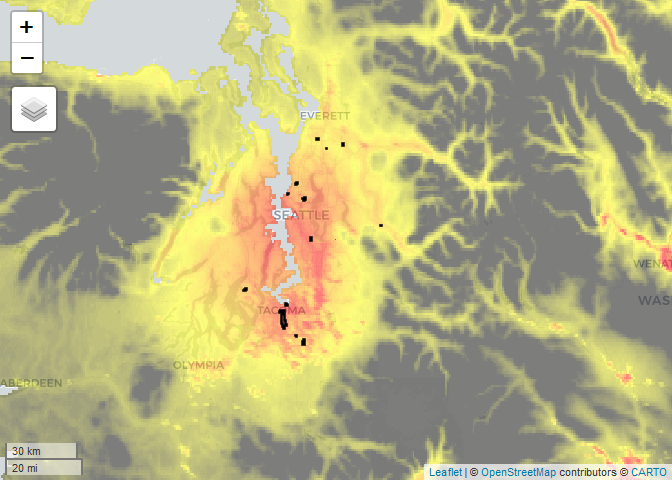

Get Predictors
================

<!-- ## Header --------------------------- -->
<!-- ## -->
<!-- ## Script name:get_predictors.R -->
<!-- ## -->
<!-- ## Abstract: This script is used to get landscape predictors from Google Earth Engine -->
<!-- ## for use in stormwaterheatmap regressions. -->
<!-- ## -->
<!-- ## Author: Christian Nilsen, Geosyntec Consultants -->
<!-- ## Email: cnilsen@geosyntec.com -->
<!-- ## -->
<!-- ## Date Created: 2021-01-24, Christian Nilsen -->
<!-- ## Date Modified: 2021-05-12, Eva Dusek Jennings -->
<!-- ## -->
<!-- ## Copyright (c) Geosyntec Consultants, 2021 -->
<!-- ## -->
<!-- ## -->
<!-- ## This program is free software: you can redistribute it and/or modify -->
<!-- ## it under the terms of the GNU General Public License as published by -->
<!-- ## the Free Software Foundation, version 3.0 -->
<!-- ## -->
<!-- ## This program is distributed in the hope that it will be useful, -->
<!-- ## but WITHOUT ANY WARRANTY; without even the implied warranty of -->
<!-- ## MERCHANTABILITY or FITNESS FOR A PARTICULAR PURPOSE.  See the -->
<!-- ## GNU General Public License for more details. -->
<!-- ## For a copy of the GNU General Public License -->
<!-- ##  see <https://www.gnu.org/licenses/>. -->
<!-- ## -->

## Watershed Polygons

New - watershed buffers  
Use the following links to switch between watershed polygons and
buffered polygons. These may be useful for including data (especially
air quality) outside of watershed bounds.

``` r
#links to feature collections. 
sheds_no_buffer <- "users/stormwaterheatmap/revised_s8_watersheds_v4"
buffered_sheds_500m <- "users/stormwaterheatmap/buffered_sheds_500m"
buffered_sheds_1k <- "users/stormwaterheatmap/buffered_sheds_1k"
buffered_sheds_2k <- "users/stormwaterheatmap/buffered_sheds_2k"
buffered_sheds_3k <- "users/stormwaterheatmap/buffered_sheds_3k"

shed_url <- buffered_sheds_3k # change this to update watershed feature layer

watersheds <- ee$FeatureCollection(sheds_no_buffer)$select(c("Location_N"), c("Location")) # 
```

# Get Predictor images from earth engine

## Tree cover, traffic, population, slope

``` r
## 
## trees
tree_cover <- ee$Image("USGS/NLCD/NLCD2016")$select("percent_tree_cover")

## traffic
traffic <- ee$Image(0)$blend(ee$Image("users/cnilsen/traffic_raw"))$rename("traffic")

## population density
population <- ee$Image("users/stormwaterheatmap/population_per_ha")
# slope

elevation <- ee$Image("USGS/NED") 
slope <- ee$Terrain$slope(elevation)
```

## Land Cover

The tnc\_landcover image can also be used for the following values:
`[0, 1, 2, 3, 4,5, 6, 7]`

`labels: [ 'No data', 'Grass/Low Vegetation', 'Shrub/Medium Vegetation', 'Trees/Forest', 'Bare soil', 'Water', 'Impervious – Except Roofs', 'Impervious - Roofs']`

``` r
## imperviousness:

tnc_landcover <-ee$Image("users/jrobertson2000/psLandCover_1m_finPS_roofs") 
impervious <-tnc_landcover$eq(6)$Or(tnc_landcover$eq(7))$rename("impervious") #
 #(excl roofs) is coded as 6; roofs are coded as 7; this
#imperviousness is both combined imp_ground 
impervious<-tnc_landcover$eq(6)$rename("imperv_ground") # roads & parking areas &sidewalks; 

roofs <- tnc_landcover$eq(7)
# Christian wouldn't do roads separately-- too correlated with
# impervious & traffic 
imp_roofs <-tnc_landcover$eq(7)$rename("imperv_roofs") 
grass_low_veg <-tnc_landcover$eq(1)$rename("grass_low_veg")
```

## Coarse Air Quality

### PM2.5

PM2.5: Global Annual PM2.5 Grids from MODIS, MISR and SeaWiFS Aerosol
Optical Depth (AOD) with GWR, v1 (1998 – 2016)

See:
<https://sedac.ciesin.columbia.edu/data/set/sdei-global-annual-gwr-pm2-5-modis-misr-seawifs-aod>

### NO2

Global 3-Year Running Mean Ground-Level NO2 Grids from GOME, SCIAMACHY
and GOME-2, v1 (1996 – 2012) See
<https://sedac.ciesin.columbia.edu/data/set/sdei-global-3-year-running-mean-no2-gome-sciamachy-gome2>

``` r
no2 <-ee$Image("users/stormwaterheatmap/SURFACE_NO2_010x010_2010")$rename("NO_2")
pm25 <-ee$Image("users/cnilsen/pm25clipped")$rename("pm25")
```

## Age of development

**Updated Layer** See:
<https://ghsl.jrc.ec.europa.eu/download.php?ds=bu>

``` r
devAge_image = ee$Image("users/stormwaterheatmap/GHS_BUILT_LDSMT_GLOBE_R2018A_3857_30_V2_0_4_7")$rename("built") 

age_of_development <- devAge_image$select("built")$rename("mean_dev_age") #mean value; this one is confusing b/c value of 2=no development
no_dev <-devAge_image$select("built")$eq(2)$rename("no_dev")
# proportion that has no development 
age_2000_2014 <-devAge_image$select("built")$eq(3)$rename("dev_2000_2014")
# proportion that was built in 2000-2014 
age_1990_2000 <-devAge_image$select("built")$eq(4)$rename("dev_1990_2000")
# proportion that was built in 1990-2000 
age_1975_1990 <-devAge_image$select("built")$eq(5)$rename("dev_1975_1990")
# proportion that was built in 1975-1990 
age_pre_1975 <-devAge_image$select("built")$eq(6)$rename("dev_pre_1975")
# proportion that was built pre-1975
```

# Commerce landuse data

source:
//<https://www.commerce.wa.gov/serving-communities/growth-management/puget-sound-mapping-project/>

| MASTER\_CAT                        | Master\_num |
|------------------------------------|-------------|
| Undesignated                       | 0           |
| AgriculturalArea                   | 1           |
| Tribal                             | 2           |
| ForestLands                        | 3           |
| IntensiveUrban                     | 4           |
| RuralCharacterResidential          | 5           |
| Water                              | 6           |
| PROW                               | 7           |
| ROW                                | 8           |
| ActiveOpenSpaceandRecreation       | 9           |
| UrbanCharacterResidential          | 10          |
| Industrial                         | 11          |
| Public                             | 12          |
| NaturalPreservationandConservation | 13          |
| Military                           | 14          |
| MineralResourceArea                | 15          |

<details>
<summary>
actual landuses in our sampling data set:
</summary>

    {
      "list": [
        [
          "KICLDRS8D_OUT",
          {
            "5": 2.3058823529411767
          }
        ],
        [
          "KICHDRS8D_OUT",
          {
            "0": 4.254901960784314,
            "7": 0.3803921568627451
          }
        ],
        [
          "SEAI1S8D_OUT",
          {
            "0": 8.737254901960785,
            "4": 30.10980392156863,
            "7": 9.952941176470588,
            "8": 25.392156862745093,
            "10": 18.462745098039214,
            "11": 4.305882352941176
          }
        ],
        [
          "PIEHIRES_OUT",
          {
            "4": 1.6392156862745098,
            "7": 7.313725490196079,
            "8": 38.48235294117647,
            "9": 6.580392156862745,
            "10": 131.32941176470592
          }
        ],
        [
          "PIELORES_OUT",
          {
            "5": 61.08627450980394
          }
        ],
        [
          "SNO_COM",
          {
            "4": 59.47450980392157
          }
        ],
        [
          "SNO_LDR",
          {
            "1": 14.36078431372549,
            "5": 14.972549019607843,
            "7": 1.2431372549019608,
            "8": 12.329411764705883
          }
        ],
        [
          "SEAC1S8D_OUT",
          {
            "4": 105.52549019607841,
            "8": 3.423529411764706
          }
        ],
        [
          "POSOUTFALL_60",
          {
            "4": 11.647058823529411,
            "6": 0.49411764705882355
          }
        ],
        [
          "SEAR1S8D_OUT",
          {
            "4": 15.231372549019605,
            "7": 0.25098039215686274,
            "8": 34.53725490196078,
            "10": 1.4627450980392156
          }
        ],
        [
          "POT564S8D_OUT",
          {
            "6": 29.54509803921568,
            "7": 2.250980392156863,
            "8": 0.2,
            "11": 37.20392156862745
          }
        ],
        [
          "PIECOMM_OUT",
          {
            "4": 7.1960784313725465
          }
        ],
        [
          "SNO_HDR",
          {
            "0": 0.7490196078431373,
            "8": 11.423529411764704
          }
        ],
        [
          "KICCOMS8D_OUT",
          {
            "0": 3.3019607843137253,
            "7": 0.11764705882352941
          }
        ],
        [
          "TAC001S8D_OF235",
          {
            "4": 97.25882352941176,
            "5": 1.3607843137254902,
            "6": 0.09803921568627451,
            "7": 0.050980392156862744
          }
        ],
        [
          "TAC003S8D_OF245",
          {
            "4": 4.423529411764706,
            "6": 0.10196078431372549,
            "7": 0.10588235294117647,
            "8": 16.91764705882353,
            "11": 1.615686274509804
          }
        ],
        [
          "TFWFD1",
          {
            "0": 8.796078431372548,
            "4": 255.20000000000005,
            "5": 5.870588235294116,
            "7": 85.6,
            "8": 722.2431372549016,
            "10": 104.77254901960785,
            "11": 3
          }
        ]
      ]
    }

</details>

``` r
landuse_table <-ee$FeatureCollection("users/stormwaterheatmap/psrc_landuse")


landuse <- landuse_table$reduceToImage(list("Master_num"),ee$Reducer$first())$rename("landuseCode")

# percent landuse

percent.residential <- landuse$eq(10)$rename("RES") 
percent.industrial<- landuse$eq(11)$rename("IND")
percent.commercial <- landuse$eq(4)$rename("COM") 
percent.rural_res <-landuse$eq(5)$rename("RURES") 
percent.row <-landuse$eq(7)$Or(landuse$eq(8))$rename("ROW")
```

## Roofs by land use

``` r
# make a binary image of roofs 1 = roof, 0 = not roof

# intersect roofs and landuse values

roofs_landuse <- landuse$multiply(roofs)$selfMask() 
percent.roofs.RES<- roofs_landuse$eq(10)$rename("roof_RES") 
percent.roofs.IND <-roofs_landuse$eq(11)$rename("roof_IND")

# percent.roofs.TRANS <- roofs_landuse$eq(3)$rename("roof_TRANS")

percent.roofs.COM <- roofs_landuse$eq(4)$rename("roof_COM")
percent.roofs.AG_TIMBER <-
roofs_landuse$eq(1)$Or(roofs_landuse$eq(3))$rename("roof_AG")
```

## Carbon Emissions

**From Gurney, K.R., J. Liang, R. Patarasuk, Y. Song, J. Huang, and G.
Roest. 2019. Vulcan: High-Resolution Annual Fossil Fuel CO2 Emissions in
USA, 2010-2015, Version 3. ORNL DAAC, Oak Ridge, Tennessee, USA.**
<https://doi.org/10.3334/ORNLDAAC/1741>

| Sector Code | Description                             |
|-------------|-----------------------------------------|
| airport     | Airport sector (taxi/takeoff to 3000’)  |
| cement      | Cement production sector                |
| cmv         | Commercial Marine Vessel sector         |
| commercial  | Commercial sector                       |
| elec\_prod  | Electricity production sector           |
| industrial  | Industrial sector                       |
| nonroad     | Nonroad sector (e.g. snowmobiles, ATVs) |
| onroad      | Onroad sector                           |
| railroad    | Railroad sector                         |
| residential | Residential sector                      |
| total       | Total emissions                         |

``` r
# CO Emissions ------------------------------------------------------------
Vulcan_total <-ee$Image("users/stormwaterheatmap/Vulcan_total")$reduce("mean")$rename("CO_emissions_total")
Vulcan_airport <-ee$Image("users/stormwaterheatmap/Vulcan_airport")$reduce("mean")$rename("CO_emissions_airport")
Vulcan_cmv <-ee$Image("users/stormwaterheatmap/Vulcan_cmv")$reduce("mean")$rename("CO_emissions_cmv")
Vulcan_commercial <-ee$Image("users/stormwaterheatmap/Vulcan_commercial")$reduce("mean")$rename("CO_emissions_commercial")
Vulcan_residential <-ee$Image("users/stormwaterheatmap/Vulcan_residential")$reduce("mean")$rename("CO_emissions_residential")
Vulcan_industrial <-ee$Image("users/stormwaterheatmap/Vulcan_industrial")$reduce("mean")$rename("CO_emissions_industrial")
Vulcan_nonroad <-ee$Image("users/stormwaterheatmap/Vulcan_nonroad")$reduce("mean")$rename("CO_emissions_nonroad")
Vulcan_onroad <-ee$Image("users/stormwaterheatmap/Vulcan_onroad")$reduce("mean")$rename("CO_emissions_onroad")
Vulcan_rail <-ee$Image("users/stormwaterheatmap/Vulcan_rail")$reduce("mean")$rename("CO_emissions_rail")
```

``` r
# Surface Air Quality ----------------------------------------------
v4_pm25 <-ee$Image("users/stormwaterheatmap/V4NA03_PM25_NA_201001_201012-RH35-NoNegs")$rename("PM25_NA")
sa <-ee$Image("users/stormwaterheatmap/surface_area")$rename("particulate_surface_area")
```

Make Map for One Predictor

``` r
# Make Map for One Predictor -----------------------------------------------

map_image <- v4_pm25 #  
map_viz <- list(min = 2, max = 7,palette = list("black", "yellow", "red"), opacity = 0.5)
Map$centerObject(eeObject = watersheds, zoom = 8)
```

    ## NOTE: Center obtained from the first element.

``` r
Map$addLayer(map_image, visParams = map_viz) + Map$addLayer(watersheds)
```

<!-- -->

# Reduce Predictors

``` r
# Reduce Predictors -------------------------------------------------------

## combine predictors in one dataset (one band each) - this is an image

predictors <- ee$Image(0)$blend(
  ee$Image$cat
  (
  age_1975_1990, 
  age_1990_2000,
  age_2000_2014, 
  age_pre_1975, 
  grass_low_veg, 
  imp_roofs, 
  impervious,
  no_dev, 
  no2, 
  percent.commercial,
  percent.industrial,
  percent.residential,
  percent.roofs.COM,
  percent.roofs.IND, 
  percent.roofs.RES, # percent.roofs.TRANS, #
  percent.row,
  percent.rural_res,
  pm25, 
  population, 
  sa,
  slope, 
  traffic,
  tree_cover, 
  v4_pm25, 
  Vulcan_commercial, 
  Vulcan_nonroad, 
  Vulcan_onroad,
  Vulcan_residential, 
  Vulcan_total
)
)

## calculate mean stats from earth engine

ee_stats <- predictors$reduceRegions( collection = watersheds, # this
#is what we gave it for 16 watersheds; Christian has one for Puget
#Lowlands; will try in Sandbox to see if it works 
scale = 30, # 30m per pixel
reducer = ee$Reducer$mean() )

# evaluate ee object - pulls data from server to client

ee_df <- ee_stats$getInfo()

# wrangle the data

df_predictors <- ee_df$features %>% # band names diff't than image#names; constant is traffic 
map("properties") %>% rbindlist(fill = TRUE) %>% select(Location_N, everything())

# built refers to buildup index. Those are categorical data - maybe shouldn't be averaged?
```

# Results

``` r
# Results -----------------------------------------------------------------

#View(df_predictors)

# pivot for charting

df_long <- df_predictors %>% pivot_longer(cols = -c(Location_N),names_to = "predictor")
df_transposed <- df_predictors %>%
  # tibble::rownames_to_column() %>%  
   pivot_longer(-Location_N,names_to = "predictor") %>% 
   pivot_wider(names_from=Location_N, values_from=value) 
# plot value of each predictor for the 16 watersheds

# ggplot(df_long) + geom_col(aes(x = Location_N, y = value), fill =
# "cadetBlue", position = "dodge") + facet_wrap(~predictor, scales = "free")

predictors_list <- split(df_long$value, df_long$predictor)

df_transposed %>% add_column('boxplot' = "",.before=2) %>% 
  add_column('histogram' = "",.before=2) %>% 
  kable(digits = 2) %>%
  kable_paper(full_width = TRUE,html_font = "serif") %>%
  column_spec(2, image = spec_hist(predictors_list,same_lim = FALSE)) %>% 
  column_spec(3, image = spec_boxplot(predictors_list,same_lim = FALSE))
```

<table class=" lightable-paper" style="font-family: serif; margin-left: auto; margin-right: auto;">
<thead>
<tr>
<th style="text-align:left;">
predictor
</th>
<th style="text-align:left;">
histogram
</th>
<th style="text-align:left;">
boxplot
</th>
<th style="text-align:right;">
KICLDRS8D\_OUT
</th>
<th style="text-align:right;">
KICHDRS8D\_OUT
</th>
<th style="text-align:right;">
SEAI1S8D\_OUT
</th>
<th style="text-align:right;">
PIEHIRES\_OUT
</th>
<th style="text-align:right;">
PIELORES\_OUT
</th>
<th style="text-align:right;">
SNO\_COM
</th>
<th style="text-align:right;">
SNO\_LDR
</th>
<th style="text-align:right;">
SEAC1S8D\_OUT
</th>
<th style="text-align:right;">
POSOUTFALL\_60
</th>
<th style="text-align:right;">
SEAR1S8D\_OUT
</th>
<th style="text-align:right;">
POT564S8D\_OUT
</th>
<th style="text-align:right;">
PIECOMM\_OUT
</th>
<th style="text-align:right;">
SNO\_HDR
</th>
<th style="text-align:right;">
KICCOMS8D\_OUT
</th>
<th style="text-align:right;">
TAC001S8D\_OF235
</th>
<th style="text-align:right;">
TAC003S8D\_OF245
</th>
<th style="text-align:right;">
TFWFD1
</th>
</tr>
</thead>
<tbody>
<tr>
<td style="text-align:left;">
COM
</td>
<td style="text-align:left;">
<svg xmlns="http://www.w3.org/2000/svg" xmlns:xlink="http://www.w3.org/1999/xlink" class="svglite" width="48.00pt" height="12.00pt" viewbox="0 0 48.00 12.00">
<defs>
<style type="text/css">
    .svglite line, .svglite polyline, .svglite polygon, .svglite path, .svglite rect, .svglite circle {
      fill: none;
      stroke: #000000;
      stroke-linecap: round;
      stroke-linejoin: round;
      stroke-miterlimit: 10.00;
    }
  </style>
</defs><rect width="100%" height="100%" style="stroke: none; fill: none;"></rect><defs><clippath id="cpMC4wMHw0OC4wMHwwLjAwfDEyLjAw"><rect x="0.00" y="0.00" width="48.00" height="12.00"></rect></clippath></defs><g clip-path="url(#cpMC4wMHw0OC4wMHwwLjAwfDEyLjAw)">
</g><defs><clippath id="cpMC4wMHw0OC4wMHwyLjg4fDEyLjAw"><rect x="0.00" y="2.88" width="48.00" height="9.12"></rect></clippath></defs><g clip-path="url(#cpMC4wMHw0OC4wMHwyLjg4fDEyLjAw)"><rect x="1.51" y="3.22" width="11.68" height="8.44" style="stroke-width: 0.38; fill: #D3D3D3;"></rect><rect x="13.19" y="11.06" width="11.68" height="0.60" style="stroke-width: 0.38; fill: #D3D3D3;"></rect><rect x="24.87" y="11.06" width="11.68" height="0.60" style="stroke-width: 0.38; fill: #D3D3D3;"></rect><rect x="36.55" y="11.06" width="11.68" height="0.60" style="stroke-width: 0.38; fill: #D3D3D3;"></rect></g>
</svg>
</td>
<td style="text-align:left;">
<svg xmlns="http://www.w3.org/2000/svg" xmlns:xlink="http://www.w3.org/1999/xlink" class="svglite" width="48.00pt" height="12.00pt" viewBox="0 0 48.00 12.00">
<defs>
<style type="text/css">
    .svglite line, .svglite polyline, .svglite polygon, .svglite path, .svglite rect, .svglite circle {
      fill: none;
      stroke: #000000;
      stroke-linecap: round;
      stroke-linejoin: round;
      stroke-miterlimit: 10.00;
    }
  </style>
</defs><rect width="100%" height="100%" style="stroke: none; fill: none;"></rect><defs><clipPath id="cpMC4wMHw0OC4wMHwwLjAwfDEyLjAw"><rect x="0.00" y="0.00" width="48.00" height="12.00"></rect></clipPath></defs><g clip-path="url(#cpMC4wMHw0OC4wMHwwLjAwfDEyLjAw)"><polygon points="6.12,8.22 6.12,3.78 10.43,3.78 10.43,8.22 " style="stroke-width: 0.75; stroke: none; fill: #D3D3D3;"></polygon><line x1="8.96" y1="8.22" x2="8.96" y2="3.78" style="stroke-width: 0.75; stroke: #FF0000; stroke-linecap: butt;"></line><line x1="5.45" y1="6.00" x2="6.12" y2="6.00" style="stroke-width: 0.75;"></line><line x1="16.88" y1="6.00" x2="10.43" y2="6.00" style="stroke-width: 0.75;"></line><line x1="5.45" y1="7.11" x2="5.45" y2="4.89" style="stroke-width: 0.75;"></line><line x1="16.88" y1="7.11" x2="16.88" y2="4.89" style="stroke-width: 0.75;"></line><circle cx="42.18" cy="6.00" r="0.54" style="stroke-width: 0.75;"></circle><circle cx="26.11" cy="6.00" r="0.54" style="stroke-width: 0.75;"></circle></g>
</svg>
</td>
<td style="text-align:right;">
0.00
</td>
<td style="text-align:right;">
0.00
</td>
<td style="text-align:right;">
0.24
</td>
<td style="text-align:right;">
0.01
</td>
<td style="text-align:right;">
0.00
</td>
<td style="text-align:right;">
1.00
</td>
<td style="text-align:right;">
0.00
</td>
<td style="text-align:right;">
0.93
</td>
<td style="text-align:right;">
0.85
</td>
<td style="text-align:right;">
0.15
</td>
<td style="text-align:right;">
0.00
</td>
<td style="text-align:right;">
1.00
</td>
<td style="text-align:right;">
0.00
</td>
<td style="text-align:right;">
0.09
</td>
<td style="text-align:right;">
0.94
</td>
<td style="text-align:right;">
0.17
</td>
<td style="text-align:right;">
0.18
</td>
</tr>
<tr>
<td style="text-align:left;">
CO\_emissions\_commercial
</td>
<td style="text-align:left;">
<svg xmlns="http://www.w3.org/2000/svg" xmlns:xlink="http://www.w3.org/1999/xlink" class="svglite" width="48.00pt" height="12.00pt" viewbox="0 0 48.00 12.00">
<defs>
<style type="text/css">
    .svglite line, .svglite polyline, .svglite polygon, .svglite path, .svglite rect, .svglite circle {
      fill: none;
      stroke: #000000;
      stroke-linecap: round;
      stroke-linejoin: round;
      stroke-miterlimit: 10.00;
    }
  </style>
</defs><rect width="100%" height="100%" style="stroke: none; fill: none;"></rect><defs><clippath id="cpMC4wMHw0OC4wMHwwLjAwfDEyLjAw"><rect x="0.00" y="0.00" width="48.00" height="12.00"></rect></clippath></defs><g clip-path="url(#cpMC4wMHw0OC4wMHwwLjAwfDEyLjAw)">
</g><defs><clippath id="cpMC4wMHw0OC4wMHwyLjg4fDEyLjAw"><rect x="0.00" y="2.88" width="48.00" height="9.12"></rect></clippath></defs><g clip-path="url(#cpMC4wMHw0OC4wMHwyLjg4fDEyLjAw)"><rect x="0.51" y="3.22" width="5.38" height="8.44" style="stroke-width: 0.38; fill: #D3D3D3;"></rect><rect x="5.89" y="3.22" width="5.38" height="8.44" style="stroke-width: 0.38; fill: #D3D3D3;"></rect><rect x="11.28" y="10.25" width="5.38" height="1.41" style="stroke-width: 0.38; fill: #D3D3D3;"></rect><rect x="16.66" y="10.25" width="5.38" height="1.41" style="stroke-width: 0.38; fill: #D3D3D3;"></rect><rect x="22.04" y="10.25" width="5.38" height="1.41" style="stroke-width: 0.38; fill: #D3D3D3;"></rect><rect x="27.42" y="11.66" width="5.38" height="0.00" style="stroke-width: 0.38; fill: #D3D3D3;"></rect><rect x="32.80" y="10.25" width="5.38" height="1.41" style="stroke-width: 0.38; fill: #D3D3D3;"></rect><rect x="38.18" y="11.66" width="5.38" height="0.00" style="stroke-width: 0.38; fill: #D3D3D3;"></rect><rect x="43.56" y="10.25" width="5.38" height="1.41" style="stroke-width: 0.38; fill: #D3D3D3;"></rect></g>
</svg>
</td>
<td style="text-align:left;">
<svg xmlns="http://www.w3.org/2000/svg" xmlns:xlink="http://www.w3.org/1999/xlink" class="svglite" width="48.00pt" height="12.00pt" viewBox="0 0 48.00 12.00">
<defs>
<style type="text/css">
    .svglite line, .svglite polyline, .svglite polygon, .svglite path, .svglite rect, .svglite circle {
      fill: none;
      stroke: #000000;
      stroke-linecap: round;
      stroke-linejoin: round;
      stroke-miterlimit: 10.00;
    }
  </style>
</defs><rect width="100%" height="100%" style="stroke: none; fill: none;"></rect><defs><clipPath id="cpMC4wMHw0OC4wMHwwLjAwfDEyLjAw"><rect x="0.00" y="0.00" width="48.00" height="12.00"></rect></clipPath></defs><g clip-path="url(#cpMC4wMHw0OC4wMHwwLjAwfDEyLjAw)"><polygon points="8.42,8.22 8.42,3.78 13.78,3.78 13.78,8.22 " style="stroke-width: 0.75; stroke: none; fill: #D3D3D3;"></polygon><line x1="11.01" y1="8.22" x2="11.01" y2="3.78" style="stroke-width: 0.75; stroke: #FF0000; stroke-linecap: butt;"></line><line x1="5.45" y1="6.00" x2="8.42" y2="6.00" style="stroke-width: 0.75;"></line><line x1="18.85" y1="6.00" x2="13.78" y2="6.00" style="stroke-width: 0.75;"></line><line x1="5.45" y1="7.11" x2="5.45" y2="4.89" style="stroke-width: 0.75;"></line><line x1="18.85" y1="7.11" x2="18.85" y2="4.89" style="stroke-width: 0.75;"></line><circle cx="34.67" cy="6.00" r="0.54" style="stroke-width: 0.75;"></circle><circle cx="42.18" cy="6.00" r="0.54" style="stroke-width: 0.75;"></circle><circle cx="25.54" cy="6.00" r="0.54" style="stroke-width: 0.75;"></circle></g>
</svg>
</td>
<td style="text-align:right;">
26.50
</td>
<td style="text-align:right;">
46.19
</td>
<td style="text-align:right;">
199.51
</td>
<td style="text-align:right;">
35.13
</td>
<td style="text-align:right;">
11.27
</td>
<td style="text-align:right;">
603.41
</td>
<td style="text-align:right;">
29.96
</td>
<td style="text-align:right;">
1914.27
</td>
<td style="text-align:right;">
264.80
</td>
<td style="text-align:right;">
466.29
</td>
<td style="text-align:right;">
193.24
</td>
<td style="text-align:right;">
115.90
</td>
<td style="text-align:right;">
85.62
</td>
<td style="text-align:right;">
47.86
</td>
<td style="text-align:right;">
1081.82
</td>
<td style="text-align:right;">
269.12
</td>
<td style="text-align:right;">
225.90
</td>
</tr>
<tr>
<td style="text-align:left;">
CO\_emissions\_nonroad
</td>
<td style="text-align:left;">
<svg xmlns="http://www.w3.org/2000/svg" xmlns:xlink="http://www.w3.org/1999/xlink" class="svglite" width="48.00pt" height="12.00pt" viewbox="0 0 48.00 12.00">
<defs>
<style type="text/css">
    .svglite line, .svglite polyline, .svglite polygon, .svglite path, .svglite rect, .svglite circle {
      fill: none;
      stroke: #000000;
      stroke-linecap: round;
      stroke-linejoin: round;
      stroke-miterlimit: 10.00;
    }
  </style>
</defs><rect width="100%" height="100%" style="stroke: none; fill: none;"></rect><defs><clippath id="cpMC4wMHw0OC4wMHwwLjAwfDEyLjAw"><rect x="0.00" y="0.00" width="48.00" height="12.00"></rect></clippath></defs><g clip-path="url(#cpMC4wMHw0OC4wMHwwLjAwfDEyLjAw)">
</g><defs><clippath id="cpMC4wMHw0OC4wMHwyLjg4fDEyLjAw"><rect x="0.00" y="2.88" width="48.00" height="9.12"></rect></clippath></defs><g clip-path="url(#cpMC4wMHw0OC4wMHwyLjg4fDEyLjAw)"><rect x="0.91" y="3.22" width="5.73" height="8.44" style="stroke-width: 0.38; fill: #D3D3D3;"></rect><rect x="6.63" y="9.79" width="5.73" height="1.88" style="stroke-width: 0.38; fill: #D3D3D3;"></rect><rect x="12.36" y="8.85" width="5.73" height="2.81" style="stroke-width: 0.38; fill: #D3D3D3;"></rect><rect x="18.09" y="10.72" width="5.73" height="0.94" style="stroke-width: 0.38; fill: #D3D3D3;"></rect><rect x="23.82" y="11.66" width="5.73" height="0.00" style="stroke-width: 0.38; fill: #D3D3D3;"></rect><rect x="29.54" y="11.66" width="5.73" height="0.00" style="stroke-width: 0.38; fill: #D3D3D3;"></rect><rect x="35.27" y="10.72" width="5.73" height="0.94" style="stroke-width: 0.38; fill: #D3D3D3;"></rect><rect x="41.00" y="10.72" width="5.73" height="0.94" style="stroke-width: 0.38; fill: #D3D3D3;"></rect></g>
</svg>
</td>
<td style="text-align:left;">
<svg xmlns="http://www.w3.org/2000/svg" xmlns:xlink="http://www.w3.org/1999/xlink" class="svglite" width="48.00pt" height="12.00pt" viewBox="0 0 48.00 12.00">
<defs>
<style type="text/css">
    .svglite line, .svglite polyline, .svglite polygon, .svglite path, .svglite rect, .svglite circle {
      fill: none;
      stroke: #000000;
      stroke-linecap: round;
      stroke-linejoin: round;
      stroke-miterlimit: 10.00;
    }
  </style>
</defs><rect width="100%" height="100%" style="stroke: none; fill: none;"></rect><defs><clipPath id="cpMC4wMHw0OC4wMHwwLjAwfDEyLjAw"><rect x="0.00" y="0.00" width="48.00" height="12.00"></rect></clipPath></defs><g clip-path="url(#cpMC4wMHw0OC4wMHwwLjAwfDEyLjAw)"><polygon points="6.33,8.22 6.33,3.78 16.49,3.78 16.49,8.22 " style="stroke-width: 0.75; stroke: none; fill: #D3D3D3;"></polygon><line x1="9.41" y1="8.22" x2="9.41" y2="3.78" style="stroke-width: 0.75; stroke: #FF0000; stroke-linecap: butt;"></line><line x1="5.45" y1="6.00" x2="6.33" y2="6.00" style="stroke-width: 0.75;"></line><line x1="19.80" y1="6.00" x2="16.49" y2="6.00" style="stroke-width: 0.75;"></line><line x1="5.45" y1="7.11" x2="5.45" y2="4.89" style="stroke-width: 0.75;"></line><line x1="19.80" y1="7.11" x2="19.80" y2="4.89" style="stroke-width: 0.75;"></line><circle cx="35.38" cy="6.00" r="0.54" style="stroke-width: 0.75;"></circle><circle cx="42.18" cy="6.00" r="0.54" style="stroke-width: 0.75;"></circle></g>
</svg>
</td>
<td style="text-align:right;">
90.22
</td>
<td style="text-align:right;">
31.20
</td>
<td style="text-align:right;">
148.45
</td>
<td style="text-align:right;">
165.35
</td>
<td style="text-align:right;">
23.50
</td>
<td style="text-align:right;">
680.58
</td>
<td style="text-align:right;">
32.35
</td>
<td style="text-align:right;">
849.41
</td>
<td style="text-align:right;">
98.19
</td>
<td style="text-align:right;">
324.77
</td>
<td style="text-align:right;">
153.46
</td>
<td style="text-align:right;">
116.73
</td>
<td style="text-align:right;">
105.13
</td>
<td style="text-align:right;">
32.16
</td>
<td style="text-align:right;">
475.21
</td>
<td style="text-align:right;">
187.75
</td>
<td style="text-align:right;">
210.78
</td>
</tr>
<tr>
<td style="text-align:left;">
CO\_emissions\_onroad
</td>
<td style="text-align:left;">
<svg xmlns="http://www.w3.org/2000/svg" xmlns:xlink="http://www.w3.org/1999/xlink" class="svglite" width="48.00pt" height="12.00pt" viewbox="0 0 48.00 12.00">
<defs>
<style type="text/css">
    .svglite line, .svglite polyline, .svglite polygon, .svglite path, .svglite rect, .svglite circle {
      fill: none;
      stroke: #000000;
      stroke-linecap: round;
      stroke-linejoin: round;
      stroke-miterlimit: 10.00;
    }
  </style>
</defs><rect width="100%" height="100%" style="stroke: none; fill: none;"></rect><defs><clippath id="cpMC4wMHw0OC4wMHwwLjAwfDEyLjAw"><rect x="0.00" y="0.00" width="48.00" height="12.00"></rect></clippath></defs><g clip-path="url(#cpMC4wMHw0OC4wMHwwLjAwfDEyLjAw)">
</g><defs><clippath id="cpMC4wMHw0OC4wMHwyLjg4fDEyLjAw"><rect x="0.00" y="2.88" width="48.00" height="9.12"></rect></clippath></defs><g clip-path="url(#cpMC4wMHw0OC4wMHwyLjg4fDEyLjAw)"><rect x="1.65" y="3.22" width="6.26" height="8.44" style="stroke-width: 0.38; fill: #D3D3D3;"></rect><rect x="7.90" y="6.38" width="6.26" height="5.28" style="stroke-width: 0.38; fill: #D3D3D3;"></rect><rect x="14.16" y="10.61" width="6.26" height="1.06" style="stroke-width: 0.38; fill: #D3D3D3;"></rect><rect x="20.42" y="11.66" width="6.26" height="0.00" style="stroke-width: 0.38; fill: #D3D3D3;"></rect><rect x="26.67" y="10.61" width="6.26" height="1.06" style="stroke-width: 0.38; fill: #D3D3D3;"></rect><rect x="32.93" y="10.61" width="6.26" height="1.06" style="stroke-width: 0.38; fill: #D3D3D3;"></rect><rect x="39.18" y="11.66" width="6.26" height="0.00" style="stroke-width: 0.38; fill: #D3D3D3;"></rect><rect x="45.44" y="10.61" width="6.26" height="1.06" style="stroke-width: 0.38; fill: #D3D3D3;"></rect></g>
</svg>
</td>
<td style="text-align:left;">
<svg xmlns="http://www.w3.org/2000/svg" xmlns:xlink="http://www.w3.org/1999/xlink" class="svglite" width="48.00pt" height="12.00pt" viewBox="0 0 48.00 12.00">
<defs>
<style type="text/css">
    .svglite line, .svglite polyline, .svglite polygon, .svglite path, .svglite rect, .svglite circle {
      fill: none;
      stroke: #000000;
      stroke-linecap: round;
      stroke-linejoin: round;
      stroke-miterlimit: 10.00;
    }
  </style>
</defs><rect width="100%" height="100%" style="stroke: none; fill: none;"></rect><defs><clipPath id="cpMC4wMHw0OC4wMHwwLjAwfDEyLjAw"><rect x="0.00" y="0.00" width="48.00" height="12.00"></rect></clipPath></defs><g clip-path="url(#cpMC4wMHw0OC4wMHwwLjAwfDEyLjAw)"><polygon points="8.20,8.22 8.20,3.78 14.79,3.78 14.79,8.22 " style="stroke-width: 0.75; stroke: none; fill: #D3D3D3;"></polygon><line x1="11.40" y1="8.22" x2="11.40" y2="3.78" style="stroke-width: 0.75; stroke: #FF0000; stroke-linecap: butt;"></line><line x1="5.45" y1="6.00" x2="8.20" y2="6.00" style="stroke-width: 0.75;"></line><line x1="15.71" y1="6.00" x2="14.79" y2="6.00" style="stroke-width: 0.75;"></line><line x1="5.45" y1="7.11" x2="5.45" y2="4.89" style="stroke-width: 0.75;"></line><line x1="15.71" y1="7.11" x2="15.71" y2="4.89" style="stroke-width: 0.75;"></line><circle cx="32.09" cy="6.00" r="0.54" style="stroke-width: 0.75;"></circle><circle cx="42.18" cy="6.00" r="0.54" style="stroke-width: 0.75;"></circle><circle cx="30.28" cy="6.00" r="0.54" style="stroke-width: 0.75;"></circle></g>
</svg>
</td>
<td style="text-align:right;">
360.45
</td>
<td style="text-align:right;">
968.32
</td>
<td style="text-align:right;">
6475.34
</td>
<td style="text-align:right;">
327.66
</td>
<td style="text-align:right;">
151.96
</td>
<td style="text-align:right;">
1690.54
</td>
<td style="text-align:right;">
304.17
</td>
<td style="text-align:right;">
7912.25
</td>
<td style="text-align:right;">
338.50
</td>
<td style="text-align:right;">
1991.44
</td>
<td style="text-align:right;">
173.99
</td>
<td style="text-align:right;">
3182.76
</td>
<td style="text-align:right;">
954.53
</td>
<td style="text-align:right;">
987.45
</td>
<td style="text-align:right;">
2483.23
</td>
<td style="text-align:right;">
2751.29
</td>
<td style="text-align:right;">
2355.75
</td>
</tr>
<tr>
<td style="text-align:left;">
CO\_emissions\_residential
</td>
<td style="text-align:left;">
<svg xmlns="http://www.w3.org/2000/svg" xmlns:xlink="http://www.w3.org/1999/xlink" class="svglite" width="48.00pt" height="12.00pt" viewbox="0 0 48.00 12.00">
<defs>
<style type="text/css">
    .svglite line, .svglite polyline, .svglite polygon, .svglite path, .svglite rect, .svglite circle {
      fill: none;
      stroke: #000000;
      stroke-linecap: round;
      stroke-linejoin: round;
      stroke-miterlimit: 10.00;
    }
  </style>
</defs><rect width="100%" height="100%" style="stroke: none; fill: none;"></rect><defs><clippath id="cpMC4wMHw0OC4wMHwwLjAwfDEyLjAw"><rect x="0.00" y="0.00" width="48.00" height="12.00"></rect></clippath></defs><g clip-path="url(#cpMC4wMHw0OC4wMHwwLjAwfDEyLjAw)">
</g><defs><clippath id="cpMC4wMHw0OC4wMHwyLjg4fDEyLjAw"><rect x="0.00" y="2.88" width="48.00" height="9.12"></rect></clippath></defs><g clip-path="url(#cpMC4wMHw0OC4wMHwyLjg4fDEyLjAw)"><rect x="0.90" y="3.22" width="7.49" height="8.44" style="stroke-width: 0.38; fill: #D3D3D3;"></rect><rect x="8.39" y="7.44" width="7.49" height="4.22" style="stroke-width: 0.38; fill: #D3D3D3;"></rect><rect x="15.88" y="8.50" width="7.49" height="3.17" style="stroke-width: 0.38; fill: #D3D3D3;"></rect><rect x="23.37" y="10.61" width="7.49" height="1.06" style="stroke-width: 0.38; fill: #D3D3D3;"></rect><rect x="30.86" y="11.66" width="7.49" height="0.00" style="stroke-width: 0.38; fill: #D3D3D3;"></rect><rect x="38.35" y="11.66" width="7.49" height="0.00" style="stroke-width: 0.38; fill: #D3D3D3;"></rect><rect x="45.84" y="10.61" width="7.49" height="1.06" style="stroke-width: 0.38; fill: #D3D3D3;"></rect></g>
</svg>
</td>
<td style="text-align:left;">
<svg xmlns="http://www.w3.org/2000/svg" xmlns:xlink="http://www.w3.org/1999/xlink" class="svglite" width="48.00pt" height="12.00pt" viewBox="0 0 48.00 12.00">
<defs>
<style type="text/css">
    .svglite line, .svglite polyline, .svglite polygon, .svglite path, .svglite rect, .svglite circle {
      fill: none;
      stroke: #000000;
      stroke-linecap: round;
      stroke-linejoin: round;
      stroke-miterlimit: 10.00;
    }
  </style>
</defs><rect width="100%" height="100%" style="stroke: none; fill: none;"></rect><defs><clipPath id="cpMC4wMHw0OC4wMHwwLjAwfDEyLjAw"><rect x="0.00" y="0.00" width="48.00" height="12.00"></rect></clipPath></defs><g clip-path="url(#cpMC4wMHw0OC4wMHwwLjAwfDEyLjAw)"><polygon points="8.20,8.22 8.20,3.78 17.13,3.78 17.13,8.22 " style="stroke-width: 0.75; stroke: none; fill: #D3D3D3;"></polygon><line x1="14.62" y1="8.22" x2="14.62" y2="3.78" style="stroke-width: 0.75; stroke: #FF0000; stroke-linecap: butt;"></line><line x1="5.45" y1="6.00" x2="8.20" y2="6.00" style="stroke-width: 0.75;"></line><line x1="27.03" y1="6.00" x2="17.13" y2="6.00" style="stroke-width: 0.75;"></line><line x1="5.45" y1="7.11" x2="5.45" y2="4.89" style="stroke-width: 0.75;"></line><line x1="27.03" y1="7.11" x2="27.03" y2="4.89" style="stroke-width: 0.75;"></line><circle cx="42.18" cy="6.00" r="0.54" style="stroke-width: 0.75;"></circle></g>
</svg>
</td>
<td style="text-align:right;">
234.26
</td>
<td style="text-align:right;">
110.58
</td>
<td style="text-align:right;">
278.54
</td>
<td style="text-align:right;">
145.49
</td>
<td style="text-align:right;">
48.23
</td>
<td style="text-align:right;">
1034.80
</td>
<td style="text-align:right;">
68.46
</td>
<td style="text-align:right;">
1425.00
</td>
<td style="text-align:right;">
244.94
</td>
<td style="text-align:right;">
964.72
</td>
<td style="text-align:right;">
4.14
</td>
<td style="text-align:right;">
137.32
</td>
<td style="text-align:right;">
365.44
</td>
<td style="text-align:right;">
113.65
</td>
<td style="text-align:right;">
248.72
</td>
<td style="text-align:right;">
9.26
</td>
<td style="text-align:right;">
400.96
</td>
</tr>
<tr>
<td style="text-align:left;">
CO\_emissions\_total
</td>
<td style="text-align:left;">
<svg xmlns="http://www.w3.org/2000/svg" xmlns:xlink="http://www.w3.org/1999/xlink" class="svglite" width="48.00pt" height="12.00pt" viewbox="0 0 48.00 12.00">
<defs>
<style type="text/css">
    .svglite line, .svglite polyline, .svglite polygon, .svglite path, .svglite rect, .svglite circle {
      fill: none;
      stroke: #000000;
      stroke-linecap: round;
      stroke-linejoin: round;
      stroke-miterlimit: 10.00;
    }
  </style>
</defs><rect width="100%" height="100%" style="stroke: none; fill: none;"></rect><defs><clippath id="cpMC4wMHw0OC4wMHwwLjAwfDEyLjAw"><rect x="0.00" y="0.00" width="48.00" height="12.00"></rect></clippath></defs><g clip-path="url(#cpMC4wMHw0OC4wMHwwLjAwfDEyLjAw)">
</g><defs><clippath id="cpMC4wMHw0OC4wMHwyLjg4fDEyLjAw"><rect x="0.00" y="2.88" width="48.00" height="9.12"></rect></clippath></defs><g clip-path="url(#cpMC4wMHw0OC4wMHwyLjg4fDEyLjAw)"><rect x="1.78" y="3.22" width="8.89" height="8.44" style="stroke-width: 0.38; fill: #D3D3D3;"></rect><rect x="10.67" y="10.89" width="8.89" height="0.77" style="stroke-width: 0.38; fill: #D3D3D3;"></rect><rect x="19.56" y="11.66" width="8.89" height="0.00" style="stroke-width: 0.38; fill: #D3D3D3;"></rect><rect x="28.44" y="11.66" width="8.89" height="0.00" style="stroke-width: 0.38; fill: #D3D3D3;"></rect><rect x="37.33" y="7.82" width="8.89" height="3.84" style="stroke-width: 0.38; fill: #D3D3D3;"></rect></g>
</svg>
</td>
<td style="text-align:left;">
<svg xmlns="http://www.w3.org/2000/svg" xmlns:xlink="http://www.w3.org/1999/xlink" class="svglite" width="48.00pt" height="12.00pt" viewBox="0 0 48.00 12.00">
<defs>
<style type="text/css">
    .svglite line, .svglite polyline, .svglite polygon, .svglite path, .svglite rect, .svglite circle {
      fill: none;
      stroke: #000000;
      stroke-linecap: round;
      stroke-linejoin: round;
      stroke-miterlimit: 10.00;
    }
  </style>
</defs><rect width="100%" height="100%" style="stroke: none; fill: none;"></rect><defs><clipPath id="cpMC4wMHw0OC4wMHwwLjAwfDEyLjAw"><rect x="0.00" y="0.00" width="48.00" height="12.00"></rect></clipPath></defs><g clip-path="url(#cpMC4wMHw0OC4wMHwwLjAwfDEyLjAw)"><polygon points="5.45,8.22 5.45,3.78 36.56,3.78 36.56,8.22 " style="stroke-width: 0.75; stroke: none; fill: #D3D3D3;"></polygon><line x1="11.06" y1="8.22" x2="11.06" y2="3.78" style="stroke-width: 0.75; stroke: #FF0000; stroke-linecap: butt;"></line><line x1="5.45" y1="6.00" x2="5.45" y2="6.00" style="stroke-width: 0.75;"></line><line x1="42.18" y1="6.00" x2="36.56" y2="6.00" style="stroke-width: 0.75;"></line><line x1="5.45" y1="7.11" x2="5.45" y2="4.89" style="stroke-width: 0.75;"></line><line x1="42.18" y1="7.11" x2="42.18" y2="4.89" style="stroke-width: 0.75;"></line></g>
</svg>
</td>
<td style="text-align:right;">
711.44
</td>
<td style="text-align:right;">
1156.28
</td>
<td style="text-align:right;">
7207.10
</td>
<td style="text-align:right;">
673.63
</td>
<td style="text-align:right;">
234.95
</td>
<td style="text-align:right;">
4009.33
</td>
<td style="text-align:right;">
437.14
</td>
<td style="text-align:right;">
12102.01
</td>
<td style="text-align:right;">
1123.57
</td>
<td style="text-align:right;">
3749.56
</td>
<td style="text-align:right;">
4073.09
</td>
<td style="text-align:right;">
3552.72
</td>
<td style="text-align:right;">
1510.72
</td>
<td style="text-align:right;">
1181.13
</td>
<td style="text-align:right;">
4331.50
</td>
<td style="text-align:right;">
3547.78
</td>
<td style="text-align:right;">
3198.37
</td>
</tr>
<tr>
<td style="text-align:left;">
IND
</td>
<td style="text-align:left;">
<svg xmlns="http://www.w3.org/2000/svg" xmlns:xlink="http://www.w3.org/1999/xlink" class="svglite" width="48.00pt" height="12.00pt" viewbox="0 0 48.00 12.00">
<defs>
<style type="text/css">
    .svglite line, .svglite polyline, .svglite polygon, .svglite path, .svglite rect, .svglite circle {
      fill: none;
      stroke: #000000;
      stroke-linecap: round;
      stroke-linejoin: round;
      stroke-miterlimit: 10.00;
    }
  </style>
</defs><rect width="100%" height="100%" style="stroke: none; fill: none;"></rect><defs><clippath id="cpMC4wMHw0OC4wMHwwLjAwfDEyLjAw"><rect x="0.00" y="0.00" width="48.00" height="12.00"></rect></clippath></defs><g clip-path="url(#cpMC4wMHw0OC4wMHwwLjAwfDEyLjAw)">
</g><defs><clippath id="cpMC4wMHw0OC4wMHwyLjg4fDEyLjAw"><rect x="0.00" y="2.88" width="48.00" height="9.12"></rect></clippath></defs><g clip-path="url(#cpMC4wMHw0OC4wMHwyLjg4fDEyLjAw)"><rect x="1.78" y="3.22" width="9.46" height="8.44" style="stroke-width: 0.38; fill: #D3D3D3;"></rect><rect x="11.24" y="10.36" width="9.46" height="1.30" style="stroke-width: 0.38; fill: #D3D3D3;"></rect><rect x="20.70" y="11.66" width="9.46" height="0.00" style="stroke-width: 0.38; fill: #D3D3D3;"></rect><rect x="30.16" y="11.01" width="9.46" height="0.65" style="stroke-width: 0.38; fill: #D3D3D3;"></rect><rect x="39.62" y="11.01" width="9.46" height="0.65" style="stroke-width: 0.38; fill: #D3D3D3;"></rect></g>
</svg>
</td>
<td style="text-align:left;">
<svg xmlns="http://www.w3.org/2000/svg" xmlns:xlink="http://www.w3.org/1999/xlink" class="svglite" width="48.00pt" height="12.00pt" viewBox="0 0 48.00 12.00">
<defs>
<style type="text/css">
    .svglite line, .svglite polyline, .svglite polygon, .svglite path, .svglite rect, .svglite circle {
      fill: none;
      stroke: #000000;
      stroke-linecap: round;
      stroke-linejoin: round;
      stroke-miterlimit: 10.00;
    }
  </style>
</defs><rect width="100%" height="100%" style="stroke: none; fill: none;"></rect><defs><clipPath id="cpMC4wMHw0OC4wMHwwLjAwfDEyLjAw"><rect x="0.00" y="0.00" width="48.00" height="12.00"></rect></clipPath></defs><g clip-path="url(#cpMC4wMHw0OC4wMHwwLjAwfDEyLjAw)"><polygon points="6.12,8.22 6.12,3.78 9.61,3.78 9.61,8.22 " style="stroke-width: 0.75; stroke: none; fill: #D3D3D3;"></polygon><line x1="7.11" y1="8.22" x2="7.11" y2="3.78" style="stroke-width: 0.75; stroke: #FF0000; stroke-linecap: butt;"></line><line x1="5.45" y1="6.00" x2="6.12" y2="6.00" style="stroke-width: 0.75;"></line><line x1="13.31" y1="6.00" x2="9.61" y2="6.00" style="stroke-width: 0.75;"></line><line x1="5.45" y1="7.11" x2="5.45" y2="4.89" style="stroke-width: 0.75;"></line><line x1="13.31" y1="7.11" x2="13.31" y2="4.89" style="stroke-width: 0.75;"></line><circle cx="15.68" cy="6.00" r="0.54" style="stroke-width: 0.75;"></circle><circle cx="33.58" cy="6.00" r="0.54" style="stroke-width: 0.75;"></circle><circle cx="42.18" cy="6.00" r="0.54" style="stroke-width: 0.75;"></circle></g>
</svg>
</td>
<td style="text-align:right;">
0.00
</td>
<td style="text-align:right;">
0.00
</td>
<td style="text-align:right;">
0.14
</td>
<td style="text-align:right;">
0.00
</td>
<td style="text-align:right;">
0.00
</td>
<td style="text-align:right;">
0.00
</td>
<td style="text-align:right;">
0.00
</td>
<td style="text-align:right;">
0.00
</td>
<td style="text-align:right;">
0.00
</td>
<td style="text-align:right;">
0.00
</td>
<td style="text-align:right;">
0.64
</td>
<td style="text-align:right;">
0.00
</td>
<td style="text-align:right;">
0.00
</td>
<td style="text-align:right;">
0.00
</td>
<td style="text-align:right;">
0.00
</td>
<td style="text-align:right;">
0.39
</td>
<td style="text-align:right;">
0.00
</td>
</tr>
<tr>
<td style="text-align:left;">
NO\_2
</td>
<td style="text-align:left;">
<svg xmlns="http://www.w3.org/2000/svg" xmlns:xlink="http://www.w3.org/1999/xlink" class="svglite" width="48.00pt" height="12.00pt" viewbox="0 0 48.00 12.00">
<defs>
<style type="text/css">
    .svglite line, .svglite polyline, .svglite polygon, .svglite path, .svglite rect, .svglite circle {
      fill: none;
      stroke: #000000;
      stroke-linecap: round;
      stroke-linejoin: round;
      stroke-miterlimit: 10.00;
    }
  </style>
</defs><rect width="100%" height="100%" style="stroke: none; fill: none;"></rect><defs><clippath id="cpMC4wMHw0OC4wMHwwLjAwfDEyLjAw"><rect x="0.00" y="0.00" width="48.00" height="12.00"></rect></clippath></defs><g clip-path="url(#cpMC4wMHw0OC4wMHwwLjAwfDEyLjAw)">
</g><defs><clippath id="cpMC4wMHw0OC4wMHwyLjg4fDEyLjAw"><rect x="0.00" y="2.88" width="48.00" height="9.12"></rect></clippath></defs><g clip-path="url(#cpMC4wMHw0OC4wMHwyLjg4fDEyLjAw)"><rect x="1.78" y="3.22" width="5.85" height="8.44" style="stroke-width: 0.38; fill: #D3D3D3;"></rect><rect x="7.62" y="9.13" width="5.85" height="2.53" style="stroke-width: 0.38; fill: #D3D3D3;"></rect><rect x="13.47" y="11.66" width="5.85" height="0.00" style="stroke-width: 0.38; fill: #D3D3D3;"></rect><rect x="19.32" y="9.97" width="5.85" height="1.69" style="stroke-width: 0.38; fill: #D3D3D3;"></rect><rect x="25.16" y="10.82" width="5.85" height="0.84" style="stroke-width: 0.38; fill: #D3D3D3;"></rect><rect x="31.01" y="11.66" width="5.85" height="0.00" style="stroke-width: 0.38; fill: #D3D3D3;"></rect><rect x="36.86" y="11.66" width="5.85" height="0.00" style="stroke-width: 0.38; fill: #D3D3D3;"></rect><rect x="42.70" y="10.82" width="5.85" height="0.84" style="stroke-width: 0.38; fill: #D3D3D3;"></rect></g>
</svg>
</td>
<td style="text-align:left;">
<svg xmlns="http://www.w3.org/2000/svg" xmlns:xlink="http://www.w3.org/1999/xlink" class="svglite" width="48.00pt" height="12.00pt" viewBox="0 0 48.00 12.00">
<defs>
<style type="text/css">
    .svglite line, .svglite polyline, .svglite polygon, .svglite path, .svglite rect, .svglite circle {
      fill: none;
      stroke: #000000;
      stroke-linecap: round;
      stroke-linejoin: round;
      stroke-miterlimit: 10.00;
    }
  </style>
</defs><rect width="100%" height="100%" style="stroke: none; fill: none;"></rect><defs><clipPath id="cpMC4wMHw0OC4wMHwwLjAwfDEyLjAw"><rect x="0.00" y="0.00" width="48.00" height="12.00"></rect></clipPath></defs><g clip-path="url(#cpMC4wMHw0OC4wMHwwLjAwfDEyLjAw)"><polygon points="6.31,8.22 6.31,3.78 14.89,3.78 14.89,8.22 " style="stroke-width: 0.75; stroke: none; fill: #D3D3D3;"></polygon><line x1="8.18" y1="8.22" x2="8.18" y2="3.78" style="stroke-width: 0.75; stroke: #FF0000; stroke-linecap: butt;"></line><line x1="5.45" y1="6.00" x2="6.31" y2="6.00" style="stroke-width: 0.75;"></line><line x1="22.16" y1="6.00" x2="14.89" y2="6.00" style="stroke-width: 0.75;"></line><line x1="5.45" y1="7.11" x2="5.45" y2="4.89" style="stroke-width: 0.75;"></line><line x1="22.16" y1="7.11" x2="22.16" y2="4.89" style="stroke-width: 0.75;"></line><circle cx="42.18" cy="6.00" r="0.54" style="stroke-width: 0.75;"></circle><circle cx="28.44" cy="6.00" r="0.54" style="stroke-width: 0.75;"></circle></g>
</svg>
</td>
<td style="text-align:right;">
5.10
</td>
<td style="text-align:right;">
2.34
</td>
<td style="text-align:right;">
5.16
</td>
<td style="text-align:right;">
3.61
</td>
<td style="text-align:right;">
3.35
</td>
<td style="text-align:right;">
3.37
</td>
<td style="text-align:right;">
3.40
</td>
<td style="text-align:right;">
4.37
</td>
<td style="text-align:right;">
3.68
</td>
<td style="text-align:right;">
3.79
</td>
<td style="text-align:right;">
4.02
</td>
<td style="text-align:right;">
3.61
</td>
<td style="text-align:right;">
3.44
</td>
<td style="text-align:right;">
2.34
</td>
<td style="text-align:right;">
4.02
</td>
<td style="text-align:right;">
4.02
</td>
<td style="text-align:right;">
3.86
</td>
</tr>
<tr>
<td style="text-align:left;">
PM25\_NA
</td>
<td style="text-align:left;">
<svg xmlns="http://www.w3.org/2000/svg" xmlns:xlink="http://www.w3.org/1999/xlink" class="svglite" width="48.00pt" height="12.00pt" viewbox="0 0 48.00 12.00">
<defs>
<style type="text/css">
    .svglite line, .svglite polyline, .svglite polygon, .svglite path, .svglite rect, .svglite circle {
      fill: none;
      stroke: #000000;
      stroke-linecap: round;
      stroke-linejoin: round;
      stroke-miterlimit: 10.00;
    }
  </style>
</defs><rect width="100%" height="100%" style="stroke: none; fill: none;"></rect><defs><clippath id="cpMC4wMHw0OC4wMHwwLjAwfDEyLjAw"><rect x="0.00" y="0.00" width="48.00" height="12.00"></rect></clippath></defs><g clip-path="url(#cpMC4wMHw0OC4wMHwwLjAwfDEyLjAw)">
</g><defs><clippath id="cpMC4wMHw0OC4wMHwyLjg4fDEyLjAw"><rect x="0.00" y="2.88" width="48.00" height="9.12"></rect></clippath></defs><g clip-path="url(#cpMC4wMHw0OC4wMHwyLjg4fDEyLjAw)"><rect x="1.78" y="3.22" width="7.13" height="8.44" style="stroke-width: 0.38; fill: #D3D3D3;"></rect><rect x="8.90" y="9.55" width="7.13" height="2.11" style="stroke-width: 0.38; fill: #D3D3D3;"></rect><rect x="16.03" y="11.66" width="7.13" height="0.00" style="stroke-width: 0.38; fill: #D3D3D3;"></rect><rect x="23.15" y="11.66" width="7.13" height="0.00" style="stroke-width: 0.38; fill: #D3D3D3;"></rect><rect x="30.28" y="10.96" width="7.13" height="0.70" style="stroke-width: 0.38; fill: #D3D3D3;"></rect><rect x="37.41" y="11.66" width="7.13" height="0.00" style="stroke-width: 0.38; fill: #D3D3D3;"></rect><rect x="44.53" y="10.96" width="7.13" height="0.70" style="stroke-width: 0.38; fill: #D3D3D3;"></rect></g>
</svg>
</td>
<td style="text-align:left;">
<svg xmlns="http://www.w3.org/2000/svg" xmlns:xlink="http://www.w3.org/1999/xlink" class="svglite" width="48.00pt" height="12.00pt" viewBox="0 0 48.00 12.00">
<defs>
<style type="text/css">
    .svglite line, .svglite polyline, .svglite polygon, .svglite path, .svglite rect, .svglite circle {
      fill: none;
      stroke: #000000;
      stroke-linecap: round;
      stroke-linejoin: round;
      stroke-miterlimit: 10.00;
    }
  </style>
</defs><rect width="100%" height="100%" style="stroke: none; fill: none;"></rect><defs><clipPath id="cpMC4wMHw0OC4wMHwwLjAwfDEyLjAw"><rect x="0.00" y="0.00" width="48.00" height="12.00"></rect></clipPath></defs><g clip-path="url(#cpMC4wMHw0OC4wMHwwLjAwfDEyLjAw)"><polygon points="5.45,8.22 5.45,3.78 12.46,3.78 12.46,8.22 " style="stroke-width: 0.75; stroke: none; fill: #D3D3D3;"></polygon><line x1="5.72" y1="8.22" x2="5.72" y2="3.78" style="stroke-width: 0.75; stroke: #FF0000; stroke-linecap: butt;"></line><line x1="5.45" y1="6.00" x2="5.45" y2="6.00" style="stroke-width: 0.75;"></line><line x1="17.19" y1="6.00" x2="12.46" y2="6.00" style="stroke-width: 0.75;"></line><line x1="5.45" y1="7.11" x2="5.45" y2="4.89" style="stroke-width: 0.75;"></line><line x1="17.19" y1="7.11" x2="17.19" y2="4.89" style="stroke-width: 0.75;"></line><circle cx="34.87" cy="6.00" r="0.54" style="stroke-width: 0.75;"></circle><circle cx="42.18" cy="6.00" r="0.54" style="stroke-width: 0.75;"></circle></g>
</svg>
</td>
<td style="text-align:right;">
5.20
</td>
<td style="text-align:right;">
5.10
</td>
<td style="text-align:right;">
6.55
</td>
<td style="text-align:right;">
5.13
</td>
<td style="text-align:right;">
5.50
</td>
<td style="text-align:right;">
5.10
</td>
<td style="text-align:right;">
4.90
</td>
<td style="text-align:right;">
5.86
</td>
<td style="text-align:right;">
6.20
</td>
<td style="text-align:right;">
5.50
</td>
<td style="text-align:right;">
6.17
</td>
<td style="text-align:right;">
6.12
</td>
<td style="text-align:right;">
4.89
</td>
<td style="text-align:right;">
5.10
</td>
<td style="text-align:right;">
6.64
</td>
<td style="text-align:right;">
6.80
</td>
<td style="text-align:right;">
6.34
</td>
</tr>
<tr>
<td style="text-align:left;">
RES
</td>
<td style="text-align:left;">
<svg xmlns="http://www.w3.org/2000/svg" xmlns:xlink="http://www.w3.org/1999/xlink" class="svglite" width="48.00pt" height="12.00pt" viewbox="0 0 48.00 12.00">
<defs>
<style type="text/css">
    .svglite line, .svglite polyline, .svglite polygon, .svglite path, .svglite rect, .svglite circle {
      fill: none;
      stroke: #000000;
      stroke-linecap: round;
      stroke-linejoin: round;
      stroke-miterlimit: 10.00;
    }
  </style>
</defs><rect width="100%" height="100%" style="stroke: none; fill: none;"></rect><defs><clippath id="cpMC4wMHw0OC4wMHwwLjAwfDEyLjAw"><rect x="0.00" y="0.00" width="48.00" height="12.00"></rect></clippath></defs><g clip-path="url(#cpMC4wMHw0OC4wMHwwLjAwfDEyLjAw)">
</g><defs><clippath id="cpMC4wMHw0OC4wMHwyLjg4fDEyLjAw"><rect x="0.00" y="2.88" width="48.00" height="9.12"></rect></clippath></defs><g clip-path="url(#cpMC4wMHw0OC4wMHwyLjg4fDEyLjAw)"><rect x="1.78" y="3.22" width="8.92" height="8.44" style="stroke-width: 0.38; fill: #D3D3D3;"></rect><rect x="10.69" y="11.66" width="8.92" height="0.00" style="stroke-width: 0.38; fill: #D3D3D3;"></rect><rect x="19.61" y="8.85" width="8.92" height="2.81" style="stroke-width: 0.38; fill: #D3D3D3;"></rect><rect x="28.53" y="7.44" width="8.92" height="4.22" style="stroke-width: 0.38; fill: #D3D3D3;"></rect><rect x="37.44" y="3.22" width="8.92" height="8.44" style="stroke-width: 0.38; fill: #D3D3D3;"></rect></g>
</svg>
</td>
<td style="text-align:left;">
<svg xmlns="http://www.w3.org/2000/svg" xmlns:xlink="http://www.w3.org/1999/xlink" class="svglite" width="48.00pt" height="12.00pt" viewBox="0 0 48.00 12.00">
<defs>
<style type="text/css">
    .svglite line, .svglite polyline, .svglite polygon, .svglite path, .svglite rect, .svglite circle {
      fill: none;
      stroke: #000000;
      stroke-linecap: round;
      stroke-linejoin: round;
      stroke-miterlimit: 10.00;
    }
  </style>
</defs><rect width="100%" height="100%" style="stroke: none; fill: none;"></rect><defs><clipPath id="cpMC4wMHw0OC4wMHwwLjAwfDEyLjAw"><rect x="0.00" y="0.00" width="48.00" height="12.00"></rect></clipPath></defs><g clip-path="url(#cpMC4wMHw0OC4wMHwwLjAwfDEyLjAw)"><polygon points="11.21,8.22 11.21,3.78 38.58,3.78 38.58,8.22 " style="stroke-width: 0.75; stroke: none; fill: #D3D3D3;"></polygon><line x1="32.36" y1="8.22" x2="32.36" y2="3.78" style="stroke-width: 0.75; stroke: #FF0000; stroke-linecap: butt;"></line><line x1="5.45" y1="6.00" x2="11.21" y2="6.00" style="stroke-width: 0.75;"></line><line x1="42.18" y1="6.00" x2="38.58" y2="6.00" style="stroke-width: 0.75;"></line><line x1="5.45" y1="7.11" x2="5.45" y2="4.89" style="stroke-width: 0.75;"></line><line x1="42.18" y1="7.11" x2="42.18" y2="4.89" style="stroke-width: 0.75;"></line></g>
</svg>
</td>
<td style="text-align:right;">
0.19
</td>
<td style="text-align:right;">
0.35
</td>
<td style="text-align:right;">
0.34
</td>
<td style="text-align:right;">
0.85
</td>
<td style="text-align:right;">
0.00
</td>
<td style="text-align:right;">
0.00
</td>
<td style="text-align:right;">
0.00
</td>
<td style="text-align:right;">
0.02
</td>
<td style="text-align:right;">
0.00
</td>
<td style="text-align:right;">
0.40
</td>
<td style="text-align:right;">
0.00
</td>
<td style="text-align:right;">
0.00
</td>
<td style="text-align:right;">
0.26
</td>
<td style="text-align:right;">
0.03
</td>
<td style="text-align:right;">
0.01
</td>
<td style="text-align:right;">
0.00
</td>
<td style="text-align:right;">
0.39
</td>
</tr>
<tr>
<td style="text-align:left;">
ROW
</td>
<td style="text-align:left;">
<svg xmlns="http://www.w3.org/2000/svg" xmlns:xlink="http://www.w3.org/1999/xlink" class="svglite" width="48.00pt" height="12.00pt" viewbox="0 0 48.00 12.00">
<defs>
<style type="text/css">
    .svglite line, .svglite polyline, .svglite polygon, .svglite path, .svglite rect, .svglite circle {
      fill: none;
      stroke: #000000;
      stroke-linecap: round;
      stroke-linejoin: round;
      stroke-miterlimit: 10.00;
    }
  </style>
</defs><rect width="100%" height="100%" style="stroke: none; fill: none;"></rect><defs><clippath id="cpMC4wMHw0OC4wMHwwLjAwfDEyLjAw"><rect x="0.00" y="0.00" width="48.00" height="12.00"></rect></clippath></defs><g clip-path="url(#cpMC4wMHw0OC4wMHwwLjAwfDEyLjAw)">
</g><defs><clippath id="cpMC4wMHw0OC4wMHwyLjg4fDEyLjAw"><rect x="0.00" y="2.88" width="48.00" height="9.12"></rect></clippath></defs><g clip-path="url(#cpMC4wMHw0OC4wMHwyLjg4fDEyLjAw)"><rect x="1.53" y="6.60" width="6.46" height="5.07" style="stroke-width: 0.38; fill: #D3D3D3;"></rect><rect x="7.99" y="6.60" width="6.46" height="5.07" style="stroke-width: 0.38; fill: #D3D3D3;"></rect><rect x="14.44" y="3.22" width="6.46" height="8.44" style="stroke-width: 0.38; fill: #D3D3D3;"></rect><rect x="20.90" y="8.28" width="6.46" height="3.38" style="stroke-width: 0.38; fill: #D3D3D3;"></rect><rect x="27.36" y="8.28" width="6.46" height="3.38" style="stroke-width: 0.38; fill: #D3D3D3;"></rect><rect x="33.81" y="11.66" width="6.46" height="0.00" style="stroke-width: 0.38; fill: #D3D3D3;"></rect><rect x="40.27" y="8.28" width="6.46" height="3.38" style="stroke-width: 0.38; fill: #D3D3D3;"></rect></g>
</svg>
</td>
<td style="text-align:left;">
<svg xmlns="http://www.w3.org/2000/svg" xmlns:xlink="http://www.w3.org/1999/xlink" class="svglite" width="48.00pt" height="12.00pt" viewBox="0 0 48.00 12.00">
<defs>
<style type="text/css">
    .svglite line, .svglite polyline, .svglite polygon, .svglite path, .svglite rect, .svglite circle {
      fill: none;
      stroke: #000000;
      stroke-linecap: round;
      stroke-linejoin: round;
      stroke-miterlimit: 10.00;
    }
  </style>
</defs><rect width="100%" height="100%" style="stroke: none; fill: none;"></rect><defs><clipPath id="cpMC4wMHw0OC4wMHwwLjAwfDEyLjAw"><rect x="0.00" y="0.00" width="48.00" height="12.00"></rect></clipPath></defs><g clip-path="url(#cpMC4wMHw0OC4wMHwwLjAwfDEyLjAw)"><polygon points="14.44,8.22 14.44,3.78 26.47,3.78 26.47,8.22 " style="stroke-width: 0.75; stroke: none; fill: #D3D3D3;"></polygon><line x1="16.86" y1="8.22" x2="16.86" y2="3.78" style="stroke-width: 0.75; stroke: #FF0000; stroke-linecap: butt;"></line><line x1="5.45" y1="6.00" x2="14.44" y2="6.00" style="stroke-width: 0.75;"></line><line x1="42.18" y1="6.00" x2="26.47" y2="6.00" style="stroke-width: 0.75;"></line><line x1="5.45" y1="7.11" x2="5.45" y2="4.89" style="stroke-width: 0.75;"></line><line x1="42.18" y1="7.11" x2="42.18" y2="4.89" style="stroke-width: 0.75;"></line></g>
</svg>
</td>
<td style="text-align:right;">
0.17
</td>
<td style="text-align:right;">
0.36
</td>
<td style="text-align:right;">
0.23
</td>
<td style="text-align:right;">
0.11
</td>
<td style="text-align:right;">
0.00
</td>
<td style="text-align:right;">
0.00
</td>
<td style="text-align:right;">
0.14
</td>
<td style="text-align:right;">
0.04
</td>
<td style="text-align:right;">
0.00
</td>
<td style="text-align:right;">
0.45
</td>
<td style="text-align:right;">
0.03
</td>
<td style="text-align:right;">
0.00
</td>
<td style="text-align:right;">
0.67
</td>
<td style="text-align:right;">
0.18
</td>
<td style="text-align:right;">
0.04
</td>
<td style="text-align:right;">
0.43
</td>
<td style="text-align:right;">
0.41
</td>
</tr>
<tr>
<td style="text-align:left;">
RURES
</td>
<td style="text-align:left;">
<svg xmlns="http://www.w3.org/2000/svg" xmlns:xlink="http://www.w3.org/1999/xlink" class="svglite" width="48.00pt" height="12.00pt" viewbox="0 0 48.00 12.00">
<defs>
<style type="text/css">
    .svglite line, .svglite polyline, .svglite polygon, .svglite path, .svglite rect, .svglite circle {
      fill: none;
      stroke: #000000;
      stroke-linecap: round;
      stroke-linejoin: round;
      stroke-miterlimit: 10.00;
    }
  </style>
</defs><rect width="100%" height="100%" style="stroke: none; fill: none;"></rect><defs><clippath id="cpMC4wMHw0OC4wMHwwLjAwfDEyLjAw"><rect x="0.00" y="0.00" width="48.00" height="12.00"></rect></clippath></defs><g clip-path="url(#cpMC4wMHw0OC4wMHwwLjAwfDEyLjAw)">
</g><defs><clippath id="cpMC4wMHw0OC4wMHwyLjg4fDEyLjAw"><rect x="0.00" y="2.88" width="48.00" height="9.12"></rect></clippath></defs><g clip-path="url(#cpMC4wMHw0OC4wMHwyLjg4fDEyLjAw)"><rect x="-0.57" y="9.97" width="5.33" height="1.69" style="stroke-width: 0.38; fill: #D3D3D3;"></rect><rect x="4.76" y="6.60" width="5.33" height="5.07" style="stroke-width: 0.38; fill: #D3D3D3;"></rect><rect x="10.09" y="3.22" width="5.33" height="8.44" style="stroke-width: 0.38; fill: #D3D3D3;"></rect><rect x="15.41" y="9.97" width="5.33" height="1.69" style="stroke-width: 0.38; fill: #D3D3D3;"></rect><rect x="20.74" y="8.28" width="5.33" height="3.38" style="stroke-width: 0.38; fill: #D3D3D3;"></rect><rect x="26.07" y="9.97" width="5.33" height="1.69" style="stroke-width: 0.38; fill: #D3D3D3;"></rect><rect x="31.39" y="8.28" width="5.33" height="3.38" style="stroke-width: 0.38; fill: #D3D3D3;"></rect><rect x="36.72" y="9.97" width="5.33" height="1.69" style="stroke-width: 0.38; fill: #D3D3D3;"></rect><rect x="42.05" y="9.97" width="5.33" height="1.69" style="stroke-width: 0.38; fill: #D3D3D3;"></rect></g>
</svg>
</td>
<td style="text-align:left;">
<svg xmlns="http://www.w3.org/2000/svg" xmlns:xlink="http://www.w3.org/1999/xlink" class="svglite" width="48.00pt" height="12.00pt" viewBox="0 0 48.00 12.00">
<defs>
<style type="text/css">
    .svglite line, .svglite polyline, .svglite polygon, .svglite path, .svglite rect, .svglite circle {
      fill: none;
      stroke: #000000;
      stroke-linecap: round;
      stroke-linejoin: round;
      stroke-miterlimit: 10.00;
    }
  </style>
</defs><rect width="100%" height="100%" style="stroke: none; fill: none;"></rect><defs><clipPath id="cpMC4wMHw0OC4wMHwwLjAwfDEyLjAw"><rect x="0.00" y="0.00" width="48.00" height="12.00"></rect></clipPath></defs><g clip-path="url(#cpMC4wMHw0OC4wMHwwLjAwfDEyLjAw)"><polygon points="13.12,8.22 13.12,3.78 25.77,3.78 25.77,8.22 " style="stroke-width: 0.75; stroke: none; fill: #D3D3D3;"></polygon><line x1="15.89" y1="8.22" x2="15.89" y2="3.78" style="stroke-width: 0.75; stroke: #FF0000; stroke-linecap: butt;"></line><line x1="5.45" y1="6.00" x2="13.12" y2="6.00" style="stroke-width: 0.75;"></line><line x1="42.18" y1="6.00" x2="25.77" y2="6.00" style="stroke-width: 0.75;"></line><line x1="5.45" y1="7.11" x2="5.45" y2="4.89" style="stroke-width: 0.75;"></line><line x1="42.18" y1="7.11" x2="42.18" y2="4.89" style="stroke-width: 0.75;"></line></g>
</svg>
</td>
<td style="text-align:right;">
0.64
</td>
<td style="text-align:right;">
0.00
</td>
<td style="text-align:right;">
0.00
</td>
<td style="text-align:right;">
0.00
</td>
<td style="text-align:right;">
1.00
</td>
<td style="text-align:right;">
0.00
</td>
<td style="text-align:right;">
0.72
</td>
<td style="text-align:right;">
0.00
</td>
<td style="text-align:right;">
0.00
</td>
<td style="text-align:right;">
0.00
</td>
<td style="text-align:right;">
0.00
</td>
<td style="text-align:right;">
0.00
</td>
<td style="text-align:right;">
0.00
</td>
<td style="text-align:right;">
0.00
</td>
<td style="text-align:right;">
0.01
</td>
<td style="text-align:right;">
0.00
</td>
<td style="text-align:right;">
0.01
</td>
</tr>
<tr>
<td style="text-align:left;">
dev\_1975\_1990
</td>
<td style="text-align:left;">
<svg xmlns="http://www.w3.org/2000/svg" xmlns:xlink="http://www.w3.org/1999/xlink" class="svglite" width="48.00pt" height="12.00pt" viewbox="0 0 48.00 12.00">
<defs>
<style type="text/css">
    .svglite line, .svglite polyline, .svglite polygon, .svglite path, .svglite rect, .svglite circle {
      fill: none;
      stroke: #000000;
      stroke-linecap: round;
      stroke-linejoin: round;
      stroke-miterlimit: 10.00;
    }
  </style>
</defs><rect width="100%" height="100%" style="stroke: none; fill: none;"></rect><defs><clippath id="cpMC4wMHw0OC4wMHwwLjAwfDEyLjAw"><rect x="0.00" y="0.00" width="48.00" height="12.00"></rect></clippath></defs><g clip-path="url(#cpMC4wMHw0OC4wMHwwLjAwfDEyLjAw)">
</g><defs><clippath id="cpMC4wMHw0OC4wMHwyLjg4fDEyLjAw"><rect x="0.00" y="2.88" width="48.00" height="9.12"></rect></clippath></defs><g clip-path="url(#cpMC4wMHw0OC4wMHwyLjg4fDEyLjAw)"><rect x="-0.72" y="7.44" width="6.17" height="4.22" style="stroke-width: 0.38; fill: #D3D3D3;"></rect><rect x="5.45" y="11.66" width="6.17" height="0.00" style="stroke-width: 0.38; fill: #D3D3D3;"></rect><rect x="11.62" y="3.22" width="6.17" height="8.44" style="stroke-width: 0.38; fill: #D3D3D3;"></rect><rect x="17.78" y="11.66" width="6.17" height="0.00" style="stroke-width: 0.38; fill: #D3D3D3;"></rect><rect x="23.95" y="6.03" width="6.17" height="5.63" style="stroke-width: 0.38; fill: #D3D3D3;"></rect><rect x="30.12" y="7.44" width="6.17" height="4.22" style="stroke-width: 0.38; fill: #D3D3D3;"></rect><rect x="36.29" y="11.66" width="6.17" height="0.00" style="stroke-width: 0.38; fill: #D3D3D3;"></rect><rect x="42.45" y="10.25" width="6.17" height="1.41" style="stroke-width: 0.38; fill: #D3D3D3;"></rect></g>
</svg>
</td>
<td style="text-align:left;">
<svg xmlns="http://www.w3.org/2000/svg" xmlns:xlink="http://www.w3.org/1999/xlink" class="svglite" width="48.00pt" height="12.00pt" viewBox="0 0 48.00 12.00">
<defs>
<style type="text/css">
    .svglite line, .svglite polyline, .svglite polygon, .svglite path, .svglite rect, .svglite circle {
      fill: none;
      stroke: #000000;
      stroke-linecap: round;
      stroke-linejoin: round;
      stroke-miterlimit: 10.00;
    }
  </style>
</defs><rect width="100%" height="100%" style="stroke: none; fill: none;"></rect><defs><clipPath id="cpMC4wMHw0OC4wMHwwLjAwfDEyLjAw"><rect x="0.00" y="0.00" width="48.00" height="12.00"></rect></clipPath></defs><g clip-path="url(#cpMC4wMHw0OC4wMHwwLjAwfDEyLjAw)"><polygon points="13.97,8.22 13.97,3.78 26.83,3.78 26.83,8.22 " style="stroke-width: 0.75; stroke: none; fill: #D3D3D3;"></polygon><line x1="17.88" y1="8.22" x2="17.88" y2="3.78" style="stroke-width: 0.75; stroke: #FF0000; stroke-linecap: butt;"></line><line x1="5.45" y1="6.00" x2="13.97" y2="6.00" style="stroke-width: 0.75;"></line><line x1="42.18" y1="6.00" x2="26.83" y2="6.00" style="stroke-width: 0.75;"></line><line x1="5.45" y1="7.11" x2="5.45" y2="4.89" style="stroke-width: 0.75;"></line><line x1="42.18" y1="7.11" x2="42.18" y2="4.89" style="stroke-width: 0.75;"></line></g>
</svg>
</td>
<td style="text-align:right;">
0.26
</td>
<td style="text-align:right;">
0.02
</td>
<td style="text-align:right;">
0.06
</td>
<td style="text-align:right;">
0.04
</td>
<td style="text-align:right;">
0.01
</td>
<td style="text-align:right;">
0.72
</td>
<td style="text-align:right;">
0.11
</td>
<td style="text-align:right;">
0.02
</td>
<td style="text-align:right;">
0.06
</td>
<td style="text-align:right;">
0.00
</td>
<td style="text-align:right;">
0.08
</td>
<td style="text-align:right;">
0.20
</td>
<td style="text-align:right;">
0.94
</td>
<td style="text-align:right;">
0.00
</td>
<td style="text-align:right;">
0.04
</td>
<td style="text-align:right;">
0.02
</td>
<td style="text-align:right;">
0.01
</td>
</tr>
<tr>
<td style="text-align:left;">
dev\_1990\_2000
</td>
<td style="text-align:left;">
<svg xmlns="http://www.w3.org/2000/svg" xmlns:xlink="http://www.w3.org/1999/xlink" class="svglite" width="48.00pt" height="12.00pt" viewbox="0 0 48.00 12.00">
<defs>
<style type="text/css">
    .svglite line, .svglite polyline, .svglite polygon, .svglite path, .svglite rect, .svglite circle {
      fill: none;
      stroke: #000000;
      stroke-linecap: round;
      stroke-linejoin: round;
      stroke-miterlimit: 10.00;
    }
  </style>
</defs><rect width="100%" height="100%" style="stroke: none; fill: none;"></rect><defs><clippath id="cpMC4wMHw0OC4wMHwwLjAwfDEyLjAw"><rect x="0.00" y="0.00" width="48.00" height="12.00"></rect></clippath></defs><g clip-path="url(#cpMC4wMHw0OC4wMHwwLjAwfDEyLjAw)">
</g><defs><clippath id="cpMC4wMHw0OC4wMHwyLjg4fDEyLjAw"><rect x="0.00" y="2.88" width="48.00" height="9.12"></rect></clippath></defs><g clip-path="url(#cpMC4wMHw0OC4wMHwyLjg4fDEyLjAw)"><rect x="1.78" y="3.22" width="6.90" height="8.44" style="stroke-width: 0.38; fill: #D3D3D3;"></rect><rect x="8.68" y="11.06" width="6.90" height="0.60" style="stroke-width: 0.38; fill: #D3D3D3;"></rect><rect x="15.58" y="11.66" width="6.90" height="0.00" style="stroke-width: 0.38; fill: #D3D3D3;"></rect><rect x="22.48" y="11.06" width="6.90" height="0.60" style="stroke-width: 0.38; fill: #D3D3D3;"></rect><rect x="29.38" y="11.66" width="6.90" height="0.00" style="stroke-width: 0.38; fill: #D3D3D3;"></rect><rect x="36.28" y="11.66" width="6.90" height="0.00" style="stroke-width: 0.38; fill: #D3D3D3;"></rect><rect x="43.19" y="11.06" width="6.90" height="0.60" style="stroke-width: 0.38; fill: #D3D3D3;"></rect></g>
</svg>
</td>
<td style="text-align:left;">
<svg xmlns="http://www.w3.org/2000/svg" xmlns:xlink="http://www.w3.org/1999/xlink" class="svglite" width="48.00pt" height="12.00pt" viewBox="0 0 48.00 12.00">
<defs>
<style type="text/css">
    .svglite line, .svglite polyline, .svglite polygon, .svglite path, .svglite rect, .svglite circle {
      fill: none;
      stroke: #000000;
      stroke-linecap: round;
      stroke-linejoin: round;
      stroke-miterlimit: 10.00;
    }
  </style>
</defs><rect width="100%" height="100%" style="stroke: none; fill: none;"></rect><defs><clipPath id="cpMC4wMHw0OC4wMHwwLjAwfDEyLjAw"><rect x="0.00" y="0.00" width="48.00" height="12.00"></rect></clipPath></defs><g clip-path="url(#cpMC4wMHw0OC4wMHwwLjAwfDEyLjAw)"><polygon points="5.45,8.22 5.45,3.78 5.45,3.78 5.45,8.22 " style="stroke-width: 0.75; stroke: none; fill: #D3D3D3;"></polygon><line x1="5.45" y1="8.22" x2="5.45" y2="3.78" style="stroke-width: 0.75; stroke: #FF0000; stroke-linecap: butt;"></line><line x1="5.45" y1="6.00" x2="5.45" y2="6.00" style="stroke-width: 0.75;"></line><line x1="5.45" y1="6.00" x2="5.45" y2="6.00" style="stroke-width: 0.75;"></line><line x1="5.45" y1="7.11" x2="5.45" y2="4.89" style="stroke-width: 0.75;"></line><line x1="5.45" y1="7.11" x2="5.45" y2="4.89" style="stroke-width: 0.75;"></line><circle cx="13.57" cy="6.00" r="0.54" style="stroke-width: 0.75;"></circle><circle cx="42.18" cy="6.00" r="0.54" style="stroke-width: 0.75;"></circle><circle cx="27.72" cy="6.00" r="0.54" style="stroke-width: 0.75;"></circle><circle cx="5.71" cy="6.00" r="0.54" style="stroke-width: 0.75;"></circle></g>
</svg>
</td>
<td style="text-align:right;">
0.38
</td>
<td style="text-align:right;">
0.10
</td>
<td style="text-align:right;">
0.02
</td>
<td style="text-align:right;">
0.24
</td>
<td style="text-align:right;">
0.04
</td>
<td style="text-align:right;">
0.06
</td>
<td style="text-align:right;">
0.15
</td>
<td style="text-align:right;">
0.00
</td>
<td style="text-align:right;">
0.00
</td>
<td style="text-align:right;">
0.00
</td>
<td style="text-align:right;">
0.02
</td>
<td style="text-align:right;">
0.17
</td>
<td style="text-align:right;">
0.01
</td>
<td style="text-align:right;">
0.06
</td>
<td style="text-align:right;">
0.01
</td>
<td style="text-align:right;">
0.00
</td>
<td style="text-align:right;">
0.03
</td>
</tr>
<tr>
<td style="text-align:left;">
dev\_2000\_2014
</td>
<td style="text-align:left;">
<svg xmlns="http://www.w3.org/2000/svg" xmlns:xlink="http://www.w3.org/1999/xlink" class="svglite" width="48.00pt" height="12.00pt" viewbox="0 0 48.00 12.00">
<defs>
<style type="text/css">
    .svglite line, .svglite polyline, .svglite polygon, .svglite path, .svglite rect, .svglite circle {
      fill: none;
      stroke: #000000;
      stroke-linecap: round;
      stroke-linejoin: round;
      stroke-miterlimit: 10.00;
    }
  </style>
</defs><rect width="100%" height="100%" style="stroke: none; fill: none;"></rect><defs><clippath id="cpMC4wMHw0OC4wMHwwLjAwfDEyLjAw"><rect x="0.00" y="0.00" width="48.00" height="12.00"></rect></clippath></defs><g clip-path="url(#cpMC4wMHw0OC4wMHwwLjAwfDEyLjAw)">
</g><defs><clippath id="cpMC4wMHw0OC4wMHwyLjg4fDEyLjAw"><rect x="0.00" y="2.88" width="48.00" height="9.12"></rect></clippath></defs><g clip-path="url(#cpMC4wMHw0OC4wMHwyLjg4fDEyLjAw)"><rect x="-3.58" y="8.28" width="7.88" height="3.38" style="stroke-width: 0.38; fill: #D3D3D3;"></rect><rect x="4.30" y="11.66" width="7.88" height="0.00" style="stroke-width: 0.38; fill: #D3D3D3;"></rect><rect x="12.18" y="4.91" width="7.88" height="6.76" style="stroke-width: 0.38; fill: #D3D3D3;"></rect><rect x="20.06" y="3.22" width="7.88" height="8.44" style="stroke-width: 0.38; fill: #D3D3D3;"></rect><rect x="27.94" y="4.91" width="7.88" height="6.76" style="stroke-width: 0.38; fill: #D3D3D3;"></rect><rect x="35.82" y="11.66" width="7.88" height="0.00" style="stroke-width: 0.38; fill: #D3D3D3;"></rect><rect x="43.70" y="8.28" width="7.88" height="3.38" style="stroke-width: 0.38; fill: #D3D3D3;"></rect></g>
</svg>
</td>
<td style="text-align:left;">
<svg xmlns="http://www.w3.org/2000/svg" xmlns:xlink="http://www.w3.org/1999/xlink" class="svglite" width="48.00pt" height="12.00pt" viewBox="0 0 48.00 12.00">
<defs>
<style type="text/css">
    .svglite line, .svglite polyline, .svglite polygon, .svglite path, .svglite rect, .svglite circle {
      fill: none;
      stroke: #000000;
      stroke-linecap: round;
      stroke-linejoin: round;
      stroke-miterlimit: 10.00;
    }
  </style>
</defs><rect width="100%" height="100%" style="stroke: none; fill: none;"></rect><defs><clipPath id="cpMC4wMHw0OC4wMHwwLjAwfDEyLjAw"><rect x="0.00" y="0.00" width="48.00" height="12.00"></rect></clipPath></defs><g clip-path="url(#cpMC4wMHw0OC4wMHwwLjAwfDEyLjAw)"><polygon points="19.28,8.22 19.28,3.78 27.33,3.78 27.33,8.22 " style="stroke-width: 0.75; stroke: none; fill: #D3D3D3;"></polygon><line x1="22.90" y1="8.22" x2="22.90" y2="3.78" style="stroke-width: 0.75; stroke: #FF0000; stroke-linecap: butt;"></line><line x1="18.61" y1="6.00" x2="19.28" y2="6.00" style="stroke-width: 0.75;"></line><line x1="31.89" y1="6.00" x2="27.33" y2="6.00" style="stroke-width: 0.75;"></line><line x1="18.61" y1="7.11" x2="18.61" y2="4.89" style="stroke-width: 0.75;"></line><line x1="31.89" y1="7.11" x2="31.89" y2="4.89" style="stroke-width: 0.75;"></line><circle cx="41.40" cy="6.00" r="0.54" style="stroke-width: 0.75;"></circle><circle cx="5.45" cy="6.00" r="0.54" style="stroke-width: 0.75;"></circle><circle cx="42.18" cy="6.00" r="0.54" style="stroke-width: 0.75;"></circle><circle cx="5.45" cy="6.00" r="0.54" style="stroke-width: 0.75;"></circle></g>
</svg>
</td>
<td style="text-align:right;">
0.00
</td>
<td style="text-align:right;">
0.00
</td>
<td style="text-align:right;">
0.02
</td>
<td style="text-align:right;">
0.10
</td>
<td style="text-align:right;">
0.04
</td>
<td style="text-align:right;">
0.00
</td>
<td style="text-align:right;">
0.12
</td>
<td style="text-align:right;">
0.00
</td>
<td style="text-align:right;">
0.00
</td>
<td style="text-align:right;">
0.00
</td>
<td style="text-align:right;">
0.00
</td>
<td style="text-align:right;">
0.04
</td>
<td style="text-align:right;">
0.01
</td>
<td style="text-align:right;">
0.00
</td>
<td style="text-align:right;">
0.00
</td>
<td style="text-align:right;">
0.00
</td>
<td style="text-align:right;">
0.01
</td>
</tr>
<tr>
<td style="text-align:left;">
dev\_pre\_1975
</td>
<td style="text-align:left;">
<svg xmlns="http://www.w3.org/2000/svg" xmlns:xlink="http://www.w3.org/1999/xlink" class="svglite" width="48.00pt" height="12.00pt" viewbox="0 0 48.00 12.00">
<defs>
<style type="text/css">
    .svglite line, .svglite polyline, .svglite polygon, .svglite path, .svglite rect, .svglite circle {
      fill: none;
      stroke: #000000;
      stroke-linecap: round;
      stroke-linejoin: round;
      stroke-miterlimit: 10.00;
    }
  </style>
</defs><rect width="100%" height="100%" style="stroke: none; fill: none;"></rect><defs><clippath id="cpMC4wMHw0OC4wMHwwLjAwfDEyLjAw"><rect x="0.00" y="0.00" width="48.00" height="12.00"></rect></clippath></defs><g clip-path="url(#cpMC4wMHw0OC4wMHwwLjAwfDEyLjAw)">
</g><defs><clippath id="cpMC4wMHw0OC4wMHwyLjg4fDEyLjAw"><rect x="0.00" y="2.88" width="48.00" height="9.12"></rect></clippath></defs><g clip-path="url(#cpMC4wMHw0OC4wMHwyLjg4fDEyLjAw)"><rect x="1.78" y="3.22" width="9.86" height="8.44" style="stroke-width: 0.38; fill: #D3D3D3;"></rect><rect x="11.63" y="10.96" width="9.86" height="0.70" style="stroke-width: 0.38; fill: #D3D3D3;"></rect><rect x="21.49" y="9.55" width="9.86" height="2.11" style="stroke-width: 0.38; fill: #D3D3D3;"></rect><rect x="31.35" y="11.66" width="9.86" height="0.00" style="stroke-width: 0.38; fill: #D3D3D3;"></rect><rect x="41.21" y="10.96" width="9.86" height="0.70" style="stroke-width: 0.38; fill: #D3D3D3;"></rect></g>
</svg>
</td>
<td style="text-align:left;">
<svg xmlns="http://www.w3.org/2000/svg" xmlns:xlink="http://www.w3.org/1999/xlink" class="svglite" width="48.00pt" height="12.00pt" viewBox="0 0 48.00 12.00">
<defs>
<style type="text/css">
    .svglite line, .svglite polyline, .svglite polygon, .svglite path, .svglite rect, .svglite circle {
      fill: none;
      stroke: #000000;
      stroke-linecap: round;
      stroke-linejoin: round;
      stroke-miterlimit: 10.00;
    }
  </style>
</defs><rect width="100%" height="100%" style="stroke: none; fill: none;"></rect><defs><clipPath id="cpMC4wMHw0OC4wMHwwLjAwfDEyLjAw"><rect x="0.00" y="0.00" width="48.00" height="12.00"></rect></clipPath></defs><g clip-path="url(#cpMC4wMHw0OC4wMHwwLjAwfDEyLjAw)"><polygon points="6.23,8.22 6.23,3.78 13.69,3.78 13.69,8.22 " style="stroke-width: 0.75; stroke: none; fill: #D3D3D3;"></polygon><line x1="7.39" y1="8.22" x2="7.39" y2="3.78" style="stroke-width: 0.75; stroke: #FF0000; stroke-linecap: butt;"></line><line x1="5.45" y1="6.00" x2="6.23" y2="6.00" style="stroke-width: 0.75;"></line><line x1="23.81" y1="6.00" x2="13.69" y2="6.00" style="stroke-width: 0.75;"></line><line x1="5.45" y1="7.11" x2="5.45" y2="4.89" style="stroke-width: 0.75;"></line><line x1="23.81" y1="7.11" x2="23.81" y2="4.89" style="stroke-width: 0.75;"></line><circle cx="27.92" cy="6.00" r="0.54" style="stroke-width: 0.75;"></circle><circle cx="42.18" cy="6.00" r="0.54" style="stroke-width: 0.75;"></circle><circle cx="27.76" cy="6.00" r="0.54" style="stroke-width: 0.75;"></circle></g>
</svg>
</td>
<td style="text-align:right;">
0.16
</td>
<td style="text-align:right;">
0.73
</td>
<td style="text-align:right;">
0.45
</td>
<td style="text-align:right;">
0.07
</td>
<td style="text-align:right;">
0.00
</td>
<td style="text-align:right;">
0.19
</td>
<td style="text-align:right;">
0.07
</td>
<td style="text-align:right;">
0.95
</td>
<td style="text-align:right;">
0.94
</td>
<td style="text-align:right;">
1.00
</td>
<td style="text-align:right;">
0.73
</td>
<td style="text-align:right;">
0.59
</td>
<td style="text-align:right;">
0.00
</td>
<td style="text-align:right;">
0.78
</td>
<td style="text-align:right;">
0.90
</td>
<td style="text-align:right;">
0.98
</td>
<td style="text-align:right;">
0.81
</td>
</tr>
<tr>
<td style="text-align:left;">
grass\_low\_veg
</td>
<td style="text-align:left;">
<svg xmlns="http://www.w3.org/2000/svg" xmlns:xlink="http://www.w3.org/1999/xlink" class="svglite" width="48.00pt" height="12.00pt" viewbox="0 0 48.00 12.00">
<defs>
<style type="text/css">
    .svglite line, .svglite polyline, .svglite polygon, .svglite path, .svglite rect, .svglite circle {
      fill: none;
      stroke: #000000;
      stroke-linecap: round;
      stroke-linejoin: round;
      stroke-miterlimit: 10.00;
    }
  </style>
</defs><rect width="100%" height="100%" style="stroke: none; fill: none;"></rect><defs><clippath id="cpMC4wMHw0OC4wMHwwLjAwfDEyLjAw"><rect x="0.00" y="0.00" width="48.00" height="12.00"></rect></clippath></defs><g clip-path="url(#cpMC4wMHw0OC4wMHwwLjAwfDEyLjAw)">
</g><defs><clippath id="cpMC4wMHw0OC4wMHwyLjg4fDEyLjAw"><rect x="0.00" y="2.88" width="48.00" height="9.12"></rect></clippath></defs><g clip-path="url(#cpMC4wMHw0OC4wMHwyLjg4fDEyLjAw)"><rect x="-0.82" y="10.46" width="6.34" height="1.21" style="stroke-width: 0.38; fill: #D3D3D3;"></rect><rect x="5.52" y="8.04" width="6.34" height="3.62" style="stroke-width: 0.38; fill: #D3D3D3;"></rect><rect x="11.86" y="10.46" width="6.34" height="1.21" style="stroke-width: 0.38; fill: #D3D3D3;"></rect><rect x="18.20" y="3.22" width="6.34" height="8.44" style="stroke-width: 0.38; fill: #D3D3D3;"></rect><rect x="24.54" y="6.84" width="6.34" height="4.83" style="stroke-width: 0.38; fill: #D3D3D3;"></rect><rect x="30.88" y="11.66" width="6.34" height="0.00" style="stroke-width: 0.38; fill: #D3D3D3;"></rect><rect x="37.22" y="11.66" width="6.34" height="0.00" style="stroke-width: 0.38; fill: #D3D3D3;"></rect><rect x="43.56" y="10.46" width="6.34" height="1.21" style="stroke-width: 0.38; fill: #D3D3D3;"></rect></g>
</svg>
</td>
<td style="text-align:left;">
<svg xmlns="http://www.w3.org/2000/svg" xmlns:xlink="http://www.w3.org/1999/xlink" class="svglite" width="48.00pt" height="12.00pt" viewBox="0 0 48.00 12.00">
<defs>
<style type="text/css">
    .svglite line, .svglite polyline, .svglite polygon, .svglite path, .svglite rect, .svglite circle {
      fill: none;
      stroke: #000000;
      stroke-linecap: round;
      stroke-linejoin: round;
      stroke-miterlimit: 10.00;
    }
  </style>
</defs><rect width="100%" height="100%" style="stroke: none; fill: none;"></rect><defs><clipPath id="cpMC4wMHw0OC4wMHwwLjAwfDEyLjAw"><rect x="0.00" y="0.00" width="48.00" height="12.00"></rect></clipPath></defs><g clip-path="url(#cpMC4wMHw0OC4wMHwwLjAwfDEyLjAw)"><polygon points="17.14,8.22 17.14,3.78 26.56,3.78 26.56,8.22 " style="stroke-width: 0.75; stroke: none; fill: #D3D3D3;"></polygon><line x1="21.55" y1="8.22" x2="21.55" y2="3.78" style="stroke-width: 0.75; stroke: #FF0000; stroke-linecap: butt;"></line><line x1="5.45" y1="6.00" x2="17.14" y2="6.00" style="stroke-width: 0.75;"></line><line x1="26.72" y1="6.00" x2="26.56" y2="6.00" style="stroke-width: 0.75;"></line><line x1="5.45" y1="7.11" x2="5.45" y2="4.89" style="stroke-width: 0.75;"></line><line x1="26.72" y1="7.11" x2="26.72" y2="4.89" style="stroke-width: 0.75;"></line><circle cx="42.18" cy="6.00" r="0.54" style="stroke-width: 0.75;"></circle></g>
</svg>
</td>
<td style="text-align:right;">
0.50
</td>
<td style="text-align:right;">
0.69
</td>
<td style="text-align:right;">
0.22
</td>
<td style="text-align:right;">
0.40
</td>
<td style="text-align:right;">
0.17
</td>
<td style="text-align:right;">
0.21
</td>
<td style="text-align:right;">
0.61
</td>
<td style="text-align:right;">
0.15
</td>
<td style="text-align:right;">
0.03
</td>
<td style="text-align:right;">
0.33
</td>
<td style="text-align:right;">
0.00
</td>
<td style="text-align:right;">
0.20
</td>
<td style="text-align:right;">
0.30
</td>
<td style="text-align:right;">
0.21
</td>
<td style="text-align:right;">
0.27
</td>
<td style="text-align:right;">
0.03
</td>
<td style="text-align:right;">
0.48
</td>
</tr>
<tr>
<td style="text-align:left;">
imperv\_ground
</td>
<td style="text-align:left;">
<svg xmlns="http://www.w3.org/2000/svg" xmlns:xlink="http://www.w3.org/1999/xlink" class="svglite" width="48.00pt" height="12.00pt" viewbox="0 0 48.00 12.00">
<defs>
<style type="text/css">
    .svglite line, .svglite polyline, .svglite polygon, .svglite path, .svglite rect, .svglite circle {
      fill: none;
      stroke: #000000;
      stroke-linecap: round;
      stroke-linejoin: round;
      stroke-miterlimit: 10.00;
    }
  </style>
</defs><rect width="100%" height="100%" style="stroke: none; fill: none;"></rect><defs><clippath id="cpMC4wMHw0OC4wMHwwLjAwfDEyLjAw"><rect x="0.00" y="0.00" width="48.00" height="12.00"></rect></clippath></defs><g clip-path="url(#cpMC4wMHw0OC4wMHwwLjAwfDEyLjAw)">
</g><defs><clippath id="cpMC4wMHw0OC4wMHwyLjg4fDEyLjAw"><rect x="0.00" y="2.88" width="48.00" height="9.12"></rect></clippath></defs><g clip-path="url(#cpMC4wMHw0OC4wMHwyLjg4fDEyLjAw)"><rect x="1.78" y="3.22" width="7.27" height="8.44" style="stroke-width: 0.38; fill: #D3D3D3;"></rect><rect x="9.05" y="9.55" width="7.27" height="2.11" style="stroke-width: 0.38; fill: #D3D3D3;"></rect><rect x="16.32" y="10.96" width="7.27" height="0.70" style="stroke-width: 0.38; fill: #D3D3D3;"></rect><rect x="23.59" y="11.66" width="7.27" height="0.00" style="stroke-width: 0.38; fill: #D3D3D3;"></rect><rect x="30.86" y="11.66" width="7.27" height="0.00" style="stroke-width: 0.38; fill: #D3D3D3;"></rect><rect x="38.13" y="11.66" width="7.27" height="0.00" style="stroke-width: 0.38; fill: #D3D3D3;"></rect><rect x="45.40" y="10.96" width="7.27" height="0.70" style="stroke-width: 0.38; fill: #D3D3D3;"></rect></g>
</svg>
</td>
<td style="text-align:left;">
<svg xmlns="http://www.w3.org/2000/svg" xmlns:xlink="http://www.w3.org/1999/xlink" class="svglite" width="48.00pt" height="12.00pt" viewBox="0 0 48.00 12.00">
<defs>
<style type="text/css">
    .svglite line, .svglite polyline, .svglite polygon, .svglite path, .svglite rect, .svglite circle {
      fill: none;
      stroke: #000000;
      stroke-linecap: round;
      stroke-linejoin: round;
      stroke-miterlimit: 10.00;
    }
  </style>
</defs><rect width="100%" height="100%" style="stroke: none; fill: none;"></rect><defs><clipPath id="cpMC4wMHw0OC4wMHwwLjAwfDEyLjAw"><rect x="0.00" y="0.00" width="48.00" height="12.00"></rect></clipPath></defs><g clip-path="url(#cpMC4wMHw0OC4wMHwwLjAwfDEyLjAw)"><polygon points="5.71,8.22 5.71,3.78 14.01,3.78 14.01,8.22 " style="stroke-width: 0.75; stroke: none; fill: #D3D3D3;"></polygon><line x1="7.49" y1="8.22" x2="7.49" y2="3.78" style="stroke-width: 0.75; stroke: #FF0000; stroke-linecap: butt;"></line><line x1="5.45" y1="6.00" x2="5.71" y2="6.00" style="stroke-width: 0.75;"></line><line x1="18.96" y1="6.00" x2="14.01" y2="6.00" style="stroke-width: 0.75;"></line><line x1="5.45" y1="7.11" x2="5.45" y2="4.89" style="stroke-width: 0.75;"></line><line x1="18.96" y1="7.11" x2="18.96" y2="4.89" style="stroke-width: 0.75;"></line><circle cx="42.18" cy="6.00" r="0.54" style="stroke-width: 0.75;"></circle></g>
</svg>
</td>
<td style="text-align:right;">
0.22
</td>
<td style="text-align:right;">
0.15
</td>
<td style="text-align:right;">
0.27
</td>
<td style="text-align:right;">
0.11
</td>
<td style="text-align:right;">
0.04
</td>
<td style="text-align:right;">
0.36
</td>
<td style="text-align:right;">
0.16
</td>
<td style="text-align:right;">
0.40
</td>
<td style="text-align:right;">
0.88
</td>
<td style="text-align:right;">
0.24
</td>
<td style="text-align:right;">
0.77
</td>
<td style="text-align:right;">
0.45
</td>
<td style="text-align:right;">
0.24
</td>
<td style="text-align:right;">
0.63
</td>
<td style="text-align:right;">
0.51
</td>
<td style="text-align:right;">
0.69
</td>
<td style="text-align:right;">
0.28
</td>
</tr>
<tr>
<td style="text-align:left;">
imperv\_roofs
</td>
<td style="text-align:left;">
<svg xmlns="http://www.w3.org/2000/svg" xmlns:xlink="http://www.w3.org/1999/xlink" class="svglite" width="48.00pt" height="12.00pt" viewbox="0 0 48.00 12.00">
<defs>
<style type="text/css">
    .svglite line, .svglite polyline, .svglite polygon, .svglite path, .svglite rect, .svglite circle {
      fill: none;
      stroke: #000000;
      stroke-linecap: round;
      stroke-linejoin: round;
      stroke-miterlimit: 10.00;
    }
  </style>
</defs><rect width="100%" height="100%" style="stroke: none; fill: none;"></rect><defs><clippath id="cpMC4wMHw0OC4wMHwwLjAwfDEyLjAw"><rect x="0.00" y="0.00" width="48.00" height="12.00"></rect></clippath></defs><g clip-path="url(#cpMC4wMHw0OC4wMHwwLjAwfDEyLjAw)">
</g><defs><clippath id="cpMC4wMHw0OC4wMHwyLjg4fDEyLjAw"><rect x="0.00" y="2.88" width="48.00" height="9.12"></rect></clippath></defs><g clip-path="url(#cpMC4wMHw0OC4wMHwyLjg4fDEyLjAw)"><rect x="-1.16" y="3.22" width="10.45" height="8.44" style="stroke-width: 0.38; fill: #D3D3D3;"></rect><rect x="9.30" y="8.85" width="10.45" height="2.81" style="stroke-width: 0.38; fill: #D3D3D3;"></rect><rect x="19.75" y="8.85" width="10.45" height="2.81" style="stroke-width: 0.38; fill: #D3D3D3;"></rect><rect x="30.20" y="7.44" width="10.45" height="4.22" style="stroke-width: 0.38; fill: #D3D3D3;"></rect><rect x="40.65" y="6.03" width="10.45" height="5.63" style="stroke-width: 0.38; fill: #D3D3D3;"></rect></g>
</svg>
</td>
<td style="text-align:left;">
<svg xmlns="http://www.w3.org/2000/svg" xmlns:xlink="http://www.w3.org/1999/xlink" class="svglite" width="48.00pt" height="12.00pt" viewBox="0 0 48.00 12.00">
<defs>
<style type="text/css">
    .svglite line, .svglite polyline, .svglite polygon, .svglite path, .svglite rect, .svglite circle {
      fill: none;
      stroke: #000000;
      stroke-linecap: round;
      stroke-linejoin: round;
      stroke-miterlimit: 10.00;
    }
  </style>
</defs><rect width="100%" height="100%" style="stroke: none; fill: none;"></rect><defs><clipPath id="cpMC4wMHw0OC4wMHwwLjAwfDEyLjAw"><rect x="0.00" y="0.00" width="48.00" height="12.00"></rect></clipPath></defs><g clip-path="url(#cpMC4wMHw0OC4wMHwwLjAwfDEyLjAw)"><polygon points="8.77,8.22 8.77,3.78 35.58,3.78 35.58,8.22 " style="stroke-width: 0.75; stroke: none; fill: #D3D3D3;"></polygon><line x1="20.89" y1="8.22" x2="20.89" y2="3.78" style="stroke-width: 0.75; stroke: #FF0000; stroke-linecap: butt;"></line><line x1="5.45" y1="6.00" x2="8.77" y2="6.00" style="stroke-width: 0.75;"></line><line x1="42.18" y1="6.00" x2="35.58" y2="6.00" style="stroke-width: 0.75;"></line><line x1="5.45" y1="7.11" x2="5.45" y2="4.89" style="stroke-width: 0.75;"></line><line x1="42.18" y1="7.11" x2="42.18" y2="4.89" style="stroke-width: 0.75;"></line></g>
</svg>
</td>
<td style="text-align:right;">
0.20
</td>
<td style="text-align:right;">
0.14
</td>
<td style="text-align:right;">
0.11
</td>
<td style="text-align:right;">
0.10
</td>
<td style="text-align:right;">
0.02
</td>
<td style="text-align:right;">
0.30
</td>
<td style="text-align:right;">
0.10
</td>
<td style="text-align:right;">
0.38
</td>
<td style="text-align:right;">
0.04
</td>
<td style="text-align:right;">
0.23
</td>
<td style="text-align:right;">
0.05
</td>
<td style="text-align:right;">
0.25
</td>
<td style="text-align:right;">
0.21
</td>
<td style="text-align:right;">
0.13
</td>
<td style="text-align:right;">
0.21
</td>
<td style="text-align:right;">
0.28
</td>
<td style="text-align:right;">
0.14
</td>
</tr>
<tr>
<td style="text-align:left;">
no\_dev
</td>
<td style="text-align:left;">
<svg xmlns="http://www.w3.org/2000/svg" xmlns:xlink="http://www.w3.org/1999/xlink" class="svglite" width="48.00pt" height="12.00pt" viewbox="0 0 48.00 12.00">
<defs>
<style type="text/css">
    .svglite line, .svglite polyline, .svglite polygon, .svglite path, .svglite rect, .svglite circle {
      fill: none;
      stroke: #000000;
      stroke-linecap: round;
      stroke-linejoin: round;
      stroke-miterlimit: 10.00;
    }
  </style>
</defs><rect width="100%" height="100%" style="stroke: none; fill: none;"></rect><defs><clippath id="cpMC4wMHw0OC4wMHwwLjAwfDEyLjAw"><rect x="0.00" y="0.00" width="48.00" height="12.00"></rect></clippath></defs><g clip-path="url(#cpMC4wMHw0OC4wMHwwLjAwfDEyLjAw)">
</g><defs><clippath id="cpMC4wMHw0OC4wMHwyLjg4fDEyLjAw"><rect x="0.00" y="2.88" width="48.00" height="9.12"></rect></clippath></defs><g clip-path="url(#cpMC4wMHw0OC4wMHwyLjg4fDEyLjAw)"><rect x="-7.42" y="8.85" width="11.66" height="2.81" style="stroke-width: 0.38; fill: #D3D3D3;"></rect><rect x="4.24" y="3.22" width="11.66" height="8.44" style="stroke-width: 0.38; fill: #D3D3D3;"></rect><rect x="15.90" y="8.85" width="11.66" height="2.81" style="stroke-width: 0.38; fill: #D3D3D3;"></rect><rect x="27.56" y="6.03" width="11.66" height="5.63" style="stroke-width: 0.38; fill: #D3D3D3;"></rect><rect x="39.23" y="7.44" width="11.66" height="4.22" style="stroke-width: 0.38; fill: #D3D3D3;"></rect></g>
</svg>
</td>
<td style="text-align:left;">
<svg xmlns="http://www.w3.org/2000/svg" xmlns:xlink="http://www.w3.org/1999/xlink" class="svglite" width="48.00pt" height="12.00pt" viewBox="0 0 48.00 12.00">
<defs>
<style type="text/css">
    .svglite line, .svglite polyline, .svglite polygon, .svglite path, .svglite rect, .svglite circle {
      fill: none;
      stroke: #000000;
      stroke-linecap: round;
      stroke-linejoin: round;
      stroke-miterlimit: 10.00;
    }
  </style>
</defs><rect width="100%" height="100%" style="stroke: none; fill: none;"></rect><defs><clipPath id="cpMC4wMHw0OC4wMHwwLjAwfDEyLjAw"><rect x="0.00" y="0.00" width="48.00" height="12.00"></rect></clipPath></defs><g clip-path="url(#cpMC4wMHw0OC4wMHwwLjAwfDEyLjAw)"><polygon points="9.41,8.22 9.41,3.78 30.62,3.78 30.62,8.22 " style="stroke-width: 0.75; stroke: none; fill: #D3D3D3;"></polygon><line x1="17.20" y1="8.22" x2="17.20" y2="3.78" style="stroke-width: 0.75; stroke: #FF0000; stroke-linecap: butt;"></line><line x1="5.45" y1="6.00" x2="9.41" y2="6.00" style="stroke-width: 0.75;"></line><line x1="42.18" y1="6.00" x2="30.62" y2="6.00" style="stroke-width: 0.75;"></line><line x1="5.45" y1="7.11" x2="5.45" y2="4.89" style="stroke-width: 0.75;"></line><line x1="42.18" y1="7.11" x2="42.18" y2="4.89" style="stroke-width: 0.75;"></line></g>
</svg>
</td>
<td style="text-align:right;">
0.20
</td>
<td style="text-align:right;">
0.15
</td>
<td style="text-align:right;">
0.45
</td>
<td style="text-align:right;">
0.55
</td>
<td style="text-align:right;">
0.90
</td>
<td style="text-align:right;">
0.03
</td>
<td style="text-align:right;">
0.55
</td>
<td style="text-align:right;">
0.03
</td>
<td style="text-align:right;">
0.00
</td>
<td style="text-align:right;">
0.00
</td>
<td style="text-align:right;">
0.02
</td>
<td style="text-align:right;">
0.00
</td>
<td style="text-align:right;">
0.04
</td>
<td style="text-align:right;">
0.17
</td>
<td style="text-align:right;">
0.05
</td>
<td style="text-align:right;">
0.00
</td>
<td style="text-align:right;">
0.14
</td>
</tr>
<tr>
<td style="text-align:left;">
particulate\_surface\_area
</td>
<td style="text-align:left;">
<svg xmlns="http://www.w3.org/2000/svg" xmlns:xlink="http://www.w3.org/1999/xlink" class="svglite" width="48.00pt" height="12.00pt" viewbox="0 0 48.00 12.00">
<defs>
<style type="text/css">
    .svglite line, .svglite polyline, .svglite polygon, .svglite path, .svglite rect, .svglite circle {
      fill: none;
      stroke: #000000;
      stroke-linecap: round;
      stroke-linejoin: round;
      stroke-miterlimit: 10.00;
    }
  </style>
</defs><rect width="100%" height="100%" style="stroke: none; fill: none;"></rect><defs><clippath id="cpMC4wMHw0OC4wMHwwLjAwfDEyLjAw"><rect x="0.00" y="0.00" width="48.00" height="12.00"></rect></clippath></defs><g clip-path="url(#cpMC4wMHw0OC4wMHwwLjAwfDEyLjAw)">
</g><defs><clippath id="cpMC4wMHw0OC4wMHwyLjg4fDEyLjAw"><rect x="0.00" y="2.88" width="48.00" height="9.12"></rect></clippath></defs><g clip-path="url(#cpMC4wMHw0OC4wMHwyLjg4fDEyLjAw)"><rect x="1.74" y="3.22" width="8.36" height="8.44" style="stroke-width: 0.38; fill: #D3D3D3;"></rect><rect x="10.10" y="10.36" width="8.36" height="1.30" style="stroke-width: 0.38; fill: #D3D3D3;"></rect><rect x="18.46" y="11.01" width="8.36" height="0.65" style="stroke-width: 0.38; fill: #D3D3D3;"></rect><rect x="26.82" y="11.66" width="8.36" height="0.00" style="stroke-width: 0.38; fill: #D3D3D3;"></rect><rect x="35.18" y="11.66" width="8.36" height="0.00" style="stroke-width: 0.38; fill: #D3D3D3;"></rect><rect x="43.54" y="11.01" width="8.36" height="0.65" style="stroke-width: 0.38; fill: #D3D3D3;"></rect></g>
</svg>
</td>
<td style="text-align:left;">
<svg xmlns="http://www.w3.org/2000/svg" xmlns:xlink="http://www.w3.org/1999/xlink" class="svglite" width="48.00pt" height="12.00pt" viewBox="0 0 48.00 12.00">
<defs>
<style type="text/css">
    .svglite line, .svglite polyline, .svglite polygon, .svglite path, .svglite rect, .svglite circle {
      fill: none;
      stroke: #000000;
      stroke-linecap: round;
      stroke-linejoin: round;
      stroke-miterlimit: 10.00;
    }
  </style>
</defs><rect width="100%" height="100%" style="stroke: none; fill: none;"></rect><defs><clipPath id="cpMC4wMHw0OC4wMHwwLjAwfDEyLjAw"><rect x="0.00" y="0.00" width="48.00" height="12.00"></rect></clipPath></defs><g clip-path="url(#cpMC4wMHw0OC4wMHwwLjAwfDEyLjAw)"><polygon points="7.31,8.22 7.31,3.78 12.23,3.78 12.23,8.22 " style="stroke-width: 0.75; stroke: none; fill: #D3D3D3;"></polygon><line x1="8.98" y1="8.22" x2="8.98" y2="3.78" style="stroke-width: 0.75; stroke: #FF0000; stroke-linecap: butt;"></line><line x1="5.45" y1="6.00" x2="7.31" y2="6.00" style="stroke-width: 0.75;"></line><line x1="16.59" y1="6.00" x2="12.23" y2="6.00" style="stroke-width: 0.75;"></line><line x1="5.45" y1="7.11" x2="5.45" y2="4.89" style="stroke-width: 0.75;"></line><line x1="16.59" y1="7.11" x2="16.59" y2="4.89" style="stroke-width: 0.75;"></line><circle cx="25.85" cy="6.00" r="0.54" style="stroke-width: 0.75;"></circle><circle cx="42.18" cy="6.00" r="0.54" style="stroke-width: 0.75;"></circle></g>
</svg>
</td>
<td style="text-align:right;">
96.40
</td>
<td style="text-align:right;">
82.50
</td>
<td style="text-align:right;">
106.00
</td>
<td style="text-align:right;">
108.80
</td>
<td style="text-align:right;">
74.10
</td>
<td style="text-align:right;">
100.60
</td>
<td style="text-align:right;">
104.83
</td>
<td style="text-align:right;">
144.20
</td>
<td style="text-align:right;">
101.10
</td>
<td style="text-align:right;">
88.40
</td>
<td style="text-align:right;">
114.70
</td>
<td style="text-align:right;">
108.80
</td>
<td style="text-align:right;">
104.80
</td>
<td style="text-align:right;">
82.50
</td>
<td style="text-align:right;">
114.70
</td>
<td style="text-align:right;">
114.70
</td>
<td style="text-align:right;">
114.38
</td>
</tr>
<tr>
<td style="text-align:left;">
percent\_tree\_cover
</td>
<td style="text-align:left;">
<svg xmlns="http://www.w3.org/2000/svg" xmlns:xlink="http://www.w3.org/1999/xlink" class="svglite" width="48.00pt" height="12.00pt" viewbox="0 0 48.00 12.00">
<defs>
<style type="text/css">
    .svglite line, .svglite polyline, .svglite polygon, .svglite path, .svglite rect, .svglite circle {
      fill: none;
      stroke: #000000;
      stroke-linecap: round;
      stroke-linejoin: round;
      stroke-miterlimit: 10.00;
    }
  </style>
</defs><rect width="100%" height="100%" style="stroke: none; fill: none;"></rect><defs><clippath id="cpMC4wMHw0OC4wMHwwLjAwfDEyLjAw"><rect x="0.00" y="0.00" width="48.00" height="12.00"></rect></clippath></defs><g clip-path="url(#cpMC4wMHw0OC4wMHwwLjAwfDEyLjAw)">
</g><defs><clippath id="cpMC4wMHw0OC4wMHwyLjg4fDEyLjAw"><rect x="0.00" y="2.88" width="48.00" height="9.12"></rect></clippath></defs><g clip-path="url(#cpMC4wMHw0OC4wMHwyLjg4fDEyLjAw)"><rect x="1.78" y="3.22" width="10.47" height="8.44" style="stroke-width: 0.38; fill: #D3D3D3;"></rect><rect x="12.25" y="8.59" width="10.47" height="3.07" style="stroke-width: 0.38; fill: #D3D3D3;"></rect><rect x="22.72" y="10.89" width="10.47" height="0.77" style="stroke-width: 0.38; fill: #D3D3D3;"></rect><rect x="33.20" y="11.66" width="10.47" height="0.00" style="stroke-width: 0.38; fill: #D3D3D3;"></rect><rect x="43.67" y="10.89" width="10.47" height="0.77" style="stroke-width: 0.38; fill: #D3D3D3;"></rect></g>
</svg>
</td>
<td style="text-align:left;">
<svg xmlns="http://www.w3.org/2000/svg" xmlns:xlink="http://www.w3.org/1999/xlink" class="svglite" width="48.00pt" height="12.00pt" viewBox="0 0 48.00 12.00">
<defs>
<style type="text/css">
    .svglite line, .svglite polyline, .svglite polygon, .svglite path, .svglite rect, .svglite circle {
      fill: none;
      stroke: #000000;
      stroke-linecap: round;
      stroke-linejoin: round;
      stroke-miterlimit: 10.00;
    }
  </style>
</defs><rect width="100%" height="100%" style="stroke: none; fill: none;"></rect><defs><clipPath id="cpMC4wMHw0OC4wMHwwLjAwfDEyLjAw"><rect x="0.00" y="0.00" width="48.00" height="12.00"></rect></clipPath></defs><g clip-path="url(#cpMC4wMHw0OC4wMHwwLjAwfDEyLjAw)"><polygon points="5.45,8.22 5.45,3.78 20.13,3.78 20.13,8.22 " style="stroke-width: 0.75; stroke: none; fill: #D3D3D3;"></polygon><line x1="6.43" y1="8.22" x2="6.43" y2="3.78" style="stroke-width: 0.75; stroke: #FF0000; stroke-linecap: butt;"></line><line x1="5.45" y1="6.00" x2="5.45" y2="6.00" style="stroke-width: 0.75;"></line><line x1="22.81" y1="6.00" x2="20.13" y2="6.00" style="stroke-width: 0.75;"></line><line x1="5.45" y1="7.11" x2="5.45" y2="4.89" style="stroke-width: 0.75;"></line><line x1="22.81" y1="7.11" x2="22.81" y2="4.89" style="stroke-width: 0.75;"></line><circle cx="42.18" cy="6.00" r="0.54" style="stroke-width: 0.75;"></circle></g>
</svg>
</td>
<td style="text-align:right;">
14.24
</td>
<td style="text-align:right;">
3.40
</td>
<td style="text-align:right;">
18.81
</td>
<td style="text-align:right;">
18.19
</td>
<td style="text-align:right;">
61.13
</td>
<td style="text-align:right;">
1.10
</td>
<td style="text-align:right;">
8.02
</td>
<td style="text-align:right;">
1.73
</td>
<td style="text-align:right;">
0.00
</td>
<td style="text-align:right;">
9.06
</td>
<td style="text-align:right;">
0.00
</td>
<td style="text-align:right;">
1.30
</td>
<td style="text-align:right;">
22.48
</td>
<td style="text-align:right;">
0.42
</td>
<td style="text-align:right;">
0.28
</td>
<td style="text-align:right;">
0.00
</td>
<td style="text-align:right;">
4.31
</td>
</tr>
<tr>
<td style="text-align:left;">
pm25
</td>
<td style="text-align:left;">
<svg xmlns="http://www.w3.org/2000/svg" xmlns:xlink="http://www.w3.org/1999/xlink" class="svglite" width="48.00pt" height="12.00pt" viewbox="0 0 48.00 12.00">
<defs>
<style type="text/css">
    .svglite line, .svglite polyline, .svglite polygon, .svglite path, .svglite rect, .svglite circle {
      fill: none;
      stroke: #000000;
      stroke-linecap: round;
      stroke-linejoin: round;
      stroke-miterlimit: 10.00;
    }
  </style>
</defs><rect width="100%" height="100%" style="stroke: none; fill: none;"></rect><defs><clippath id="cpMC4wMHw0OC4wMHwwLjAwfDEyLjAw"><rect x="0.00" y="0.00" width="48.00" height="12.00"></rect></clippath></defs><g clip-path="url(#cpMC4wMHw0OC4wMHwwLjAwfDEyLjAw)">
</g><defs><clippath id="cpMC4wMHw0OC4wMHwyLjg4fDEyLjAw"><rect x="0.00" y="2.88" width="48.00" height="9.12"></rect></clippath></defs><g clip-path="url(#cpMC4wMHw0OC4wMHwyLjg4fDEyLjAw)"><rect x="1.78" y="3.22" width="6.10" height="8.44" style="stroke-width: 0.38; fill: #D3D3D3;"></rect><rect x="7.88" y="11.66" width="6.10" height="0.00" style="stroke-width: 0.38; fill: #D3D3D3;"></rect><rect x="13.97" y="11.66" width="6.10" height="0.00" style="stroke-width: 0.38; fill: #D3D3D3;"></rect><rect x="20.07" y="11.01" width="6.10" height="0.65" style="stroke-width: 0.38; fill: #D3D3D3;"></rect><rect x="26.17" y="11.66" width="6.10" height="0.00" style="stroke-width: 0.38; fill: #D3D3D3;"></rect><rect x="32.27" y="10.36" width="6.10" height="1.30" style="stroke-width: 0.38; fill: #D3D3D3;"></rect><rect x="38.37" y="11.66" width="6.10" height="0.00" style="stroke-width: 0.38; fill: #D3D3D3;"></rect><rect x="44.46" y="11.01" width="6.10" height="0.65" style="stroke-width: 0.38; fill: #D3D3D3;"></rect></g>
</svg>
</td>
<td style="text-align:left;">
<svg xmlns="http://www.w3.org/2000/svg" xmlns:xlink="http://www.w3.org/1999/xlink" class="svglite" width="48.00pt" height="12.00pt" viewBox="0 0 48.00 12.00">
<defs>
<style type="text/css">
    .svglite line, .svglite polyline, .svglite polygon, .svglite path, .svglite rect, .svglite circle {
      fill: none;
      stroke: #000000;
      stroke-linecap: round;
      stroke-linejoin: round;
      stroke-miterlimit: 10.00;
    }
  </style>
</defs><rect width="100%" height="100%" style="stroke: none; fill: none;"></rect><defs><clipPath id="cpMC4wMHw0OC4wMHwwLjAwfDEyLjAw"><rect x="0.00" y="0.00" width="48.00" height="12.00"></rect></clipPath></defs><g clip-path="url(#cpMC4wMHw0OC4wMHwwLjAwfDEyLjAw)"><polygon points="5.45,8.22 5.45,3.78 10.05,3.78 10.05,8.22 " style="stroke-width: 0.75; stroke: none; fill: #D3D3D3;"></polygon><line x1="7.69" y1="8.22" x2="7.69" y2="3.78" style="stroke-width: 0.75; stroke: #FF0000; stroke-linecap: butt;"></line><line x1="5.45" y1="6.00" x2="5.45" y2="6.00" style="stroke-width: 0.75;"></line><line x1="10.05" y1="6.00" x2="10.05" y2="6.00" style="stroke-width: 0.75;"></line><line x1="5.45" y1="7.11" x2="5.45" y2="4.89" style="stroke-width: 0.75;"></line><line x1="10.05" y1="7.11" x2="10.05" y2="4.89" style="stroke-width: 0.75;"></line><circle cx="35.39" cy="6.00" r="0.54" style="stroke-width: 0.75;"></circle><circle cx="42.18" cy="6.00" r="0.54" style="stroke-width: 0.75;"></circle><circle cx="30.68" cy="6.00" r="0.54" style="stroke-width: 0.75;"></circle><circle cx="25.46" cy="6.00" r="0.54" style="stroke-width: 0.75;"></circle></g>
</svg>
</td>
<td style="text-align:right;">
4.80
</td>
<td style="text-align:right;">
4.81
</td>
<td style="text-align:right;">
6.32
</td>
<td style="text-align:right;">
4.83
</td>
<td style="text-align:right;">
5.25
</td>
<td style="text-align:right;">
5.15
</td>
<td style="text-align:right;">
4.64
</td>
<td style="text-align:right;">
6.66
</td>
<td style="text-align:right;">
6.77
</td>
<td style="text-align:right;">
6.38
</td>
<td style="text-align:right;">
6.70
</td>
<td style="text-align:right;">
5.53
</td>
<td style="text-align:right;">
4.90
</td>
<td style="text-align:right;">
4.80
</td>
<td style="text-align:right;">
6.31
</td>
<td style="text-align:right;">
6.54
</td>
<td style="text-align:right;">
5.73
</td>
</tr>
<tr>
<td style="text-align:left;">
pop\_per\_ha
</td>
<td style="text-align:left;">
<svg xmlns="http://www.w3.org/2000/svg" xmlns:xlink="http://www.w3.org/1999/xlink" class="svglite" width="48.00pt" height="12.00pt" viewbox="0 0 48.00 12.00">
<defs>
<style type="text/css">
    .svglite line, .svglite polyline, .svglite polygon, .svglite path, .svglite rect, .svglite circle {
      fill: none;
      stroke: #000000;
      stroke-linecap: round;
      stroke-linejoin: round;
      stroke-miterlimit: 10.00;
    }
  </style>
</defs><rect width="100%" height="100%" style="stroke: none; fill: none;"></rect><defs><clippath id="cpMC4wMHw0OC4wMHwwLjAwfDEyLjAw"><rect x="0.00" y="0.00" width="48.00" height="12.00"></rect></clippath></defs><g clip-path="url(#cpMC4wMHw0OC4wMHwwLjAwfDEyLjAw)">
</g><defs><clippath id="cpMC4wMHw0OC4wMHwyLjg4fDEyLjAw"><rect x="0.00" y="2.88" width="48.00" height="9.12"></rect></clippath></defs><g clip-path="url(#cpMC4wMHw0OC4wMHwyLjg4fDEyLjAw)"><rect x="1.78" y="3.22" width="7.70" height="8.44" style="stroke-width: 0.38; fill: #D3D3D3;"></rect><rect x="9.47" y="11.06" width="7.70" height="0.60" style="stroke-width: 0.38; fill: #D3D3D3;"></rect><rect x="17.17" y="11.06" width="7.70" height="0.60" style="stroke-width: 0.38; fill: #D3D3D3;"></rect><rect x="24.86" y="11.66" width="7.70" height="0.00" style="stroke-width: 0.38; fill: #D3D3D3;"></rect><rect x="32.56" y="11.66" width="7.70" height="0.00" style="stroke-width: 0.38; fill: #D3D3D3;"></rect><rect x="40.26" y="11.06" width="7.70" height="0.60" style="stroke-width: 0.38; fill: #D3D3D3;"></rect></g>
</svg>
</td>
<td style="text-align:left;">
<svg xmlns="http://www.w3.org/2000/svg" xmlns:xlink="http://www.w3.org/1999/xlink" class="svglite" width="48.00pt" height="12.00pt" viewBox="0 0 48.00 12.00">
<defs>
<style type="text/css">
    .svglite line, .svglite polyline, .svglite polygon, .svglite path, .svglite rect, .svglite circle {
      fill: none;
      stroke: #000000;
      stroke-linecap: round;
      stroke-linejoin: round;
      stroke-miterlimit: 10.00;
    }
  </style>
</defs><rect width="100%" height="100%" style="stroke: none; fill: none;"></rect><defs><clipPath id="cpMC4wMHw0OC4wMHwwLjAwfDEyLjAw"><rect x="0.00" y="0.00" width="48.00" height="12.00"></rect></clipPath></defs><g clip-path="url(#cpMC4wMHw0OC4wMHwwLjAwfDEyLjAw)"><polygon points="5.45,8.22 5.45,3.78 5.45,3.78 5.45,8.22 " style="stroke-width: 0.75; stroke: none; fill: #D3D3D3;"></polygon><line x1="5.45" y1="8.22" x2="5.45" y2="3.78" style="stroke-width: 0.75; stroke: #FF0000; stroke-linecap: butt;"></line><line x1="5.45" y1="6.00" x2="5.45" y2="6.00" style="stroke-width: 0.75;"></line><line x1="5.45" y1="6.00" x2="5.45" y2="6.00" style="stroke-width: 0.75;"></line><line x1="5.45" y1="7.11" x2="5.45" y2="4.89" style="stroke-width: 0.75;"></line><line x1="5.45" y1="7.11" x2="5.45" y2="4.89" style="stroke-width: 0.75;"></line><circle cx="18.85" cy="6.00" r="0.54" style="stroke-width: 0.75;"></circle><circle cx="17.87" cy="6.00" r="0.54" style="stroke-width: 0.75;"></circle><circle cx="42.18" cy="6.00" r="0.54" style="stroke-width: 0.75;"></circle><circle cx="6.03" cy="6.00" r="0.54" style="stroke-width: 0.75;"></circle></g>
</svg>
</td>
<td style="text-align:right;">
5.04
</td>
<td style="text-align:right;">
9.88
</td>
<td style="text-align:right;">
5.46
</td>
<td style="text-align:right;">
9.98
</td>
<td style="text-align:right;">
2.81
</td>
<td style="text-align:right;">
59.14
</td>
<td style="text-align:right;">
2.26
</td>
<td style="text-align:right;">
106.42
</td>
<td style="text-align:right;">
10.30
</td>
<td style="text-align:right;">
32.34
</td>
<td style="text-align:right;">
0.09
</td>
<td style="text-align:right;">
15.81
</td>
<td style="text-align:right;">
22.75
</td>
<td style="text-align:right;">
12.63
</td>
<td style="text-align:right;">
11.74
</td>
<td style="text-align:right;">
8.48
</td>
<td style="text-align:right;">
19.70
</td>
</tr>
<tr>
<td style="text-align:left;">
roof\_COM
</td>
<td style="text-align:left;">
<svg xmlns="http://www.w3.org/2000/svg" xmlns:xlink="http://www.w3.org/1999/xlink" class="svglite" width="48.00pt" height="12.00pt" viewbox="0 0 48.00 12.00">
<defs>
<style type="text/css">
    .svglite line, .svglite polyline, .svglite polygon, .svglite path, .svglite rect, .svglite circle {
      fill: none;
      stroke: #000000;
      stroke-linecap: round;
      stroke-linejoin: round;
      stroke-miterlimit: 10.00;
    }
  </style>
</defs><rect width="100%" height="100%" style="stroke: none; fill: none;"></rect><defs><clippath id="cpMC4wMHw0OC4wMHwwLjAwfDEyLjAw"><rect x="0.00" y="0.00" width="48.00" height="12.00"></rect></clippath></defs><g clip-path="url(#cpMC4wMHw0OC4wMHwwLjAwfDEyLjAw)">
</g><defs><clippath id="cpMC4wMHw0OC4wMHwyLjg4fDEyLjAw"><rect x="0.00" y="2.88" width="48.00" height="9.12"></rect></clippath></defs><g clip-path="url(#cpMC4wMHw0OC4wMHwyLjg4fDEyLjAw)"><rect x="1.78" y="3.22" width="7.73" height="8.44" style="stroke-width: 0.38; fill: #D3D3D3;"></rect><rect x="9.50" y="11.66" width="7.73" height="0.00" style="stroke-width: 0.38; fill: #D3D3D3;"></rect><rect x="17.23" y="11.66" width="7.73" height="0.00" style="stroke-width: 0.38; fill: #D3D3D3;"></rect><rect x="24.95" y="10.36" width="7.73" height="1.30" style="stroke-width: 0.38; fill: #D3D3D3;"></rect><rect x="32.68" y="11.01" width="7.73" height="0.65" style="stroke-width: 0.38; fill: #D3D3D3;"></rect><rect x="40.41" y="11.01" width="7.73" height="0.65" style="stroke-width: 0.38; fill: #D3D3D3;"></rect></g>
</svg>
</td>
<td style="text-align:left;">
<svg xmlns="http://www.w3.org/2000/svg" xmlns:xlink="http://www.w3.org/1999/xlink" class="svglite" width="48.00pt" height="12.00pt" viewBox="0 0 48.00 12.00">
<defs>
<style type="text/css">
    .svglite line, .svglite polyline, .svglite polygon, .svglite path, .svglite rect, .svglite circle {
      fill: none;
      stroke: #000000;
      stroke-linecap: round;
      stroke-linejoin: round;
      stroke-miterlimit: 10.00;
    }
  </style>
</defs><rect width="100%" height="100%" style="stroke: none; fill: none;"></rect><defs><clipPath id="cpMC4wMHw0OC4wMHwwLjAwfDEyLjAw"><rect x="0.00" y="0.00" width="48.00" height="12.00"></rect></clipPath></defs><g clip-path="url(#cpMC4wMHw0OC4wMHwwLjAwfDEyLjAw)"><polygon points="5.45,8.22 5.45,3.78 11.76,3.78 11.76,8.22 " style="stroke-width: 0.75; stroke: none; fill: #D3D3D3;"></polygon><line x1="6.16" y1="8.22" x2="6.16" y2="3.78" style="stroke-width: 0.75; stroke: #FF0000; stroke-linecap: butt;"></line><line x1="5.45" y1="6.00" x2="5.45" y2="6.00" style="stroke-width: 0.75;"></line><line x1="11.76" y1="6.00" x2="11.76" y2="6.00" style="stroke-width: 0.75;"></line><line x1="5.45" y1="7.11" x2="5.45" y2="4.89" style="stroke-width: 0.75;"></line><line x1="11.76" y1="7.11" x2="11.76" y2="4.89" style="stroke-width: 0.75;"></line><circle cx="32.97" cy="6.00" r="0.54" style="stroke-width: 0.75;"></circle><circle cx="42.18" cy="6.00" r="0.54" style="stroke-width: 0.75;"></circle><circle cx="30.73" cy="6.00" r="0.54" style="stroke-width: 0.75;"></circle><circle cx="28.04" cy="6.00" r="0.54" style="stroke-width: 0.75;"></circle></g>
</svg>
</td>
<td style="text-align:right;">
0.00
</td>
<td style="text-align:right;">
0.00
</td>
<td style="text-align:right;">
0.02
</td>
<td style="text-align:right;">
0.00
</td>
<td style="text-align:right;">
0.00
</td>
<td style="text-align:right;">
0.30
</td>
<td style="text-align:right;">
0.00
</td>
<td style="text-align:right;">
0.36
</td>
<td style="text-align:right;">
0.04
</td>
<td style="text-align:right;">
0.05
</td>
<td style="text-align:right;">
0.00
</td>
<td style="text-align:right;">
0.25
</td>
<td style="text-align:right;">
0.00
</td>
<td style="text-align:right;">
0.00
</td>
<td style="text-align:right;">
0.20
</td>
<td style="text-align:right;">
0.03
</td>
<td style="text-align:right;">
0.02
</td>
</tr>
<tr>
<td style="text-align:left;">
roof\_IND
</td>
<td style="text-align:left;">
<svg xmlns="http://www.w3.org/2000/svg" xmlns:xlink="http://www.w3.org/1999/xlink" class="svglite" width="48.00pt" height="12.00pt" viewbox="0 0 48.00 12.00">
<defs>
<style type="text/css">
    .svglite line, .svglite polyline, .svglite polygon, .svglite path, .svglite rect, .svglite circle {
      fill: none;
      stroke: #000000;
      stroke-linecap: round;
      stroke-linejoin: round;
      stroke-miterlimit: 10.00;
    }
  </style>
</defs><rect width="100%" height="100%" style="stroke: none; fill: none;"></rect><defs><clippath id="cpMC4wMHw0OC4wMHwwLjAwfDEyLjAw"><rect x="0.00" y="0.00" width="48.00" height="12.00"></rect></clippath></defs><g clip-path="url(#cpMC4wMHw0OC4wMHwwLjAwfDEyLjAw)">
</g><defs><clippath id="cpMC4wMHw0OC4wMHwyLjg4fDEyLjAw"><rect x="0.00" y="2.88" width="48.00" height="9.12"></rect></clippath></defs><g clip-path="url(#cpMC4wMHw0OC4wMHwyLjg4fDEyLjAw)"><rect x="1.78" y="3.22" width="6.60" height="8.44" style="stroke-width: 0.38; fill: #D3D3D3;"></rect><rect x="8.38" y="6.84" width="6.60" height="4.83" style="stroke-width: 0.38; fill: #D3D3D3;"></rect><rect x="14.98" y="10.46" width="6.60" height="1.21" style="stroke-width: 0.38; fill: #D3D3D3;"></rect><rect x="21.58" y="10.46" width="6.60" height="1.21" style="stroke-width: 0.38; fill: #D3D3D3;"></rect><rect x="28.18" y="8.04" width="6.60" height="3.62" style="stroke-width: 0.38; fill: #D3D3D3;"></rect><rect x="34.78" y="11.66" width="6.60" height="0.00" style="stroke-width: 0.38; fill: #D3D3D3;"></rect><rect x="41.38" y="10.46" width="6.60" height="1.21" style="stroke-width: 0.38; fill: #D3D3D3;"></rect></g>
</svg>
</td>
<td style="text-align:left;">
<svg xmlns="http://www.w3.org/2000/svg" xmlns:xlink="http://www.w3.org/1999/xlink" class="svglite" width="48.00pt" height="12.00pt" viewBox="0 0 48.00 12.00">
<defs>
<style type="text/css">
    .svglite line, .svglite polyline, .svglite polygon, .svglite path, .svglite rect, .svglite circle {
      fill: none;
      stroke: #000000;
      stroke-linecap: round;
      stroke-linejoin: round;
      stroke-miterlimit: 10.00;
    }
  </style>
</defs><rect width="100%" height="100%" style="stroke: none; fill: none;"></rect><defs><clipPath id="cpMC4wMHw0OC4wMHwwLjAwfDEyLjAw"><rect x="0.00" y="0.00" width="48.00" height="12.00"></rect></clipPath></defs><g clip-path="url(#cpMC4wMHw0OC4wMHwwLjAwfDEyLjAw)"><polygon points="7.02,8.22 7.02,3.78 25.17,3.78 25.17,8.22 " style="stroke-width: 0.75; stroke: none; fill: #D3D3D3;"></polygon><line x1="13.22" y1="8.22" x2="13.22" y2="3.78" style="stroke-width: 0.75; stroke: #FF0000; stroke-linecap: butt;"></line><line x1="5.45" y1="6.00" x2="7.02" y2="6.00" style="stroke-width: 0.75;"></line><line x1="42.18" y1="6.00" x2="25.17" y2="6.00" style="stroke-width: 0.75;"></line><line x1="5.45" y1="7.11" x2="5.45" y2="4.89" style="stroke-width: 0.75;"></line><line x1="42.18" y1="7.11" x2="42.18" y2="4.89" style="stroke-width: 0.75;"></line></g>
</svg>
</td>
<td style="text-align:right;">
0.00
</td>
<td style="text-align:right;">
0.00
</td>
<td style="text-align:right;">
0.04
</td>
<td style="text-align:right;">
0.00
</td>
<td style="text-align:right;">
0.00
</td>
<td style="text-align:right;">
0.00
</td>
<td style="text-align:right;">
0.00
</td>
<td style="text-align:right;">
0.00
</td>
<td style="text-align:right;">
0.00
</td>
<td style="text-align:right;">
0.00
</td>
<td style="text-align:right;">
0.04
</td>
<td style="text-align:right;">
0.00
</td>
<td style="text-align:right;">
0.00
</td>
<td style="text-align:right;">
0.00
</td>
<td style="text-align:right;">
0.00
</td>
<td style="text-align:right;">
0.12
</td>
<td style="text-align:right;">
0.00
</td>
</tr>
<tr>
<td style="text-align:left;">
roof\_RES
</td>
<td style="text-align:left;">
<svg xmlns="http://www.w3.org/2000/svg" xmlns:xlink="http://www.w3.org/1999/xlink" class="svglite" width="48.00pt" height="12.00pt" viewbox="0 0 48.00 12.00">
<defs>
<style type="text/css">
    .svglite line, .svglite polyline, .svglite polygon, .svglite path, .svglite rect, .svglite circle {
      fill: none;
      stroke: #000000;
      stroke-linecap: round;
      stroke-linejoin: round;
      stroke-miterlimit: 10.00;
    }
  </style>
</defs><rect width="100%" height="100%" style="stroke: none; fill: none;"></rect><defs><clippath id="cpMC4wMHw0OC4wMHwwLjAwfDEyLjAw"><rect x="0.00" y="0.00" width="48.00" height="12.00"></rect></clippath></defs><g clip-path="url(#cpMC4wMHw0OC4wMHwwLjAwfDEyLjAw)">
</g><defs><clippath id="cpMC4wMHw0OC4wMHwyLjg4fDEyLjAw"><rect x="0.00" y="2.88" width="48.00" height="9.12"></rect></clippath></defs><g clip-path="url(#cpMC4wMHw0OC4wMHwyLjg4fDEyLjAw)"><rect x="1.78" y="3.22" width="8.89" height="8.44" style="stroke-width: 0.38; fill: #D3D3D3;"></rect><rect x="10.67" y="11.66" width="8.89" height="0.00" style="stroke-width: 0.38; fill: #D3D3D3;"></rect><rect x="19.56" y="11.66" width="8.89" height="0.00" style="stroke-width: 0.38; fill: #D3D3D3;"></rect><rect x="28.44" y="10.46" width="8.89" height="1.21" style="stroke-width: 0.38; fill: #D3D3D3;"></rect><rect x="37.33" y="11.06" width="8.89" height="0.60" style="stroke-width: 0.38; fill: #D3D3D3;"></rect></g>
</svg>
</td>
<td style="text-align:left;">
<svg xmlns="http://www.w3.org/2000/svg" xmlns:xlink="http://www.w3.org/1999/xlink" class="svglite" width="48.00pt" height="12.00pt" viewBox="0 0 48.00 12.00">
<defs>
<style type="text/css">
    .svglite line, .svglite polyline, .svglite polygon, .svglite path, .svglite rect, .svglite circle {
      fill: none;
      stroke: #000000;
      stroke-linecap: round;
      stroke-linejoin: round;
      stroke-miterlimit: 10.00;
    }
  </style>
</defs><rect width="100%" height="100%" style="stroke: none; fill: none;"></rect><defs><clipPath id="cpMC4wMHw0OC4wMHwwLjAwfDEyLjAw"><rect x="0.00" y="0.00" width="48.00" height="12.00"></rect></clipPath></defs><g clip-path="url(#cpMC4wMHw0OC4wMHwwLjAwfDEyLjAw)"><polygon points="5.45,8.22 5.45,3.78 5.71,3.78 5.71,8.22 " style="stroke-width: 0.75; stroke: none; fill: #D3D3D3;"></polygon><line x1="5.45" y1="8.22" x2="5.45" y2="3.78" style="stroke-width: 0.75; stroke: #FF0000; stroke-linecap: butt;"></line><line x1="5.45" y1="6.00" x2="5.45" y2="6.00" style="stroke-width: 0.75;"></line><line x1="5.83" y1="6.00" x2="5.71" y2="6.00" style="stroke-width: 0.75;"></line><line x1="5.45" y1="7.11" x2="5.45" y2="4.89" style="stroke-width: 0.75;"></line><line x1="5.83" y1="7.11" x2="5.83" y2="4.89" style="stroke-width: 0.75;"></line><circle cx="29.02" cy="6.00" r="0.54" style="stroke-width: 0.75;"></circle><circle cx="42.18" cy="6.00" r="0.54" style="stroke-width: 0.75;"></circle><circle cx="31.87" cy="6.00" r="0.54" style="stroke-width: 0.75;"></circle></g>
</svg>
</td>
<td style="text-align:right;">
0.01
</td>
<td style="text-align:right;">
0.02
</td>
<td style="text-align:right;">
0.01
</td>
<td style="text-align:right;">
0.09
</td>
<td style="text-align:right;">
0.00
</td>
<td style="text-align:right;">
0.00
</td>
<td style="text-align:right;">
0.00
</td>
<td style="text-align:right;">
0.01
</td>
<td style="text-align:right;">
0.00
</td>
<td style="text-align:right;">
0.12
</td>
<td style="text-align:right;">
0.00
</td>
<td style="text-align:right;">
0.00
</td>
<td style="text-align:right;">
0.08
</td>
<td style="text-align:right;">
0.00
</td>
<td style="text-align:right;">
0.00
</td>
<td style="text-align:right;">
0.00
</td>
<td style="text-align:right;">
0.07
</td>
</tr>
<tr>
<td style="text-align:left;">
slope
</td>
<td style="text-align:left;">
<svg xmlns="http://www.w3.org/2000/svg" xmlns:xlink="http://www.w3.org/1999/xlink" class="svglite" width="48.00pt" height="12.00pt" viewbox="0 0 48.00 12.00">
<defs>
<style type="text/css">
    .svglite line, .svglite polyline, .svglite polygon, .svglite path, .svglite rect, .svglite circle {
      fill: none;
      stroke: #000000;
      stroke-linecap: round;
      stroke-linejoin: round;
      stroke-miterlimit: 10.00;
    }
  </style>
</defs><rect width="100%" height="100%" style="stroke: none; fill: none;"></rect><defs><clippath id="cpMC4wMHw0OC4wMHwwLjAwfDEyLjAw"><rect x="0.00" y="0.00" width="48.00" height="12.00"></rect></clippath></defs><g clip-path="url(#cpMC4wMHw0OC4wMHwwLjAwfDEyLjAw)">
</g><defs><clippath id="cpMC4wMHw0OC4wMHwyLjg4fDEyLjAw"><rect x="0.00" y="2.88" width="48.00" height="9.12"></rect></clippath></defs><g clip-path="url(#cpMC4wMHw0OC4wMHwyLjg4fDEyLjAw)"><rect x="0.38" y="6.38" width="9.89" height="5.28" style="stroke-width: 0.38; fill: #D3D3D3;"></rect><rect x="10.28" y="3.22" width="9.89" height="8.44" style="stroke-width: 0.38; fill: #D3D3D3;"></rect><rect x="20.17" y="9.55" width="9.89" height="2.11" style="stroke-width: 0.38; fill: #D3D3D3;"></rect><rect x="30.07" y="10.61" width="9.89" height="1.06" style="stroke-width: 0.38; fill: #D3D3D3;"></rect><rect x="39.96" y="10.61" width="9.89" height="1.06" style="stroke-width: 0.38; fill: #D3D3D3;"></rect></g>
</svg>
</td>
<td style="text-align:left;">
<svg xmlns="http://www.w3.org/2000/svg" xmlns:xlink="http://www.w3.org/1999/xlink" class="svglite" width="48.00pt" height="12.00pt" viewBox="0 0 48.00 12.00">
<defs>
<style type="text/css">
    .svglite line, .svglite polyline, .svglite polygon, .svglite path, .svglite rect, .svglite circle {
      fill: none;
      stroke: #000000;
      stroke-linecap: round;
      stroke-linejoin: round;
      stroke-miterlimit: 10.00;
    }
  </style>
</defs><rect width="100%" height="100%" style="stroke: none; fill: none;"></rect><defs><clipPath id="cpMC4wMHw0OC4wMHwwLjAwfDEyLjAw"><rect x="0.00" y="0.00" width="48.00" height="12.00"></rect></clipPath></defs><g clip-path="url(#cpMC4wMHw0OC4wMHwwLjAwfDEyLjAw)"><polygon points="7.26,8.22 7.26,3.78 20.32,3.78 20.32,8.22 " style="stroke-width: 0.75; stroke: none; fill: #D3D3D3;"></polygon><line x1="13.72" y1="8.22" x2="13.72" y2="3.78" style="stroke-width: 0.75; stroke: #FF0000; stroke-linecap: butt;"></line><line x1="5.45" y1="6.00" x2="7.26" y2="6.00" style="stroke-width: 0.75;"></line><line x1="29.67" y1="6.00" x2="20.32" y2="6.00" style="stroke-width: 0.75;"></line><line x1="5.45" y1="7.11" x2="5.45" y2="4.89" style="stroke-width: 0.75;"></line><line x1="29.67" y1="7.11" x2="29.67" y2="4.89" style="stroke-width: 0.75;"></line><circle cx="42.18" cy="6.00" r="0.54" style="stroke-width: 0.75;"></circle></g>
</svg>
</td>
<td style="text-align:right;">
3.92
</td>
<td style="text-align:right;">
0.73
</td>
<td style="text-align:right;">
9.27
</td>
<td style="text-align:right;">
2.02
</td>
<td style="text-align:right;">
6.21
</td>
<td style="text-align:right;">
2.26
</td>
<td style="text-align:right;">
2.30
</td>
<td style="text-align:right;">
2.61
</td>
<td style="text-align:right;">
2.96
</td>
<td style="text-align:right;">
2.20
</td>
<td style="text-align:right;">
0.28
</td>
<td style="text-align:right;">
4.03
</td>
<td style="text-align:right;">
0.62
</td>
<td style="text-align:right;">
0.59
</td>
<td style="text-align:right;">
5.06
</td>
<td style="text-align:right;">
0.69
</td>
<td style="text-align:right;">
3.16
</td>
</tr>
<tr>
<td style="text-align:left;">
traffic
</td>
<td style="text-align:left;">
<svg xmlns="http://www.w3.org/2000/svg" xmlns:xlink="http://www.w3.org/1999/xlink" class="svglite" width="48.00pt" height="12.00pt" viewbox="0 0 48.00 12.00">
<defs>
<style type="text/css">
    .svglite line, .svglite polyline, .svglite polygon, .svglite path, .svglite rect, .svglite circle {
      fill: none;
      stroke: #000000;
      stroke-linecap: round;
      stroke-linejoin: round;
      stroke-miterlimit: 10.00;
    }
  </style>
</defs><rect width="100%" height="100%" style="stroke: none; fill: none;"></rect><defs><clippath id="cpMC4wMHw0OC4wMHwwLjAwfDEyLjAw"><rect x="0.00" y="0.00" width="48.00" height="12.00"></rect></clippath></defs><g clip-path="url(#cpMC4wMHw0OC4wMHwwLjAwfDEyLjAw)">
</g><defs><clippath id="cpMC4wMHw0OC4wMHwyLjg4fDEyLjAw"><rect x="0.00" y="2.88" width="48.00" height="9.12"></rect></clippath></defs><g clip-path="url(#cpMC4wMHw0OC4wMHwyLjg4fDEyLjAw)"><rect x="1.78" y="3.22" width="11.35" height="8.44" style="stroke-width: 0.38; fill: #D3D3D3;"></rect><rect x="13.12" y="10.82" width="11.35" height="0.84" style="stroke-width: 0.38; fill: #D3D3D3;"></rect><rect x="24.47" y="9.13" width="11.35" height="2.53" style="stroke-width: 0.38; fill: #D3D3D3;"></rect><rect x="35.82" y="9.13" width="11.35" height="2.53" style="stroke-width: 0.38; fill: #D3D3D3;"></rect></g>
</svg>
</td>
<td style="text-align:left;">
<svg xmlns="http://www.w3.org/2000/svg" xmlns:xlink="http://www.w3.org/1999/xlink" class="svglite" width="48.00pt" height="12.00pt" viewBox="0 0 48.00 12.00">
<defs>
<style type="text/css">
    .svglite line, .svglite polyline, .svglite polygon, .svglite path, .svglite rect, .svglite circle {
      fill: none;
      stroke: #000000;
      stroke-linecap: round;
      stroke-linejoin: round;
      stroke-miterlimit: 10.00;
    }
  </style>
</defs><rect width="100%" height="100%" style="stroke: none; fill: none;"></rect><defs><clipPath id="cpMC4wMHw0OC4wMHwwLjAwfDEyLjAw"><rect x="0.00" y="0.00" width="48.00" height="12.00"></rect></clipPath></defs><g clip-path="url(#cpMC4wMHw0OC4wMHwwLjAwfDEyLjAw)"><polygon points="5.90,8.22 5.90,3.78 28.96,3.78 28.96,8.22 " style="stroke-width: 0.75; stroke: none; fill: #D3D3D3;"></polygon><line x1="8.16" y1="8.22" x2="8.16" y2="3.78" style="stroke-width: 0.75; stroke: #FF0000; stroke-linecap: butt;"></line><line x1="5.45" y1="6.00" x2="5.90" y2="6.00" style="stroke-width: 0.75;"></line><line x1="42.18" y1="6.00" x2="28.96" y2="6.00" style="stroke-width: 0.75;"></line><line x1="5.45" y1="7.11" x2="5.45" y2="4.89" style="stroke-width: 0.75;"></line><line x1="42.18" y1="7.11" x2="42.18" y2="4.89" style="stroke-width: 0.75;"></line></g>
</svg>
</td>
<td style="text-align:right;">
144.42
</td>
<td style="text-align:right;">
16.56
</td>
<td style="text-align:right;">
1737.65
</td>
<td style="text-align:right;">
23.94
</td>
<td style="text-align:right;">
17.38
</td>
<td style="text-align:right;">
1253.55
</td>
<td style="text-align:right;">
33.75
</td>
<td style="text-align:right;">
1958.41
</td>
<td style="text-align:right;">
0.00
</td>
<td style="text-align:right;">
646.71
</td>
<td style="text-align:right;">
6.14
</td>
<td style="text-align:right;">
202.81
</td>
<td style="text-align:right;">
129.04
</td>
<td style="text-align:right;">
1085.14
</td>
<td style="text-align:right;">
1755.53
</td>
<td style="text-align:right;">
37.00
</td>
<td style="text-align:right;">
1468.26
</td>
</tr>
</tbody>
</table>

``` r
# save csv file of predictors

write.csv(df_predictors, here("data", "spatial_predictors_raw.csv"),
row.names = FALSE)

#---------------------------------------------

# To extract what was in other watersheds?

# whole model domain: we want to predict what is goign on in urbanized areas. Constrain just to puget lowlands?

# probably 2000 watersheds. EE might crash? Or do at a larger scale?
```
